# Neural Network Basic

我们在经历巨大的变化，基本上是因为我们与电脑的关系发生了变化。我们现在不是编程让他们去做，而是给它们**展示（数据）**，它们会**自己去理解**。 这是一个完全不同的使用计算机的方式。 计算机科学系是围绕计算机编程的思想而建立的。 他们不理解，给计算机展示和给计算机输入指令是一样重要的。

思想其实是一个表示神经活动的很大的向量。 这与一个思想是一个符号表达这个认识是不同的。 我认为那些认为思想是符号表达的人犯了一个大错误。  输入是一连串的单词，而输出也是一连串的单词。 因此，字符串显然是代表事物的方式。 所以他们认为在输入和输出之间也一定是一个字符串，或是像字符串的东西。  我认为之间的东西和字符串一点都不像。 我认为这种“思想一定需要某种语言来表达“的想法
跟那些“对于空间的理解一定需要像素来表达”的想法一样愚蠢。 必须以像素为单位,像素进入。 如果我们有一个点阵式打印机和人脑连接起来， 然后像素就会被打印出来，但介于两者之间的并不是像素。 所以我认为思想只是一些很大的向量。 这些向量有一些导致其他结果的能量 它们能诱导其他的向量。 这完全不同于标准的人工智能观点，那就是思想是符号表达。

### Binary Classification

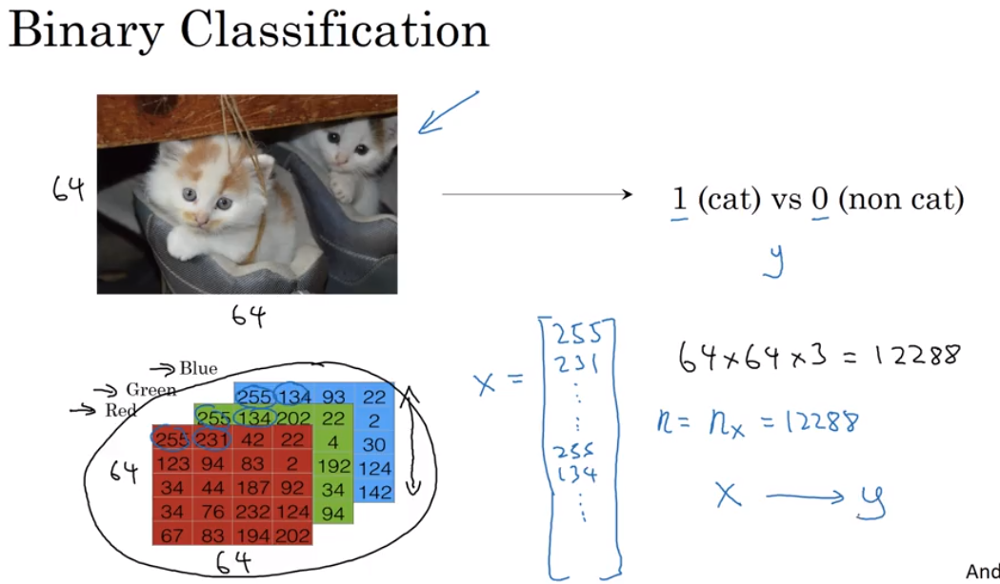

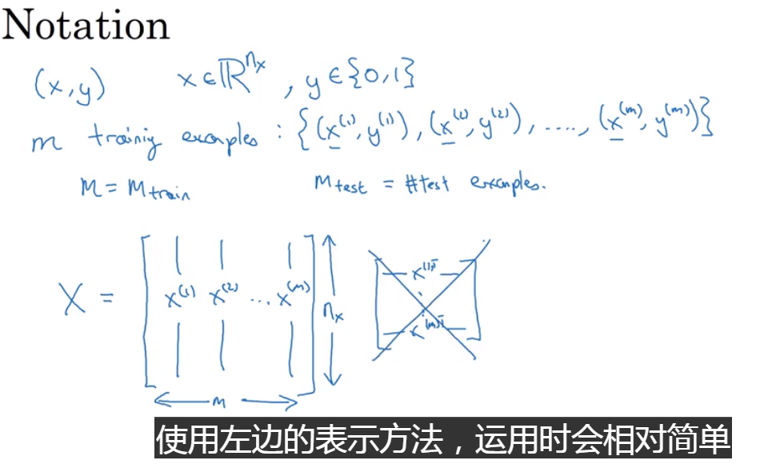

### Logistic Regression

- 在神经网络编程中，w和b分别对待，使得在实现层面给会更简单。

- 逻辑回归可以看成是非常小的神经网络
- The **loss function** computes the error for a **single** training example; the **cost function** is the **average** of the loss functions of the **entire training set**

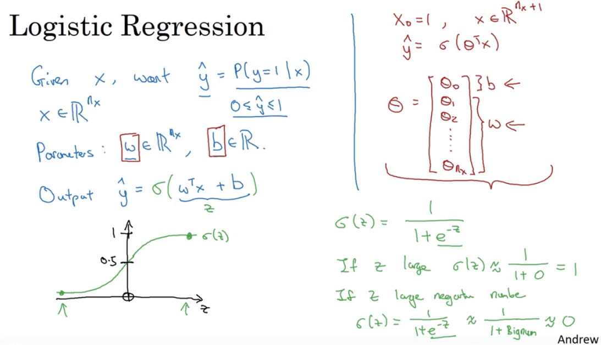

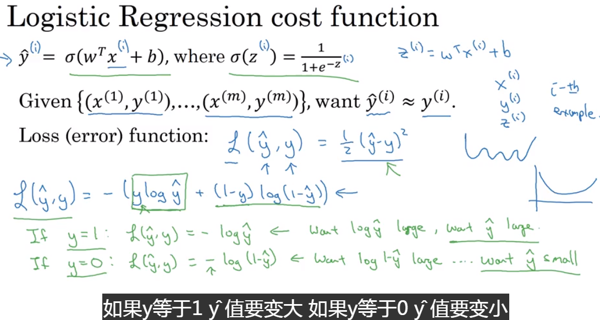

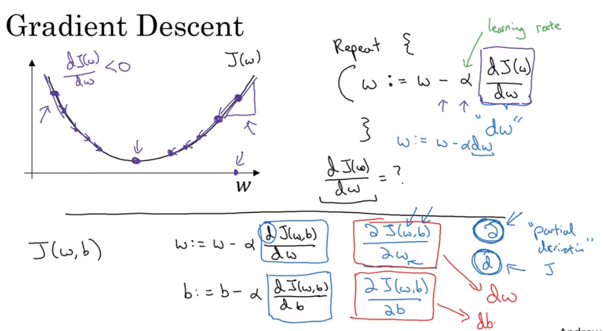

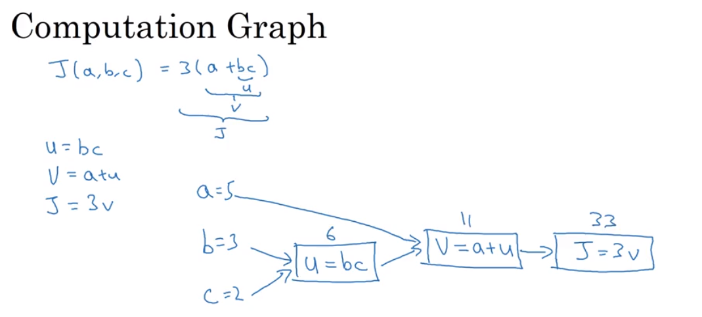

### Derivatives with a Computation Graph

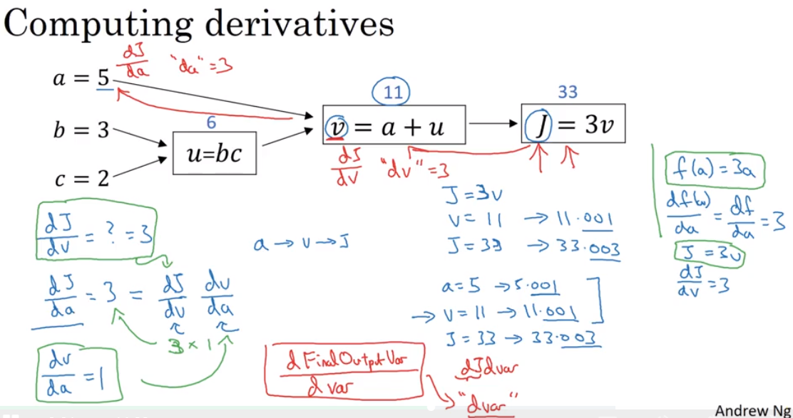

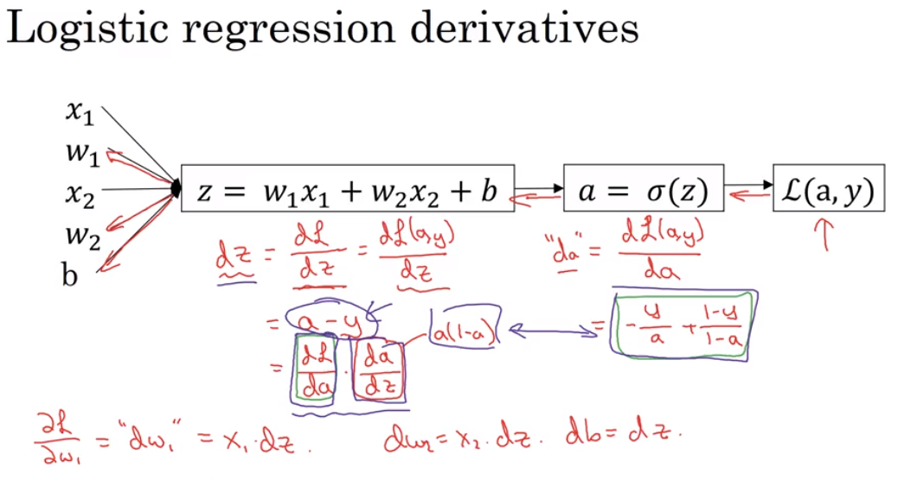

### Vectorization

利用内置函数实现**向量化**能够极大提升运算效率，尽量**避免使用显示的for循环**。

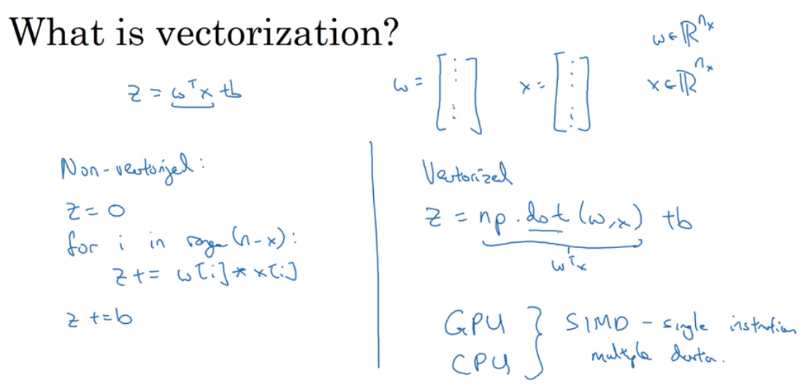

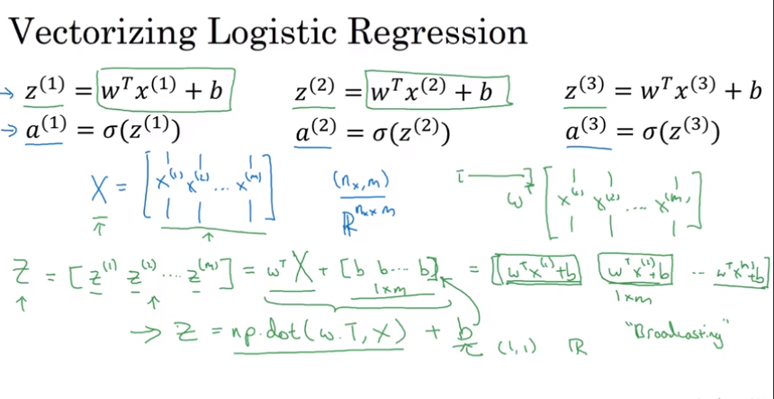

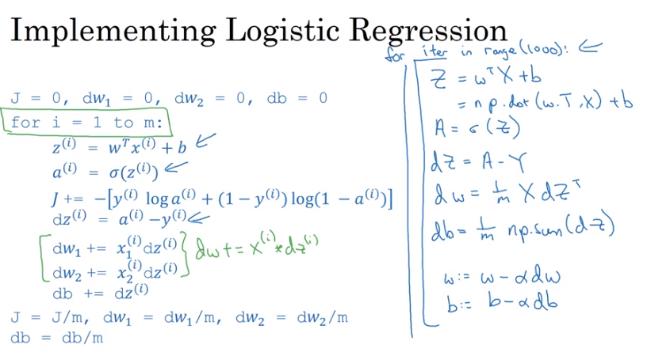

###　Broadcasting in Python

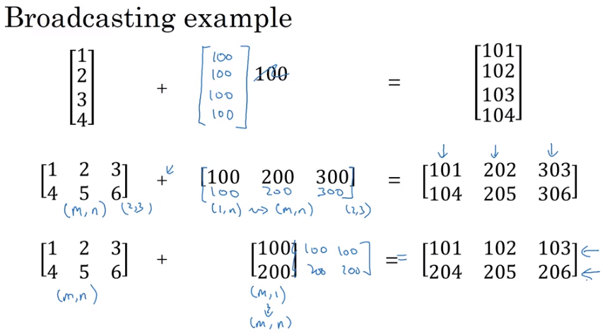

### Python

- 增加语言的灵活性

- 有时会引入bug，例如当维度不匹配时，你希望它抛出异常，但是由于broadcast的存在可能不会抛出异常

- numpy

  - 尽量不要使用秩为1的数组

    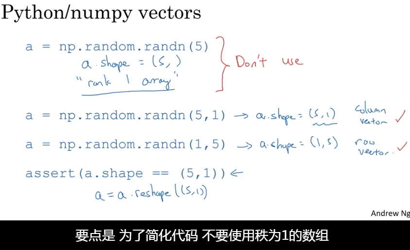

    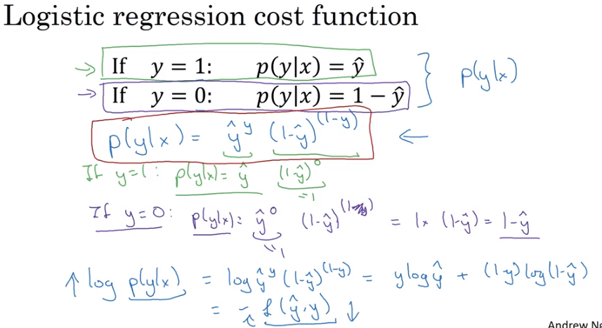

    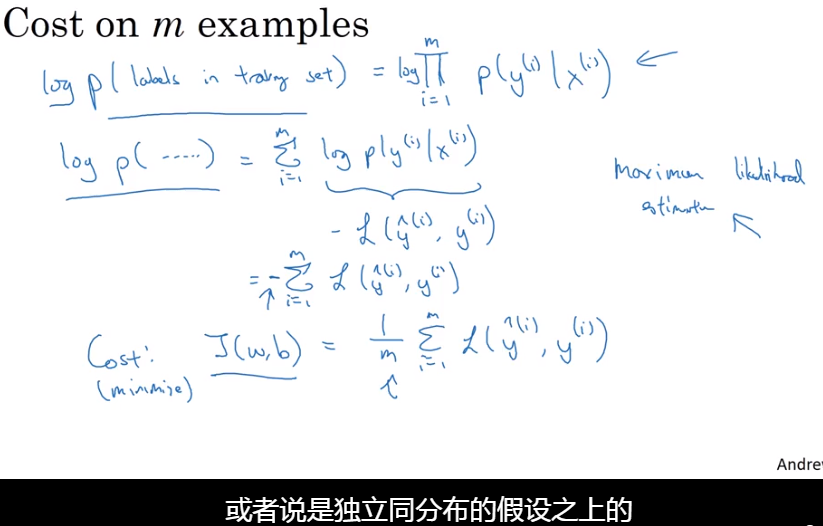

