### Neural Network Representation

#### 一个神经元代表两步计算：1. 计算线性函数的值；2. 计算激活函数

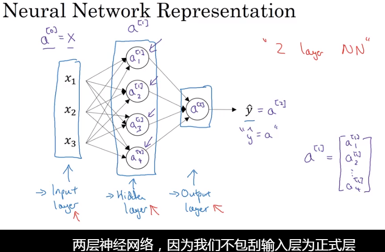

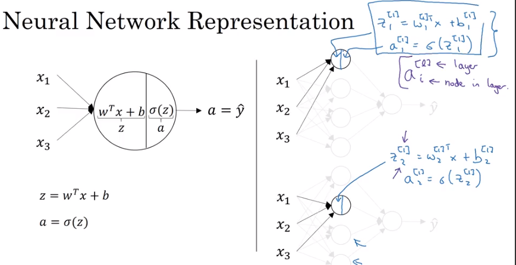

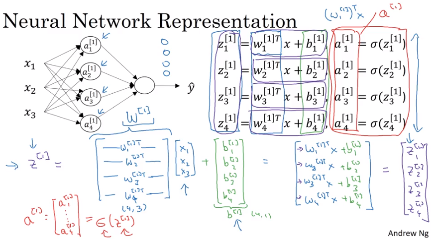

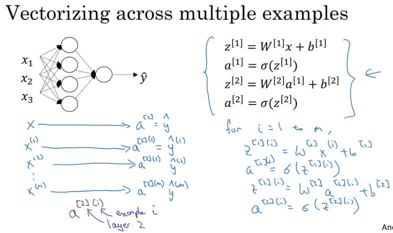

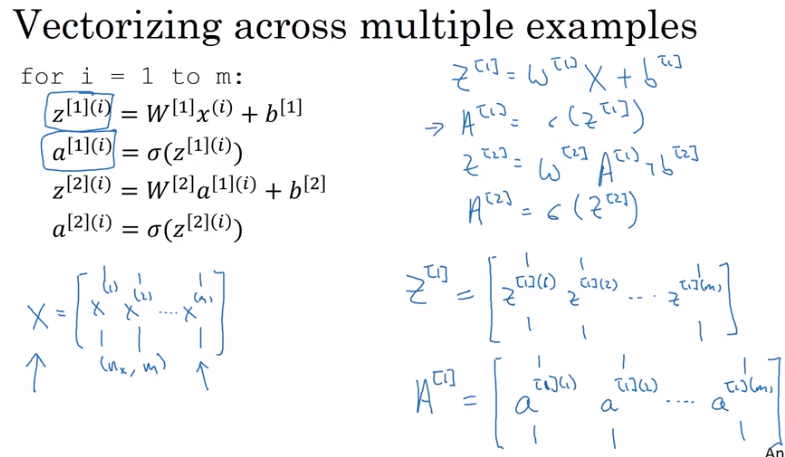

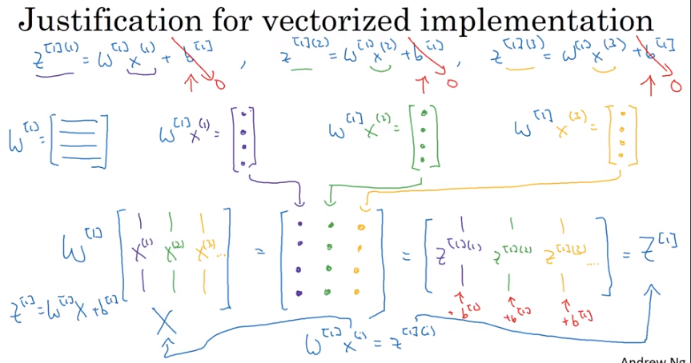

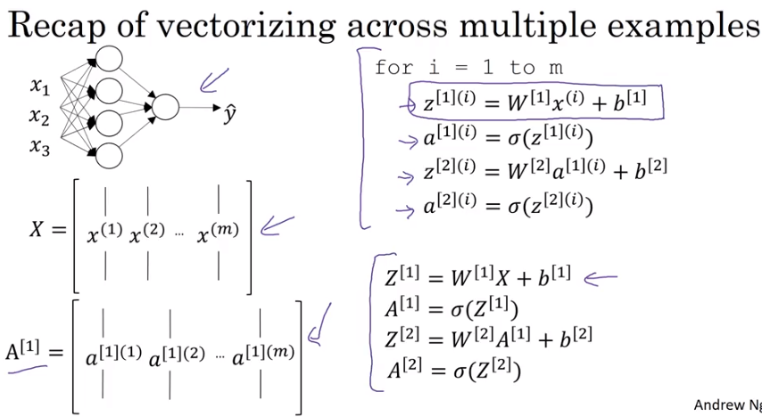

### Activation function

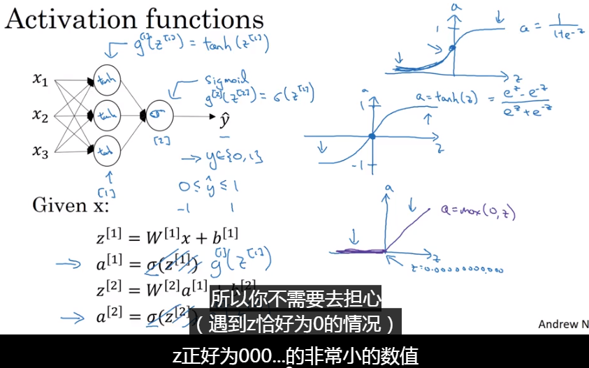

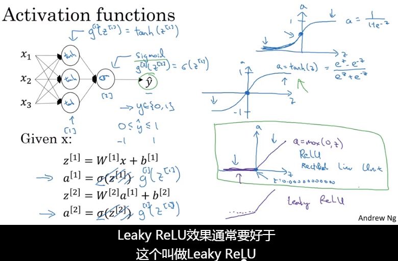

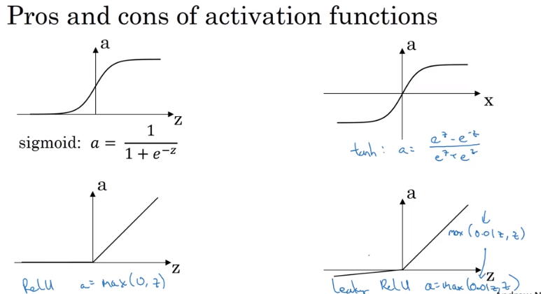

## 为什么需要非线性的激活函数？

**如果使用线性函数或者恒等激活函数，那么不管有多少层神经网络，它所做的仅仅是计算线性激活函数，那还不如直接用线性回归模型进行训练。**

### 激活函数的导数

- sigmoid

  $\sigma'(z) = \sigma(z) (1-\sigma(z))$

- Tanh 激活函数

  $g'(z) = 1-(tanh(z))^2$

- ReLU

  $g'(z) = 0(z<0)$

  $g'(z) = 1(z>=0)$

  ​

### 神经网络单隐层梯度

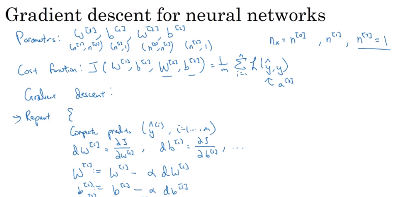

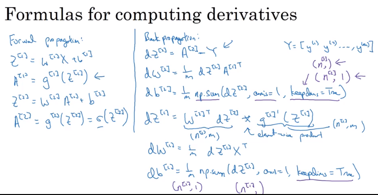

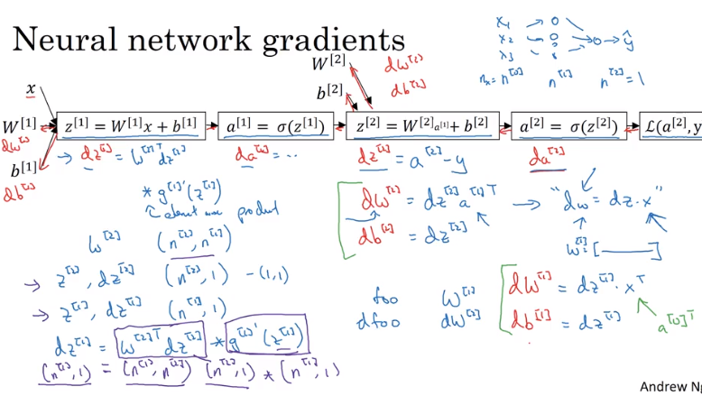

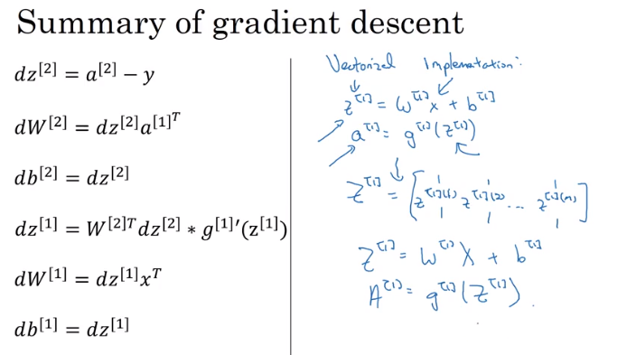

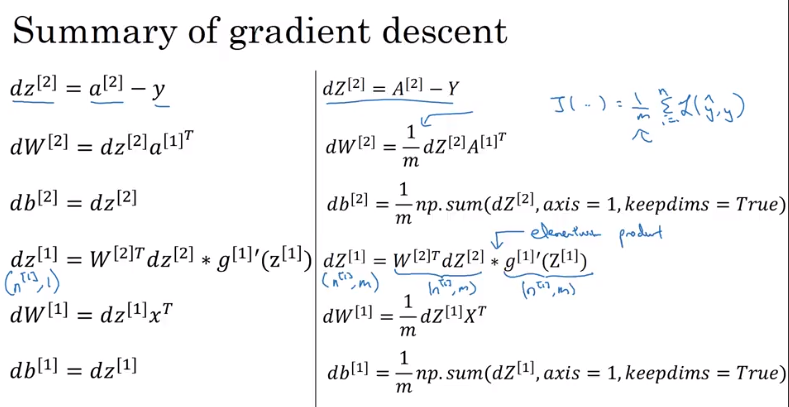

### 权重初始化 - 非常重要

- 在神经网络中，权重不能初始化为**0**
- 无论使用什么样的样本训练，得到的训练节点的值一模一样，进而导致每一层的都一样（对称结构）
- 可以通过随机初始化进行权重初始化
- 为什么要初始化很小的权重值？
  - 因为如果初始化权重很大的时候，会使得利用sigmoid或者tanh作为激活函数时，会使得一开始的z值很大，梯度比较小，收敛过程也会很慢。

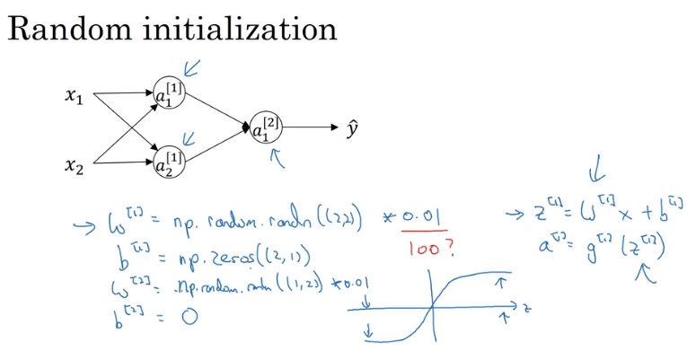