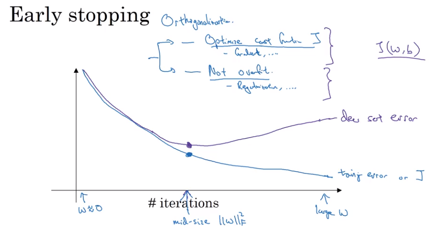

### 设置机器学习

当进行神经网络学习时，会有好多需要考虑

- 多少层

- 多少个神经元

- 学习率

- 激活函数的选择

  **参数的选择是一个反复迭代的过程**

####1.一般需要将数据分成：

- 训练集
- 开发集
- 测试集

如果数据量较少，可以使用传统的数据分割方式-0.6/0.2/0.2

如果数据量很大，可以相应地减少开发集合测试集的数据量 0.99/0.95/0.05

#### 2.训练集和测试集分布不同

深度学习的一个特点是需要大量训练数据，一般通过爬虫获取数据，但是获取的训练数据的数据分布很可能与测试集的数据不同。

所以建立好训练、开发、测试集，会迭代得更快，还能更高效地测量算法存在的偏差和方差

#### 3. Bias vs Variance

- How to deal bias and variance?
- 用训练集/开发集判断
- High Bias
  - **Bigger network**
  - Train Longer
  - New algorithm
- Low bias and High Variance
  - **more data**
  - **regularization**
  - More appropriate NN
- 深度学习在监督学习中扮演重要角色的一个原因是：更为复杂的网络和大数据的支持，是的模型的偏差和方差都能够被有效降低。

### Regularization

当遇到模型过拟合时，第一个想法就是regularization。因为一般来说，获得更多数据并不是那么容易的。

- 在Regularizaion时，为什么不对bias进行规整？
  - w 通常是很高维的数据，尤其是在发生过拟合的情况下
  - 而b只是一个参数而已，没必要花大力气去规整
- 一般有L1，L2规整
- L1能够稀疏化w，有助于压缩模型。**吴恩达**认为由**稀疏参数**所带来的效果**收效甚微**
- 所以L2更常用，一般用**开发集**去选取$\lambda$ (python中lambda是关键字)
- L2也叫权重缩减
- why Regularization 会减小过拟合？？？？
- ​

#### Neural Network Regularization

#### Dropout

让神经元随机失活，直觉上，不能过分依赖于任何一个特征，是的权重泛化到每一个权重上，进而是的使得不易过拟合。与L2类似

- 根据每一层神经元的复杂程度，选择留存率对神经元进行随机失活
- 一般在特征输入层，留存率设置的比较高，接近1
- 应用，计算机视觉

dropout的一个缺点是代价函数变得不那么明确

再实际上，一般先不用dropout进行模型训练，确保梯度是单调递减的。然后在overfit的情况下可以利用dropout

### Data augmentation

人工数据合成 - 通过旋转、放大缩小、扭曲等操作增加数据量

- 最优化最小代价函数并且减少过拟合

### early stopping

优点：只需尝试很少的w值（小，中，大），就能够相对容易确定迭代次数；可以**减小过拟合**

缺点：无法分别去解决最优化代价函数和减少过拟合这两个问题；因为在减小过拟合的过程本身就打乱了最优化代价函数的过程；一种方式是用正则化代替，可以让超参数的搜索空间更容易分解

## set up optimization problem

### Normalizing training sets

保证所以特征的尺度一直，使优化更为方便。

**注意点**：必须用一样的$\mu$和$\sigma^2$ 去规范化数据集（训练集和测试集）

- 为什么要规范化
  - 这样会使代价函数更为对称，在梯度下降的过程中会使得迭代过程更为容易

### 梯度消失和梯度爆炸

神经层数很多时(非常深的网络)，当权重稍微大于单位矩阵时，最后的输出会呈指数增长，梯度爆炸；当权重矩阵小于单位矩阵，则输出会呈指数下降，会出现梯度消失现象：这两种情况会使模型训练更加复杂

### 权重初始化

通过合理地初始化权重会使得梯度消失和梯度爆炸变缓

### Numerical approximation of gradient

### 梯度检查技巧

- 不要用在训练模型当中，应该在debug中
- 如果发现梯度计算出问题，看每一部分
- 如果使用regularization，在梯度检查的时候不要忘了规整项
- 不要和dropout 用在一块，如果要用梯度检查，需要关掉dropout。

