## Optimization algorithms

### Mini-batch gradient descent

当训练数据量很大时，如果采用批梯度下降，参数更新过程会非常慢，而是用MBGD会快很多

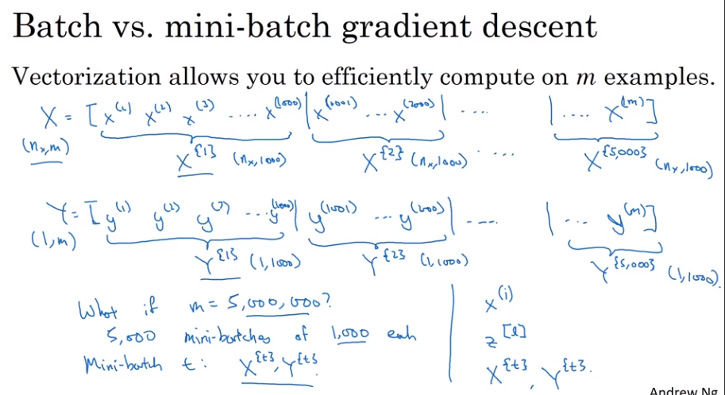

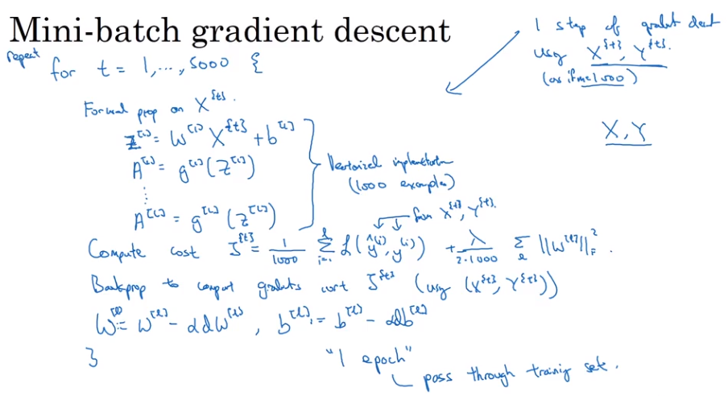

### Understanding mini-batch gradient descent

- 选择mini-batch大小
  - 数据量小时，用BGD
  - 典型的MBGD的大小一般为64,128,256,512
  - mini-batch的样本要小于cpu/gpu的内存大小

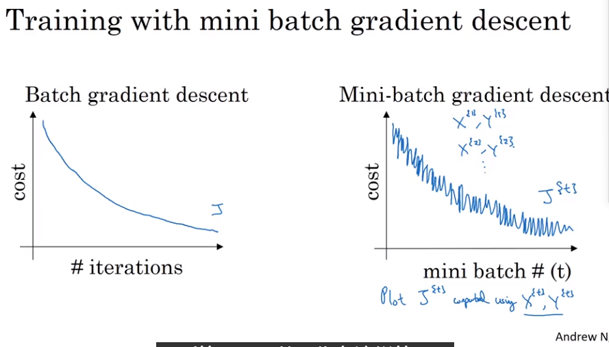

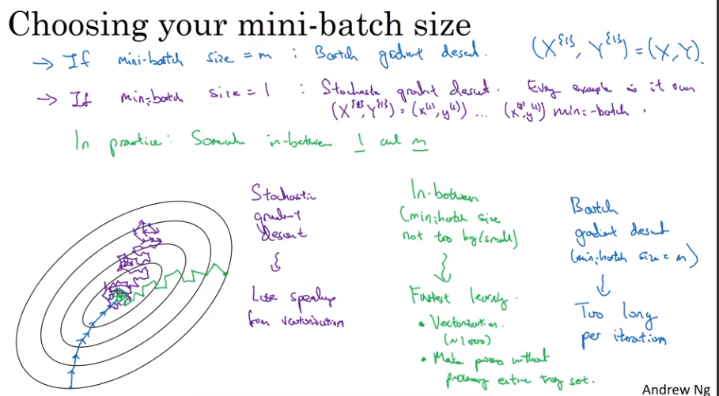

### Exponentially weighted averages

####　滑动平均－指数加权平均

- 高效，内存占用少，而且只需要一行代码就能实现

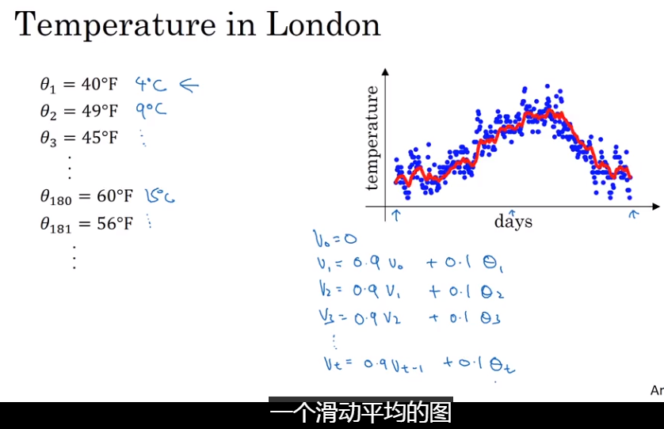

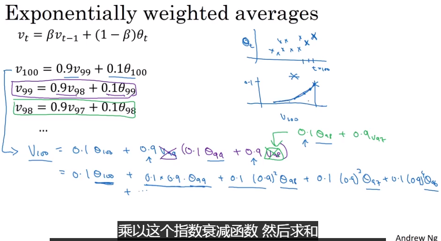

### Bias correction in exponentially weighted averages

偏差修正

在计算初期，由于数据量较少，平均出来的值不符合实际，偏差较大，通过设置权重的计算方式来校准。

实际上，在实现梯度下降或动量梯度下降时，一般不用偏差修正，因为随着迭代的进行，所得到的值已经属于无偏估计。

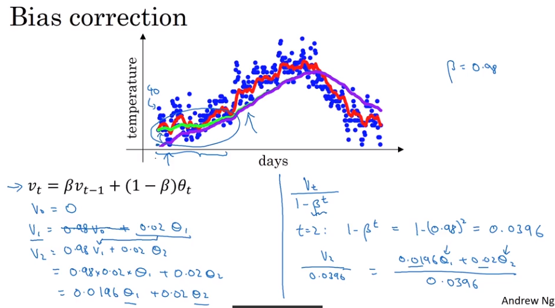

### 动量梯度下降算法

希望在梯度方向下降的快点

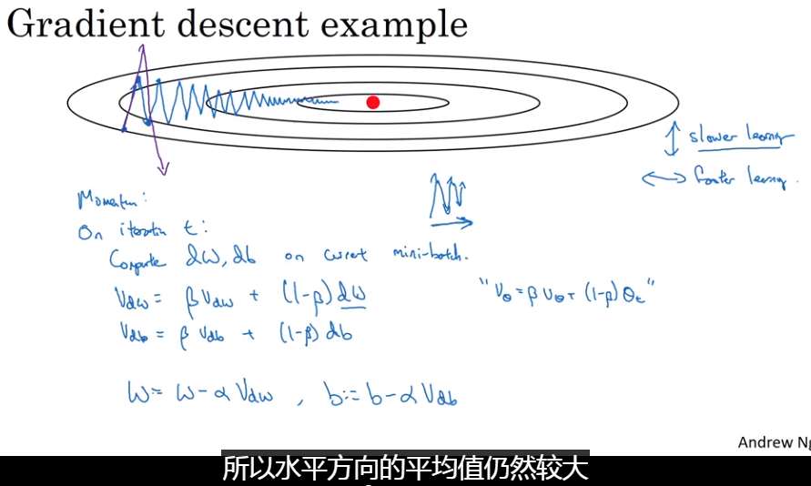

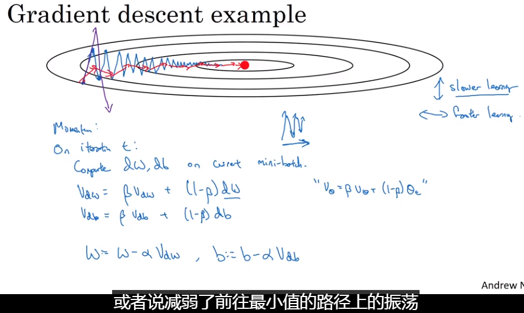

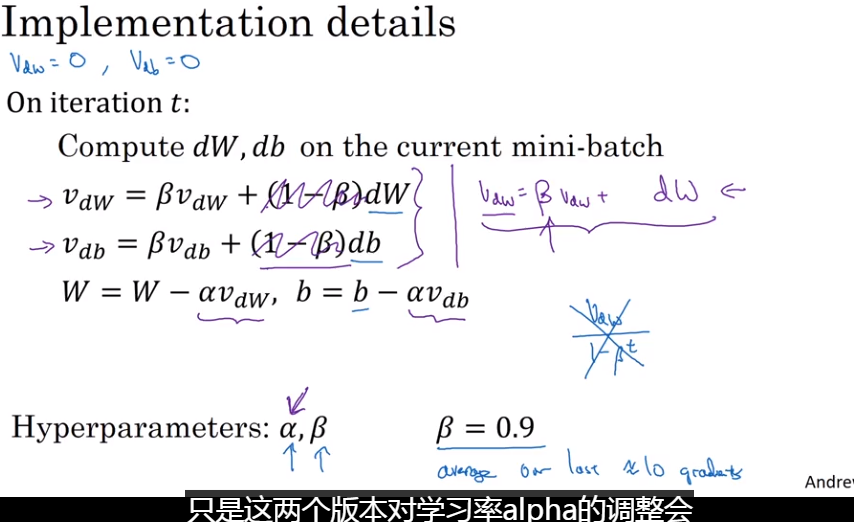

### 

### RMSprop 均方根传递

它和动量一样，降低梯度下降和小批量梯度下降中的震荡，并且令你能使用更大的学习率$\alpha$，从而提升收敛速率。

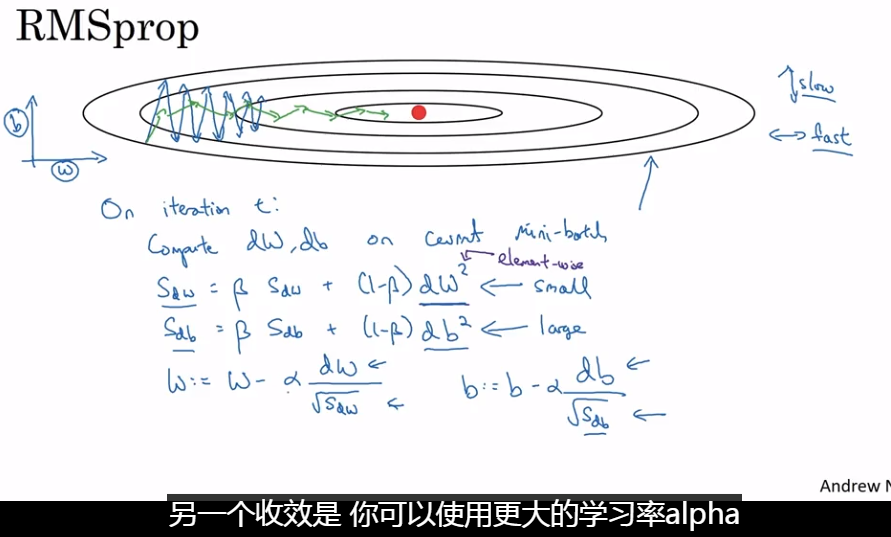

### Adam optimization algorithm

本质上是将动量算法和RMSprop结合起来

- 超参数的选择

  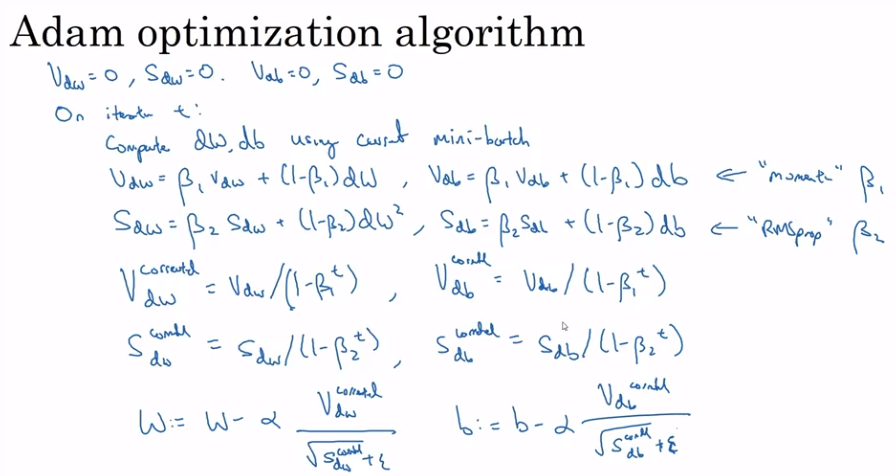

  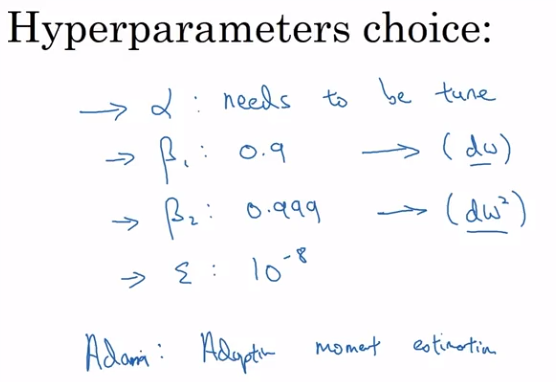

### 学习率decay

一般用mini-BGD进行梯度下降的计算，最后的优化结果会在最优点附近徘徊。这是因为在batch的训练集中存在一定的噪声，并且学习率是固定的。

- 优化的方法
  - 动态设置学习率衰减公式（与迭代次数相关的）
- 学习率的衰减方法一般放在后面去考虑

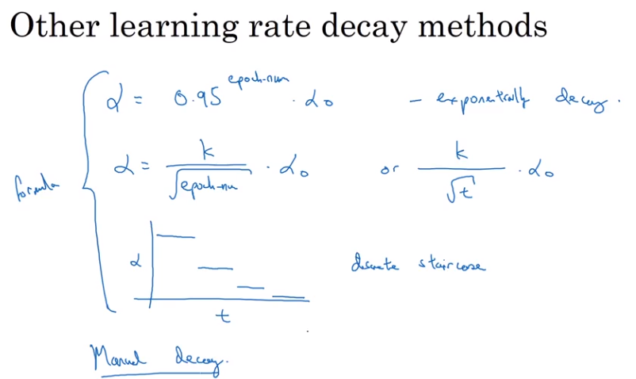

### 局部最优

在高维空间中，或者训练复杂的神经网络，不太可能会碰到局部最优点，但更容易碰到**鞍点**（saddle point）, 次数一般用Adam这种算法来跳出该区域

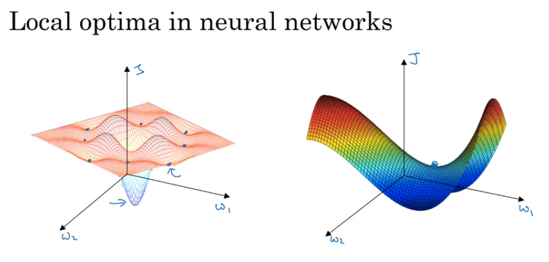

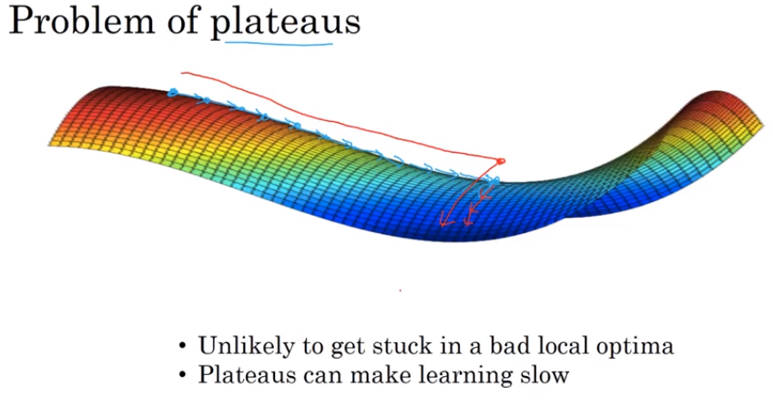