### Tuning process

#### 超参数

- 超参数值域随机抽样，更有效的搜索有效的超参数空间
- 一般通过均匀取样进行处理，但不是对所有的超参数都适用，例如，在学习率（0.0001,0.001,0.01,0.1,1）的选择上可以通过对数抽样进行旋转。

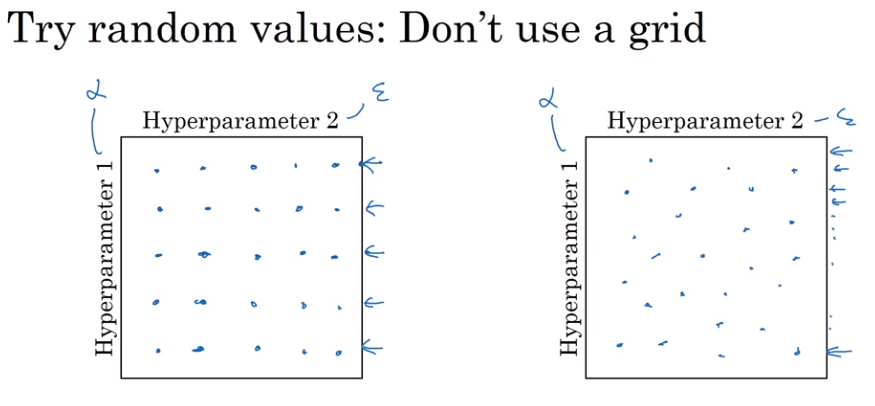

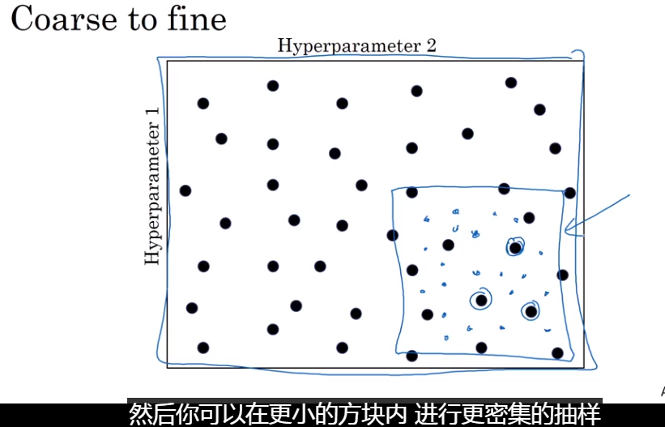

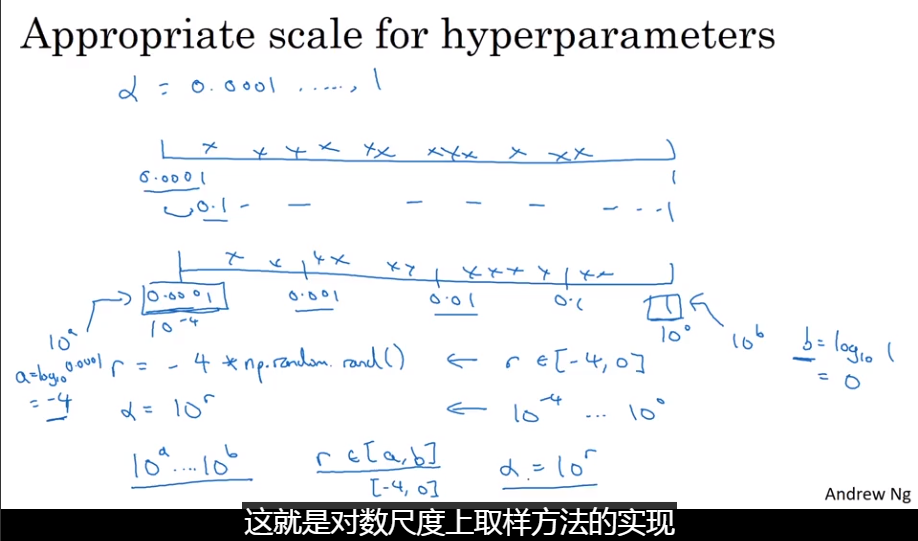

- 另一个棘手的问题是beta（指数加权平均值）的确定：
  - 线性取样是一个bad主意，因为随着$\beta$趋近于1，其结果对于$\beta$的改变非常敏感

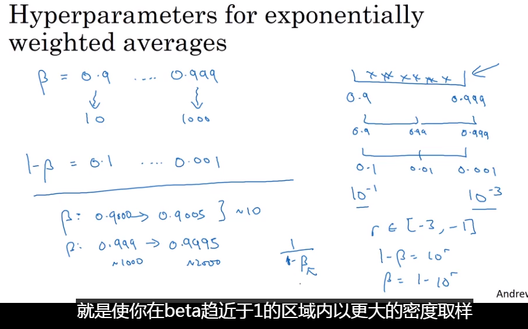

### Hyperparameters tuning in practice: Pandas vs. Caviar

实际中，根据计算资源的情况选择相应的超参数调整方法

- 熊猫模式的本质是训练一个单一的模型（时间跨度较大）
- 鱼子酱的本质是同时训练多个模型

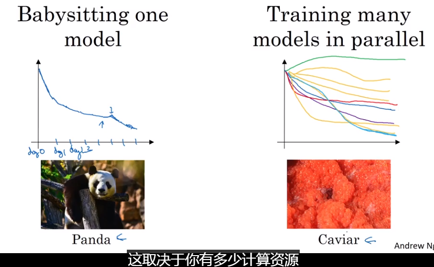

##　有一种技术可以让神经网络对于超参数的选择不那么敏感，可能没法普及至所有的神经网络，但是一旦奏效，能够让超参数探寻过程变得更加容易，也可以缩短训练时间

## Batch Normalization

可以让超参数的搜索更为简单，可以让神经网络对于超参数的选择不那么敏感，更容易训练更深的网络。

- 对于每一个隐含层中的a是否也可以进行归一化？
  - 虽然在实际中归一化时一般针对z而不是a，即在激活函数前进行归一化
  - 输入层和隐含层的归一化的不同点是：隐藏层归一化后并不一定是均值为0，方差为1的分布
  - 例如，原本是一个sigmoid函数，你肯定不希望归一化的值都在中间那段直线的区域上
  - 通过设置$\gamma$ $\beta$可以让归一化的值呈现为想要的分布

- ​

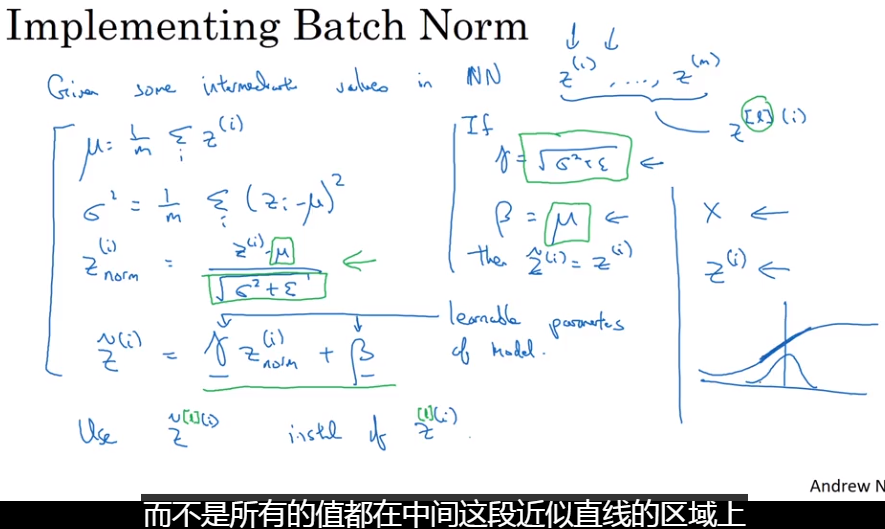

### Fitting Batch Norm into a neural network

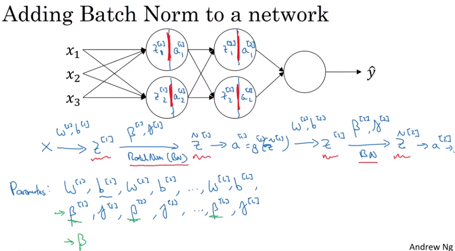

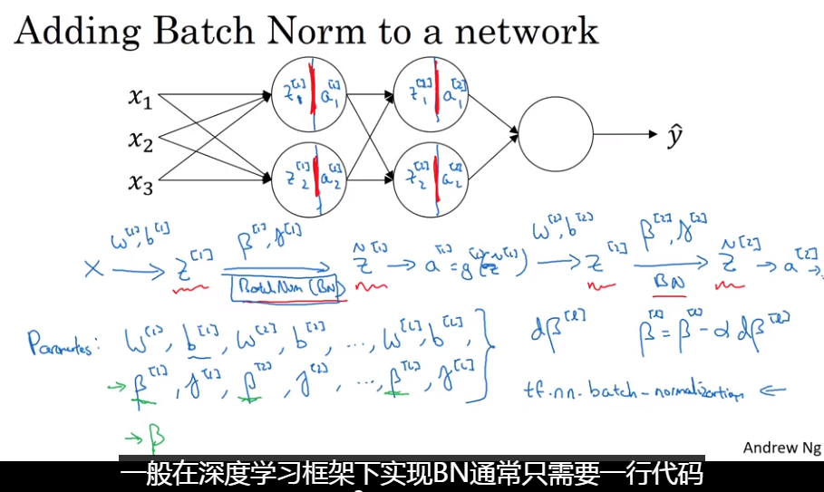

#### Working with mini-batches

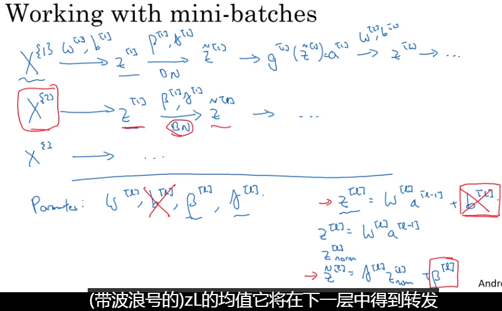

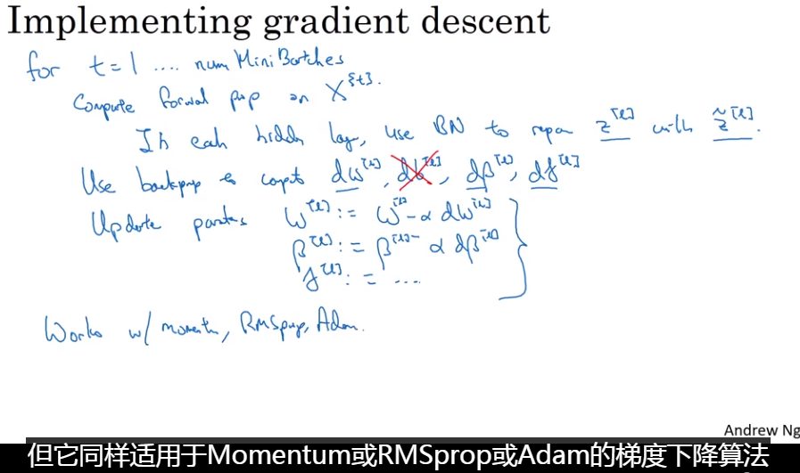

#### 为什么BN有效？

- 它能够减少输入值变化所产生的问题，使前层的影响稳定，进而使神经网络后层有更加稳固的基础，后层适应前面层变化的力量被削弱。换句话说，BN减少前层参数和后层参数之间的耦合，允许每一层网络独立学习
- 有轻微的规整化的效果（regularization）,在mini-batch中采用归一化会引入一定的噪声，使后续的隐藏单元不要过度依赖其它隐藏单元。在增大minibatch的时候，在减少噪声的同时也减少了正则化的效果。

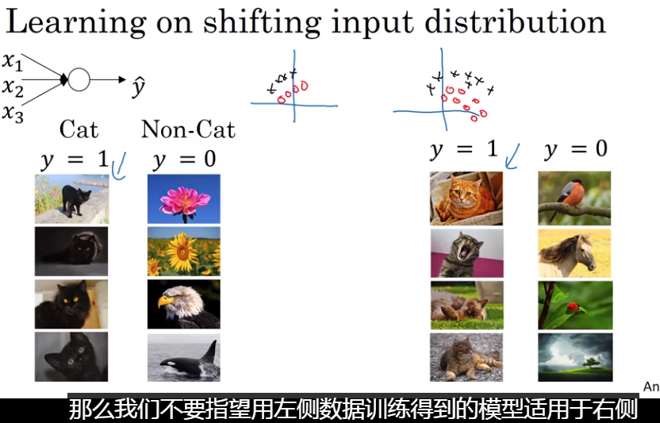

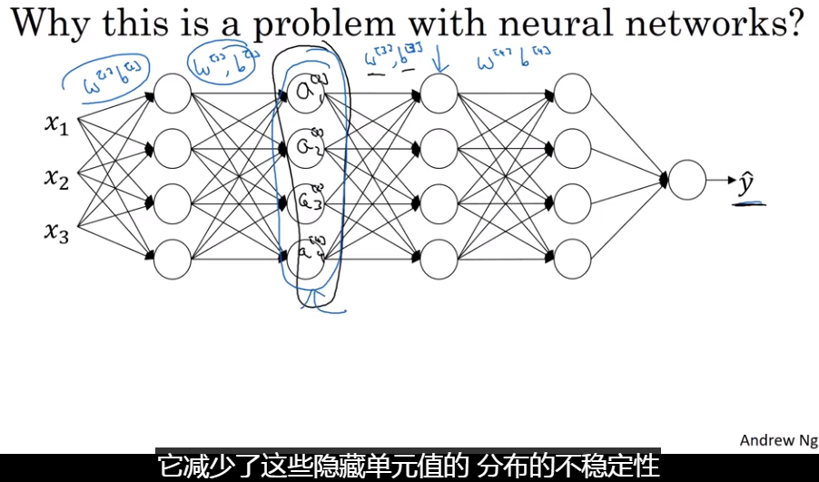

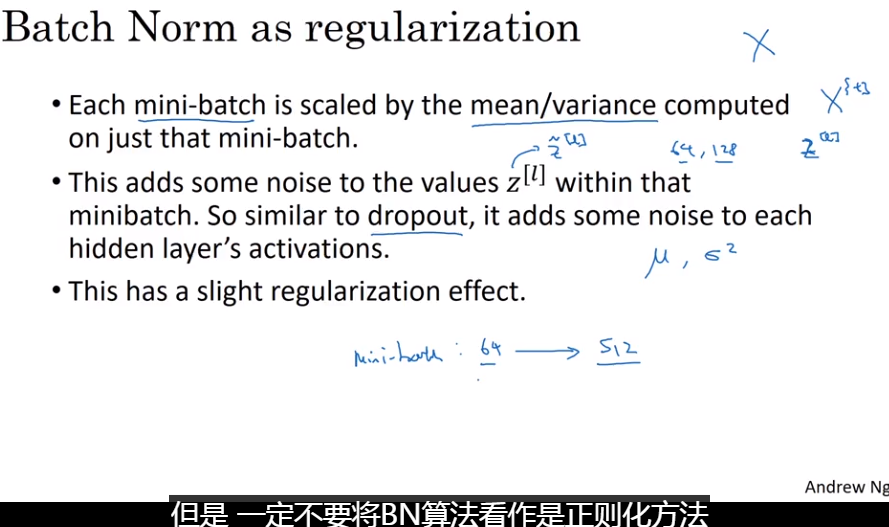

### Batch Norm at test time

指数加权平均

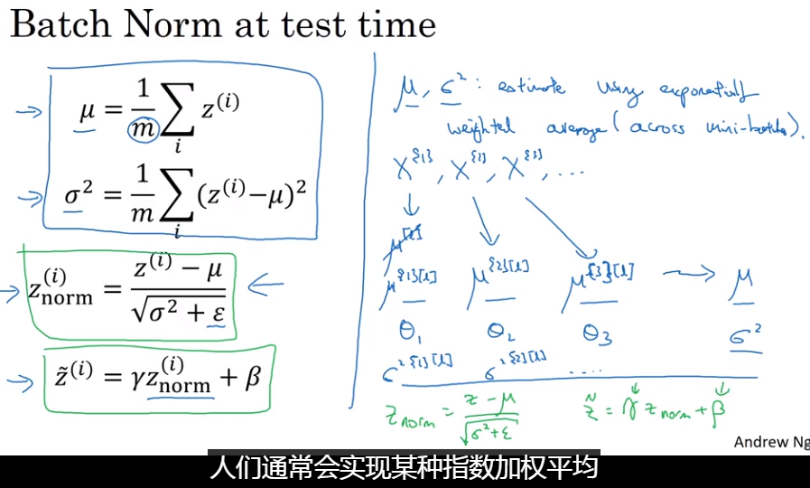

### Multiclass classification

#### Softmax Regression

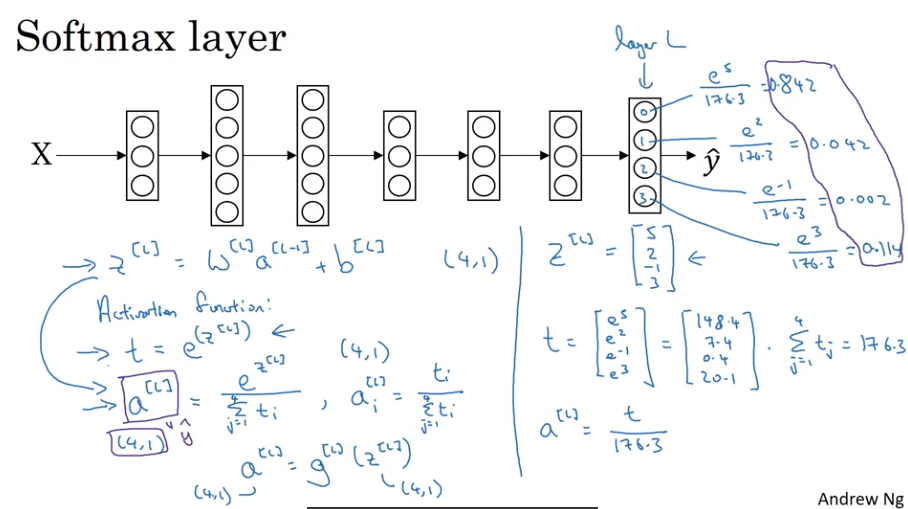

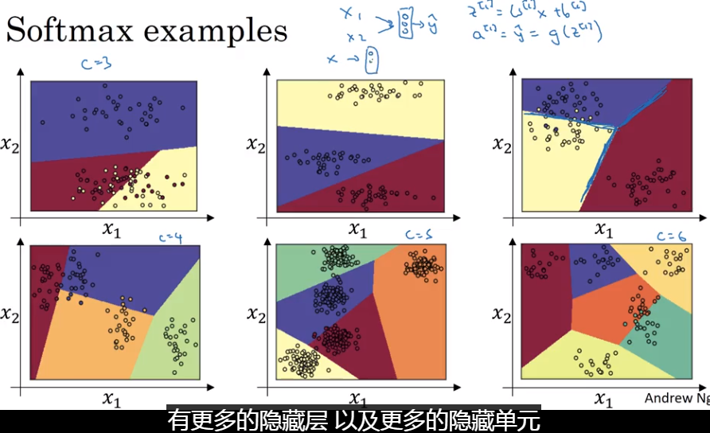

### Train soft-max classifier

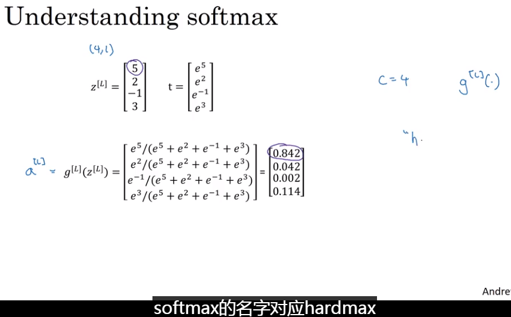

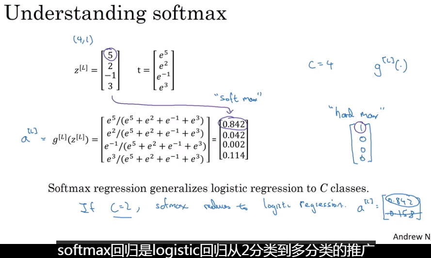

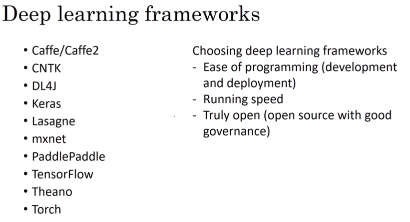