### 正交化

对与机器学习问题

- **1** 能够对训练集拟合好 (更复杂的网络、Adam)
- **2** 拟合开发集（Regularization、增加训练集）
- **3** 拟合测试集（增加数据集）
- **4** 在实际使用中表现良好（改变开发集或者代价函数）
- ***训练神经网络是不太想用early stopping，这个行为同时影响你在训练资料上有多准，因为你提前停止，还不够拟合训练集，而这行为也时常用来改善开发集上的表现(不够正交)***

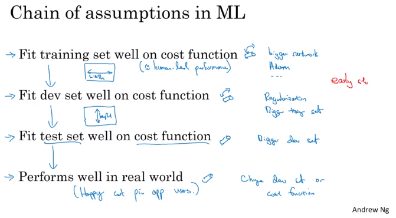

## Setting up your goal

------

### 1. 设置单一量化评估指标

- 例如，与其使用precision与recall来选好的分类器还不如直接使用**F1-Score**来选。
- 一个好的验证集和单一量化评估指标可以**提高迭代效率**
- 设置满足指标和优化指标（例如，在满足运行时间的限制下，尽可能提高准确率）

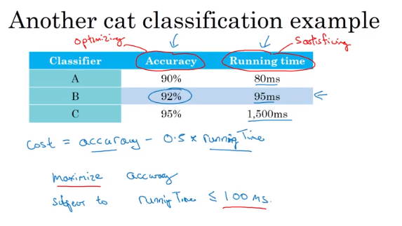

### 如何设置训练/验证集/测试集

- 让验证集和测试集的分布一样（随机打乱取样）
- 在不影响实际性能，训练集越多越好

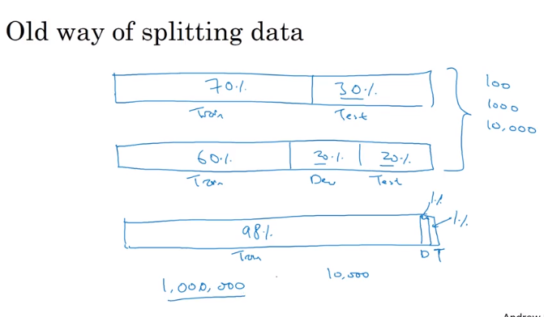

### 什么时候改变开发集/测试集和评估指标

- 对于不希望分类错误的通过提高权重实现
- 当当前的评估指标无法对算法的优劣进行判断，那么需要更改评估指标
- 如果在当前的评价指标以及当前开发集和测试集的分布很好，不能对应于在你真正关心的场景上也表现很好

#### 尽管在开发的时候不能确定一个很完美的指标，但是一定要尽快确定，这样可以提高迭代效率，如果不合适还可以修改

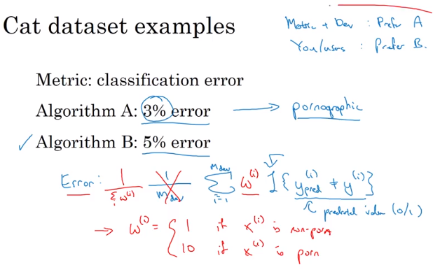

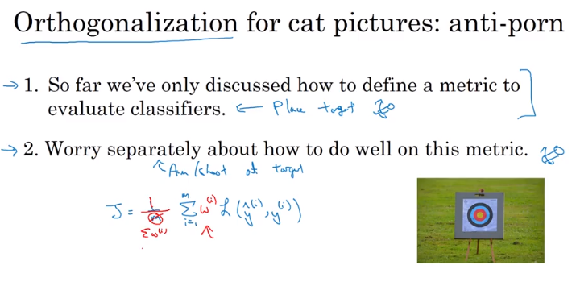

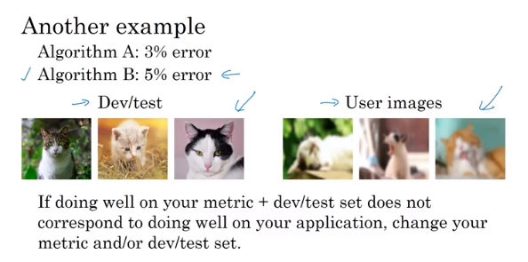

## 和人类的表现进行对比

机器学习有一个理论上限，机器学习要做的的就是逼近这个上限（贝叶斯最优误差），而一般人类的表现比较接近这个上限

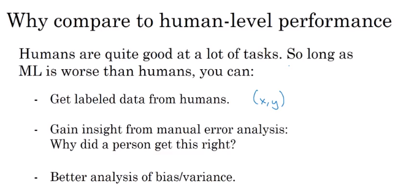

#### 可避免偏差

- 当训练误差与一个估算的贝叶斯误差之差（可避免误差）的比较大的话，就先要去消除误差

### Human level performance

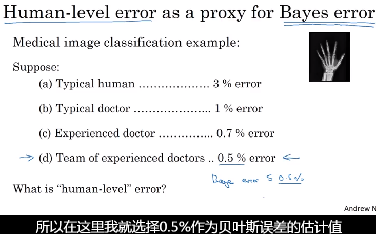

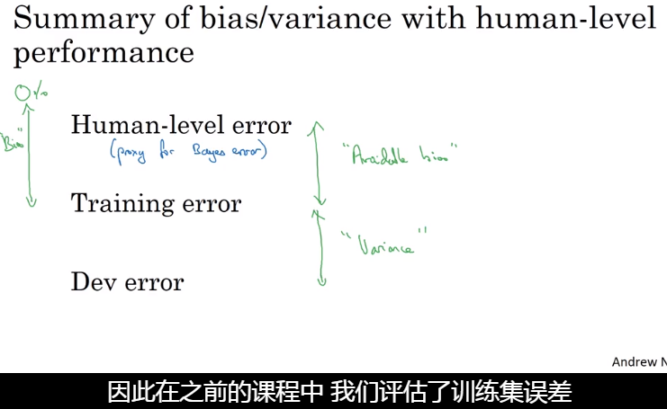

### Surpassing human-level performance

当机器学习的表现超过人类的表现时，此时应该怎么办？

- 因为不知道贝叶斯最优误差，很难判断应该是先降低偏差还是先降低方差

##### 应用

（非自然感知问题）

- 推荐系统

- 在线推广

- 贷款申请

  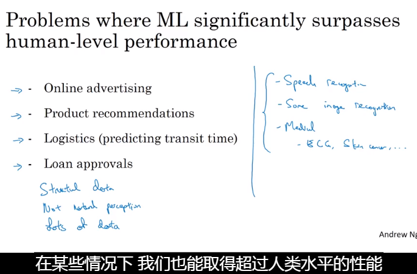

### Improving your model performance

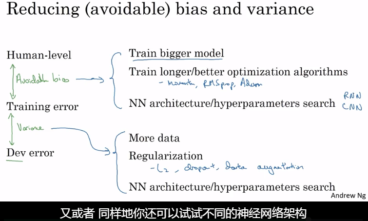

