## Error Analysis

### Carrying out error analysis

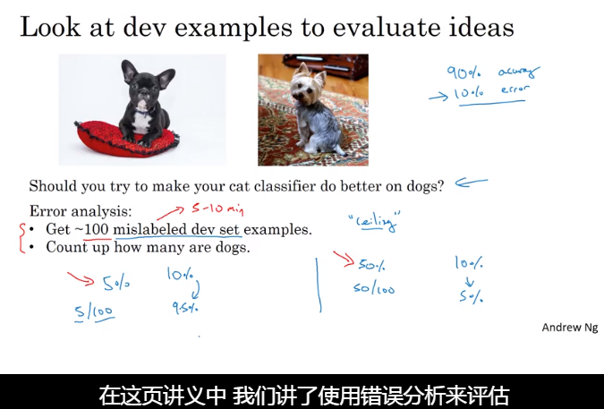

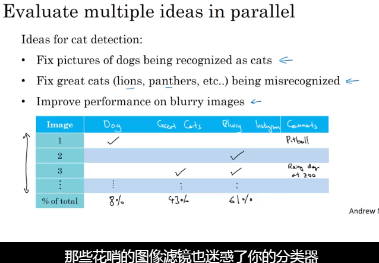

### Cleaning up incorrectly labeled data

如果发现错误的标签，应该怎么做?

- 在训练集中，即使有一些错误标签，如果数据量较大的情况下，可以不必去修改。
- 在开发集中，需要统计那些错误标签的样本，与实际的算法输出进行比较

是否值得花时间去修改误标签的样本？

- 看整体的开发集的错误率
- 由错误标签导致的错误率
- 其它原因导致的错误率

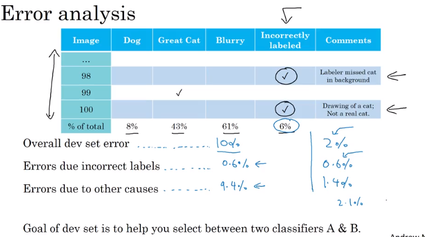

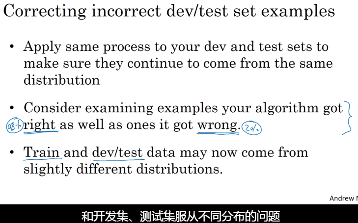

### Build your first system quickly, then iterate

- 对于一个新的研究课题，快速实现一个系统，然后再迭代

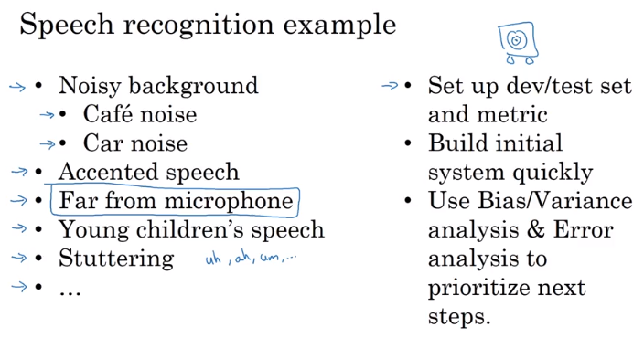

## Mismatched training and dev/test set

### Training and testing on different distributions

#### 以猫分类器为例

- 将不同分布的数据混合到一起，然后打乱（当这几种分布不同的数据量差别很大时，不建议采用）
- 训练集中的分布于测试集中的不一样

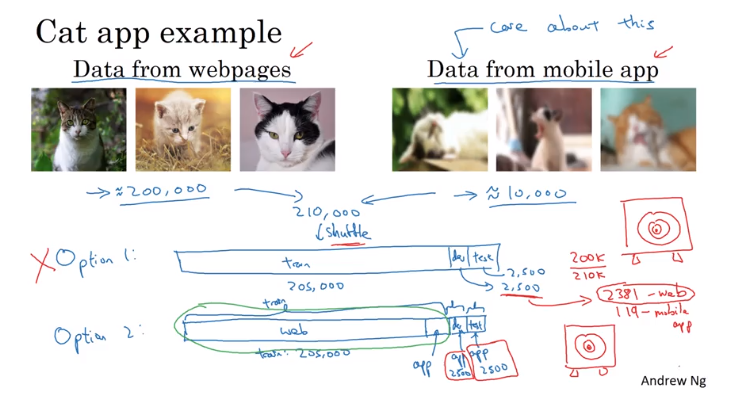

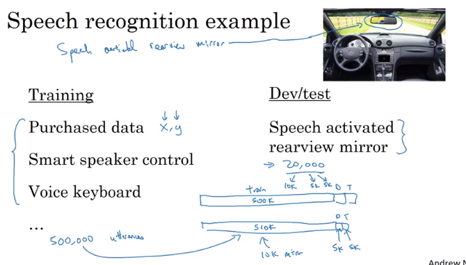

### Bias and Variance with mismatched data distributions

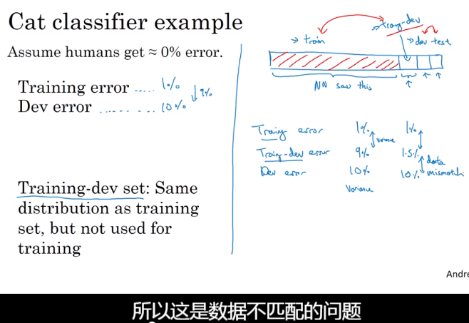

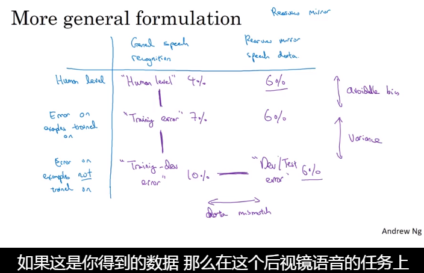

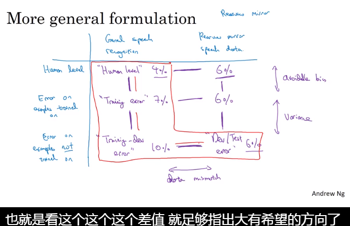

### Addressing data mismatch

目标是使训练集和开发集尽可能相似

- 人工合成数据-（**注意点**：是否模拟了所有可能样本的子集中的数据，否则会造成过拟合）

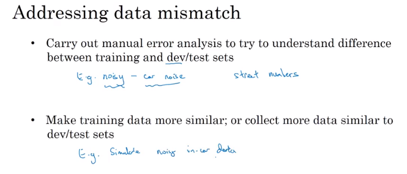

### Learning from multiple tasks

### 1. 迁移学习

####一种把一个任务中学习到的信息迁移到另外一个不同任务中的方法

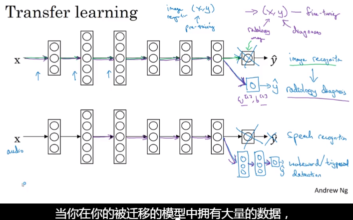

#### 什么时候迁移学习才适用？

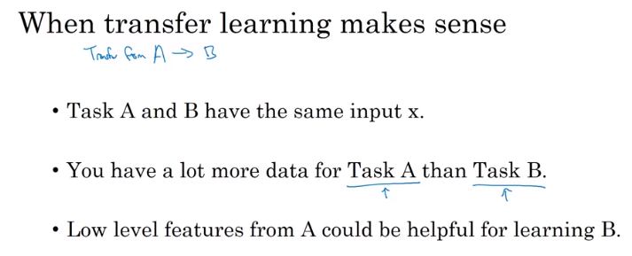

### 2. 多任务学习

自动驾驶：需要实现各种任务（识别道路、识别红灯、识别障碍物、行人等等）

用一个模型实现4项任务比用四个模型实现4项任务更有优势

**应用：计算机视觉物体检测**

- 一个优点是，即使数据集中的标签不全也能够训练

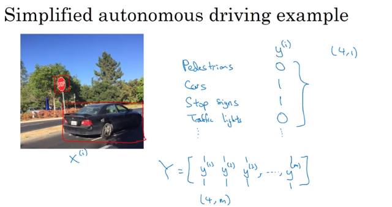

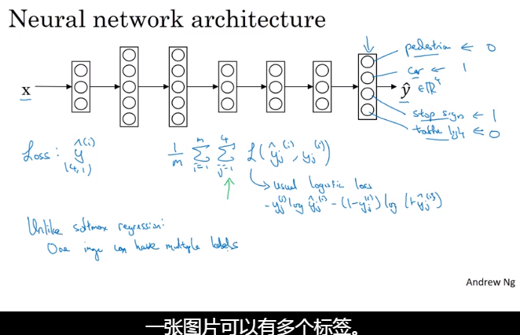

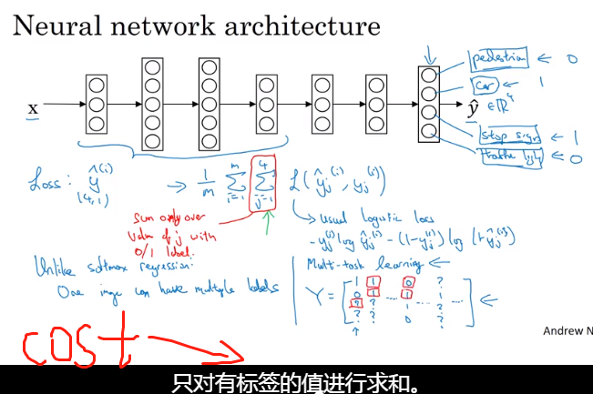

### 什么时候进行多任务学习才有意义

- 训练的任务共享一些低层次特征
- 每个单项任务的数据量非常相似（不是硬性要求）
- 训练一个**很大的神经网络**来使每项任务都有高精度

#### *迁移学习会比多任务学习应用的**多多多**~~~*

## End to end learning

传统的学习是将一个问题分成一堆的步骤，需要建立很多手工设计的组件。

而end to end 能够有效地简化系统，但并不总是有效的

挑战：**需要大量数据**

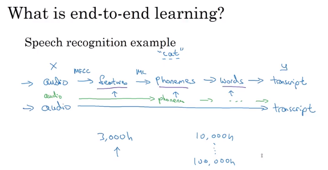

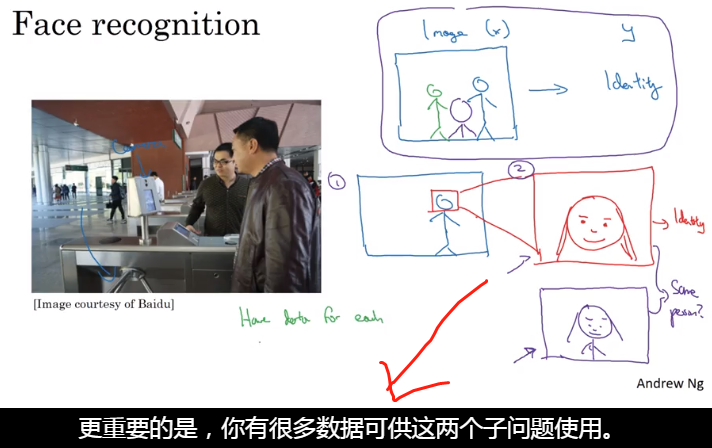

### 什么情况下可以使用end to end deep learning

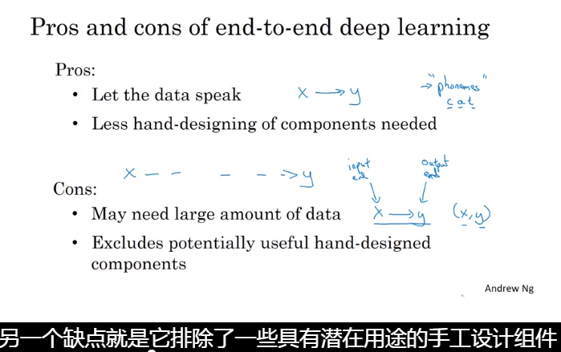

