## Object Localization

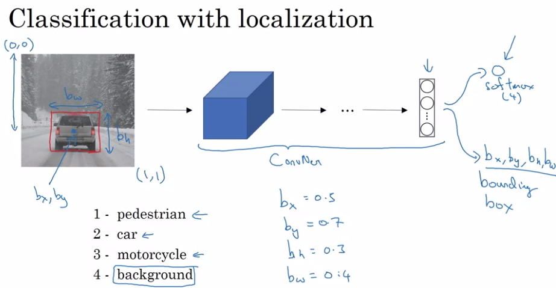

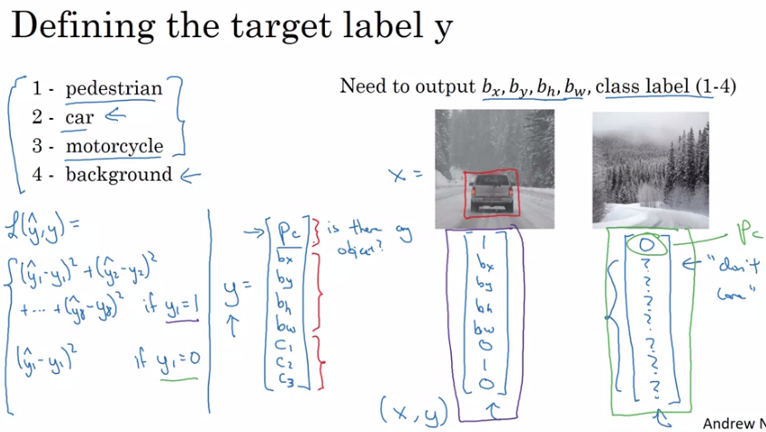

### landmarks - 关键点检测

- 在训练集中需要人为的标出各个特征点的位置
- 利用神经网络进行学习模型

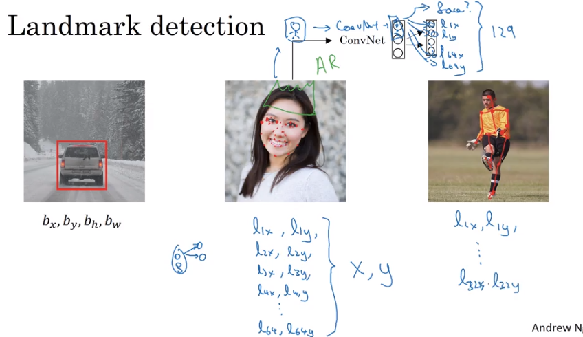

### 物体检测 - 滑动窗检测

缺点：计算成本很高，因为各种大小的窗都得试一下

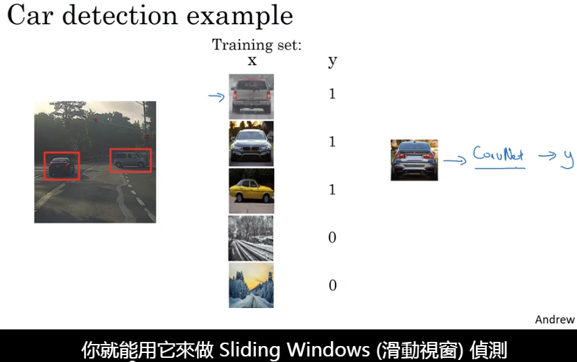

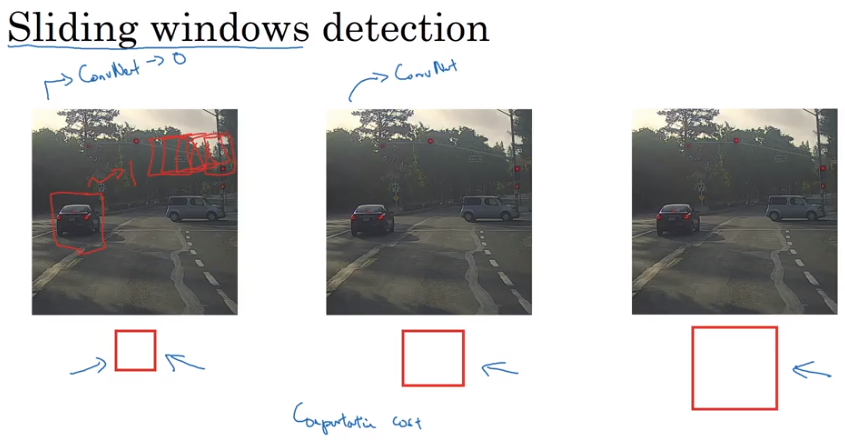

### Convolutional Implementation of Sliding Windows

- 将全连接层转化为卷积，预算效率提升很多
- 缺点：边界框的位置不太准确
- 改进方法：Bounding Box Predictions

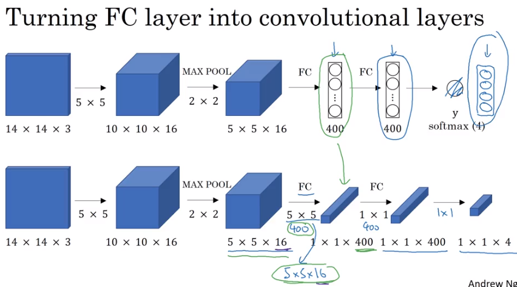

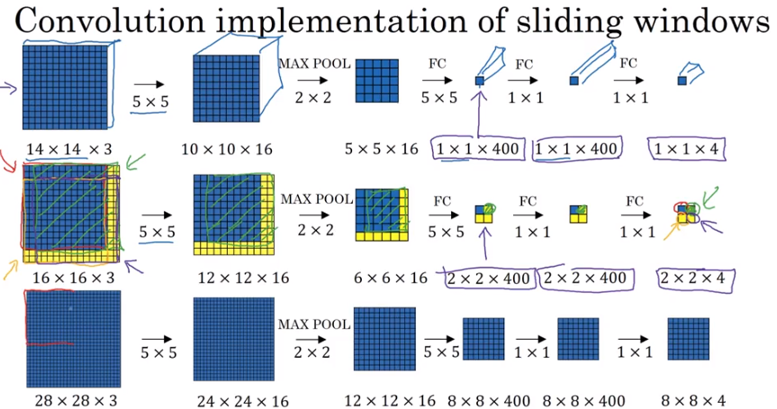

### Bounding Box Predictions

- YOLO Algorithm（3*3cell）
- 用cell来划分
- 在实际上需要用更细的cell，例如19*19，这样每个格子里会有多个物件的概率变小
- 一个细节是：当把物体交给格子时（物体属于哪个格子）,是以物体的中心为准，中心在哪个格子里就属于哪个格子，这样就避免了一个物体存在于多个格子的情况.

#### 如何确定box的参数

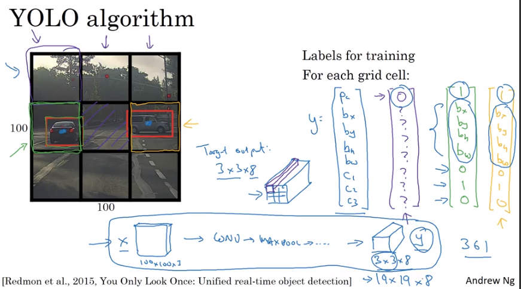

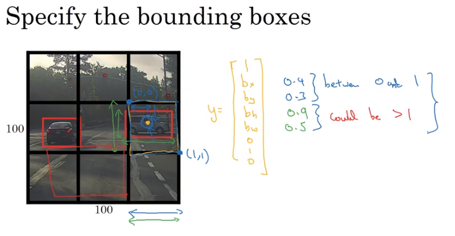

### 评价物体检测的效果

#### Intersection Over Union(交集除以并集)-IoU

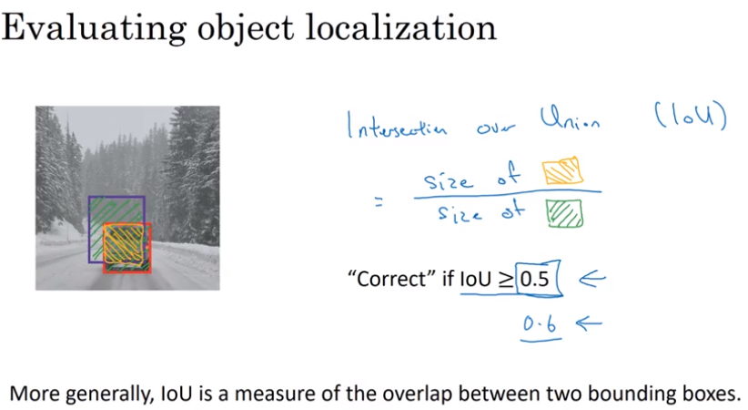

### Non-max Suppression 只检测一次

之所以叫抑制非最大是因为该算法先找出最大的然后抑制掉与它重合度高的非最大

####     物体检测的一个问题是，一个物体可能会被检测到多次，于是出现Non-max Suppression

- 每种检测到物品的几率，然后让几率最高的框变亮，如果其他的框与该变亮的框重叠度很高的话，则会被抑制掉，然后把抑制掉的框去掉剩下的就是所需要的结果
- 如果涉及到多种物体识别,例如路人、汽车、自行车，这种输出会有额外的三个维度，然后独自进行3次抑制非最大算法，每一种分别做一次

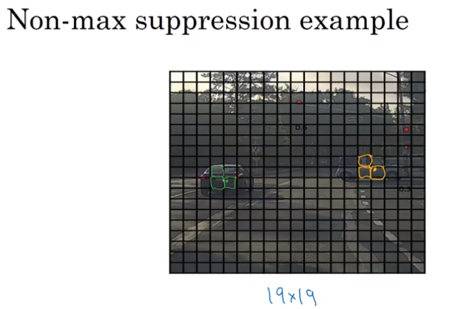

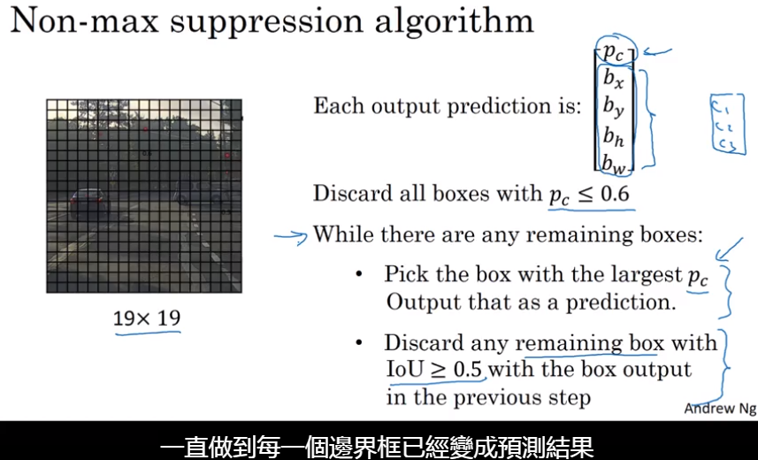

### 物体检测提升方法 -- Anchor Boxes

当前的物体检测方法中每个cell只能检测一个物体，如果一个cell想要检测多个物体呢？？？

- 事先确定几个anchor boxes
- 适用于物体有比较明显的特征
- 缺点：需要手动选择

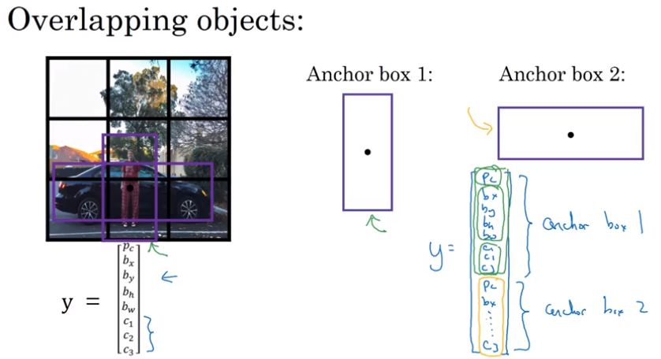

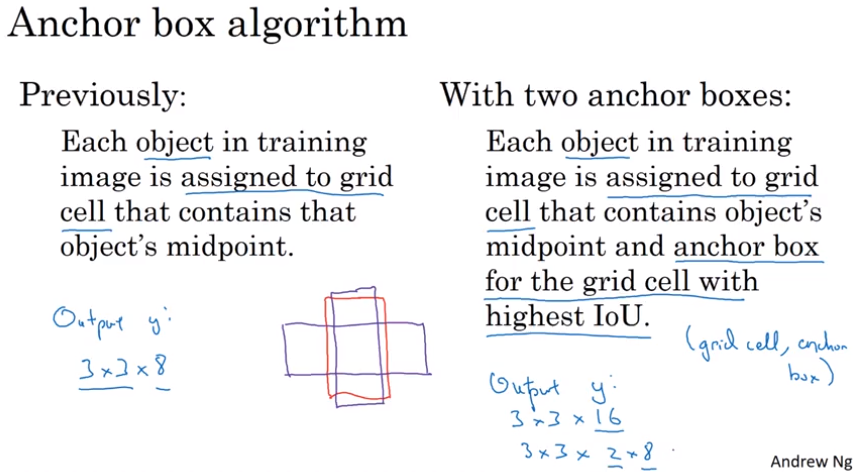

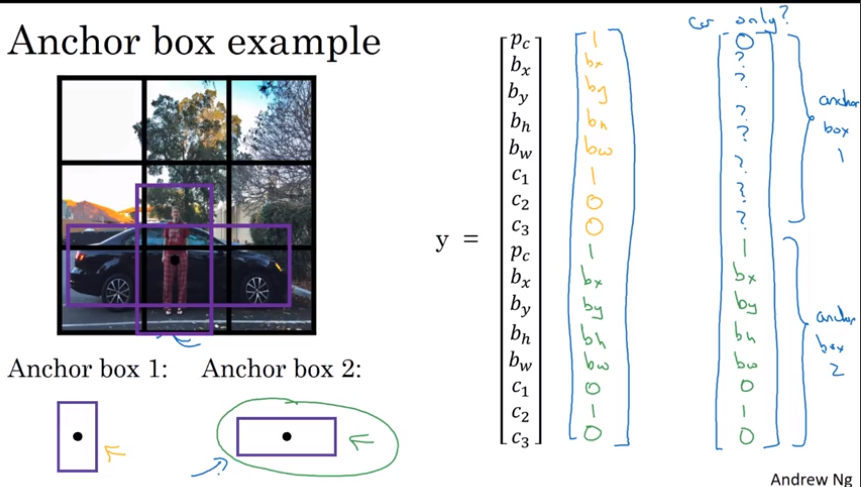

## YOLO Algorithm 

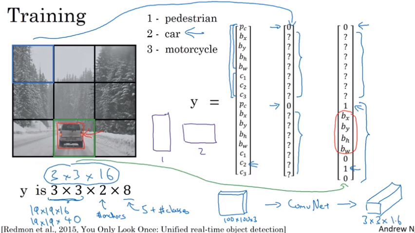

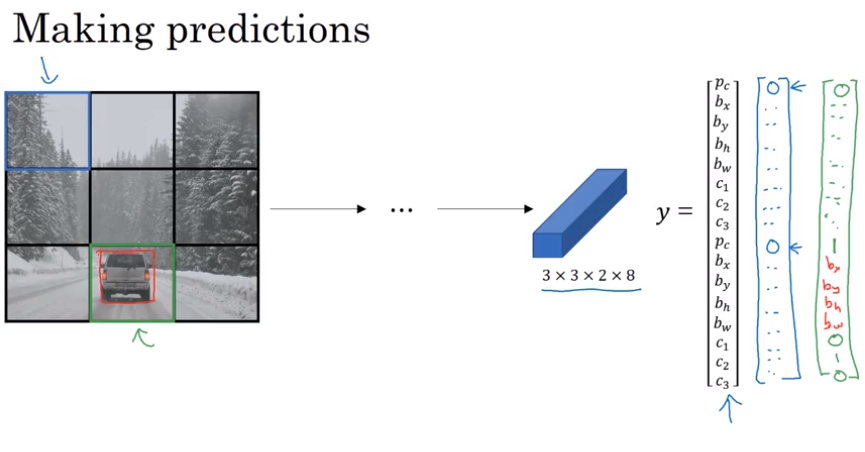

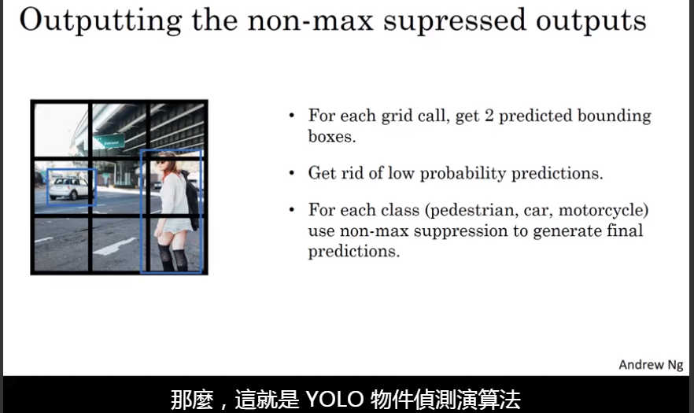