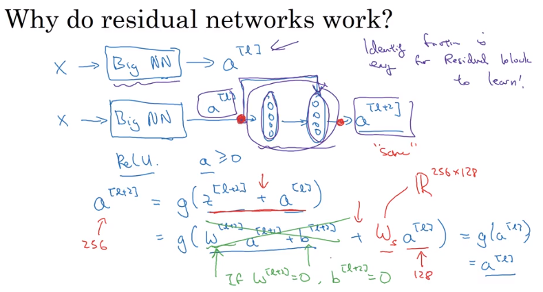

## Case studies

### 经典的神经网络

- LeNet-5
- AlexNet
- VGG

#### ResNet(很深的一个网络)

------

#### LeNet - 5

#### AlexNet

相对复杂的结构

#### VGG - 16

简化了神经网络架构

### 深度残差网络

### Networks in Networks and 1x1 Convolutions

1*1卷积的作用

- 基本是用一个全连接的神经网络(网络中的网路)
- 可以减少通道数量

### 在卷积网络中的实用建议

- Github
- 迁移学习，可以利用别人已经训练好的权重进行初始化，一个好处是即使样本很小也能获得不错的效果。
- 数据扩增
  - (图像镜射、随机裁剪、旋转，局部扭曲，shearing)
  - 颜色变化（颜色扭曲）
- 计算机视觉

