## CNN

- 参数共享
- 连接的稀疏性

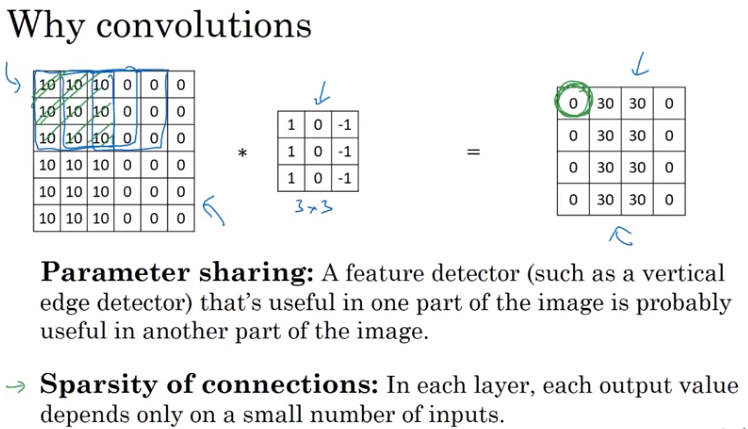

### Edge detection

#### 1. 垂直边缘检测

通过滤波器来对图片进行卷积计算，尺寸一般是基数

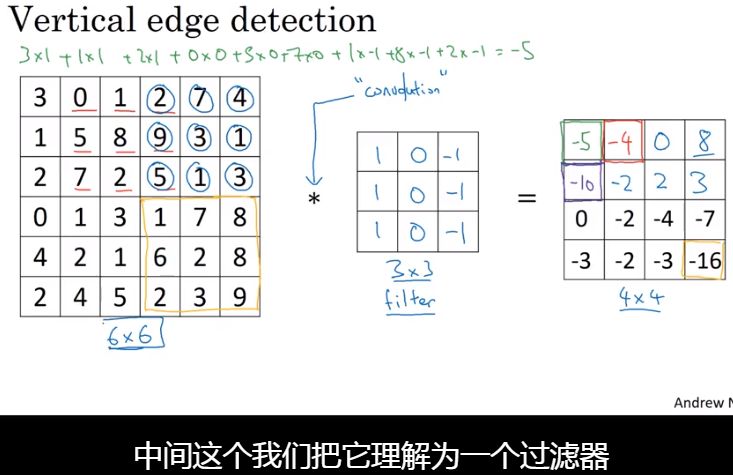

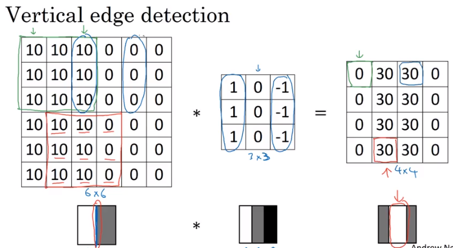

#### 2. Padding

- 在每一层卷积的时候，输出的图片尺寸不断变小，尤其是当网络很deep时
- 丢失边界上的信息

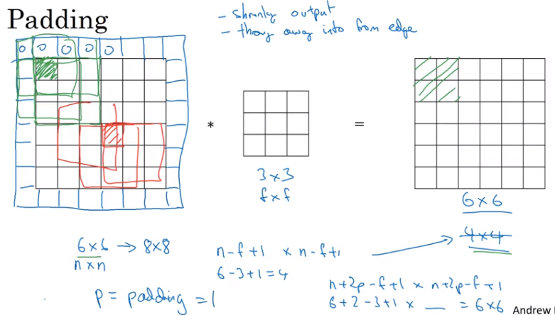

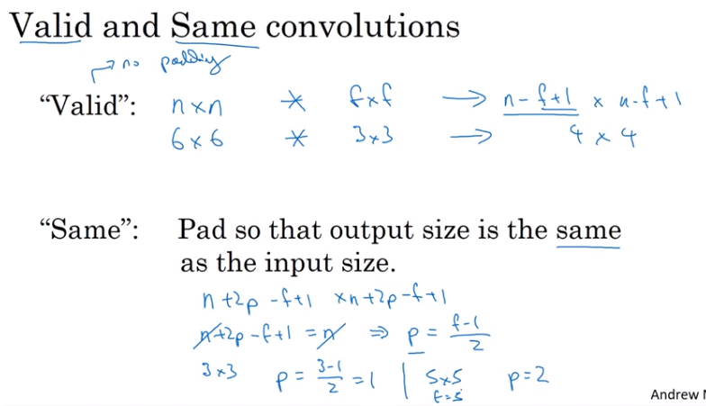

### Stride 步幅

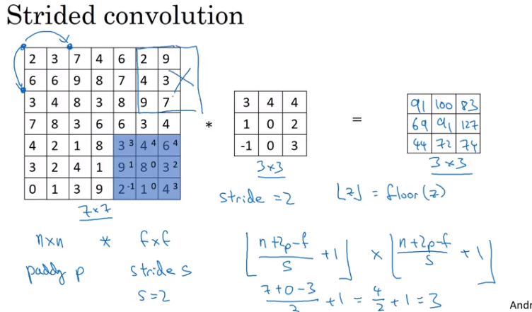

### Cross-correlation(深度学习所用的卷积) vs convolution

在深度学习中，通常忽略掉翻转操作

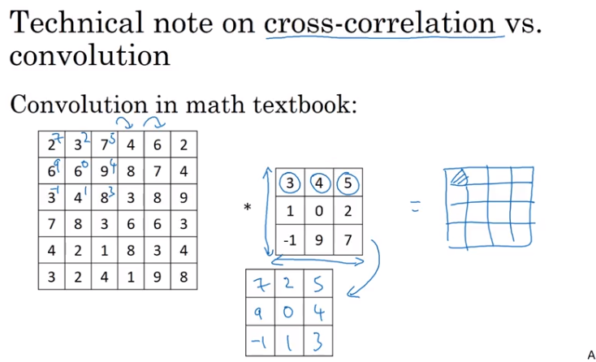

### 三维卷积

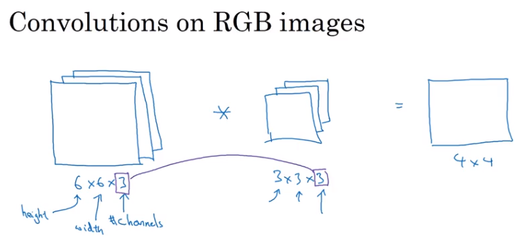

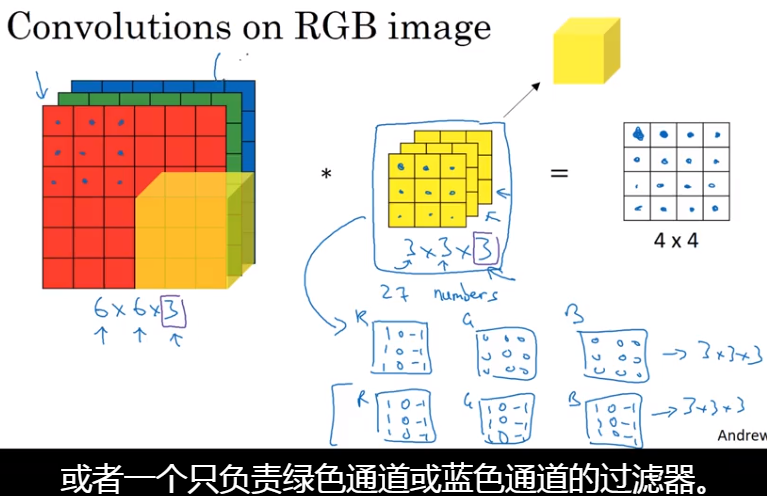

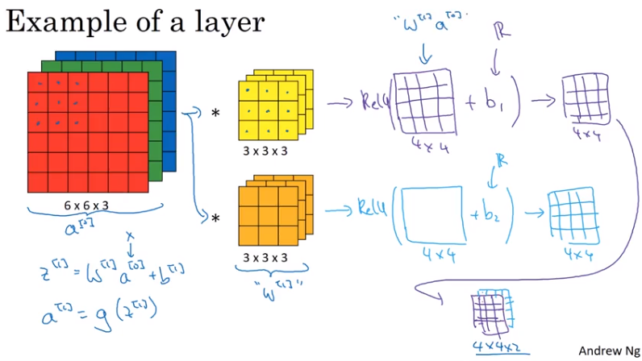

### One layer of CNN

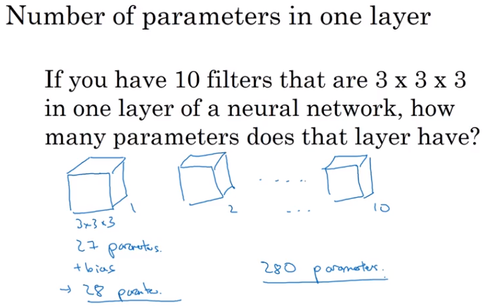

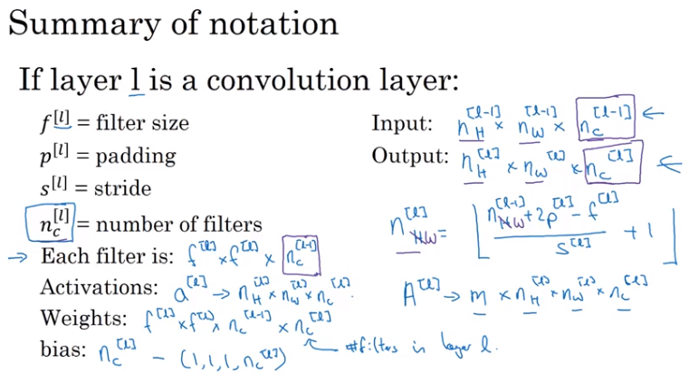

### Simple Convolutional Network Example

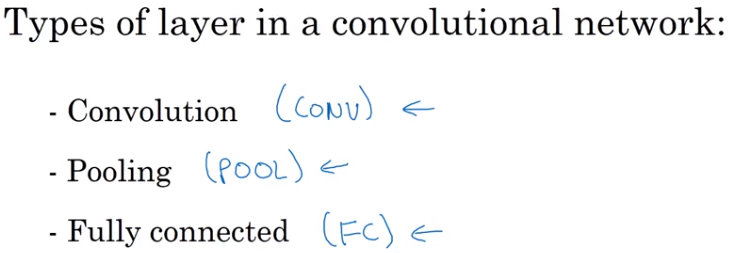

### Pooling

- Max pooling-效果好
- 均值pooling
- 有趣的是max pooling有一套超参但是不需要学习参数

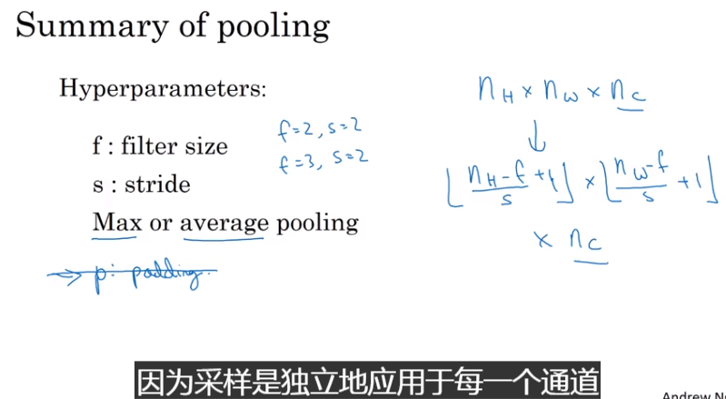

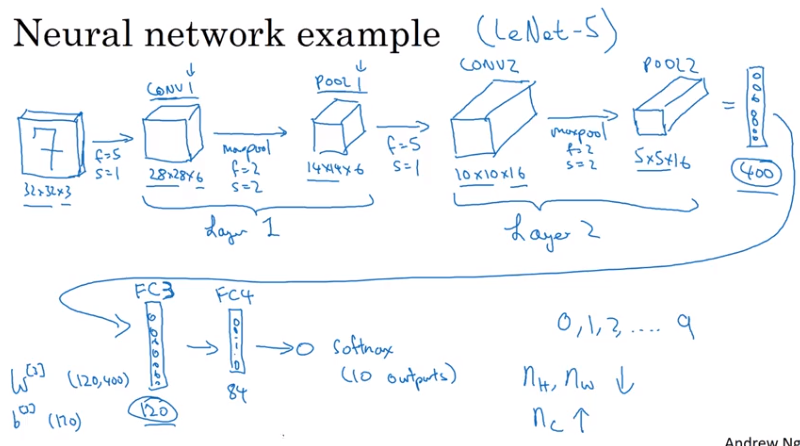

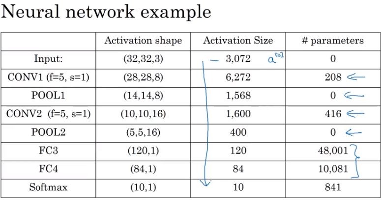