## Face Recognition

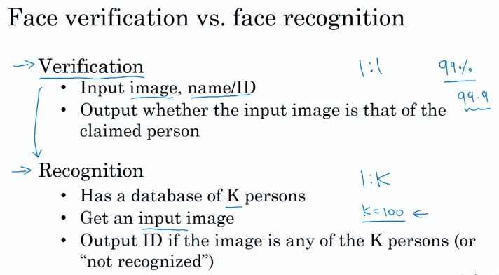

### 1. One shot learning

   通过一个样本识别人脸，需要一个**相似函数**来度量人脸间的相似性。

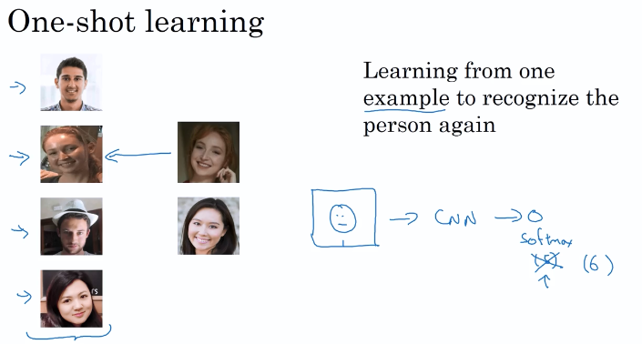

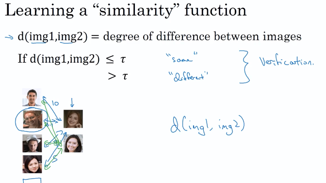

### 2. Siamese Network -   孪生网络架构

目标：当两张图很接近时，最后的编码输出的差距就很小，反之则很大

#### *两个神经网络具有相同的参数，如何训练？？？*

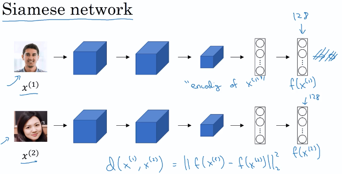

### 3. Triplet Loss - 三元组损失函数 

同时查看三张照片，这三张分别为锚照片，正例、负例

- 如何选择三种样本
  - 选择很难满足条件的数据，即正例与参照和负例和参照的差距类似，提高学习算法的效率

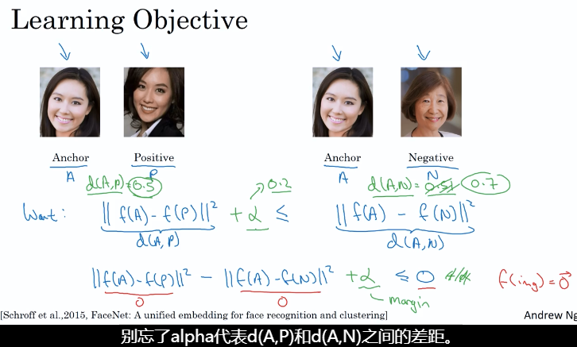

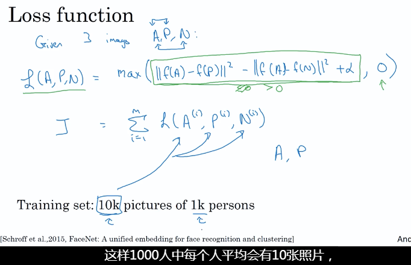

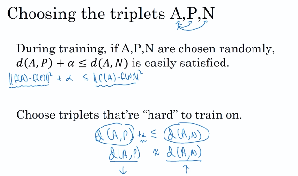

###4. Face Verification and Binary Classification

#### 另外一种训练方法

最后的逻辑回归单元

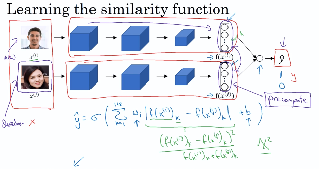

## 神经风格转移

例如将一幅内容图片和一张风格图片进行合成

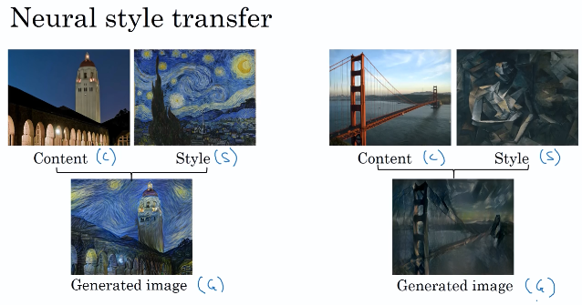

### 1. 那些很深的卷积网络在做什么？

### 2. Cost Function

- Content Cost Function
- Style Cost Function

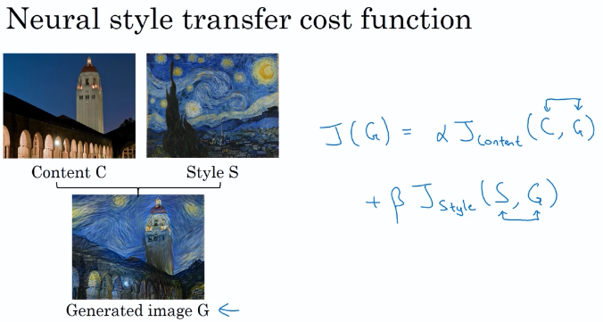

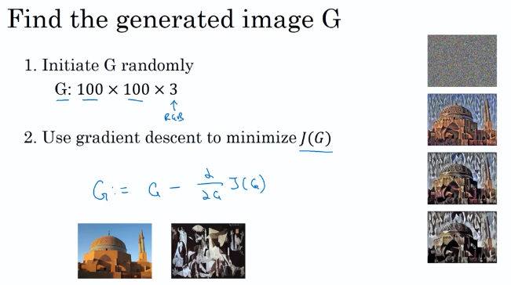

#### Content Cost Function

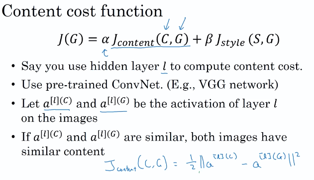

#### Style Cost Function

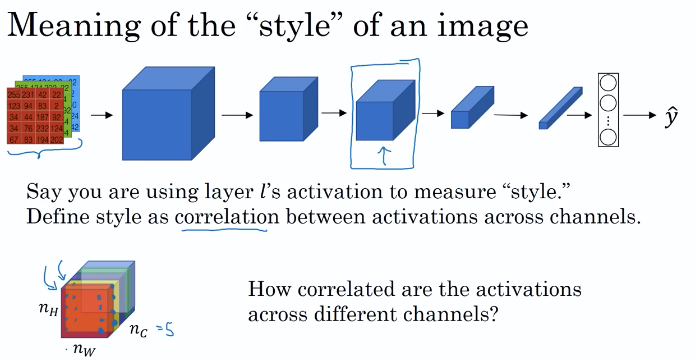

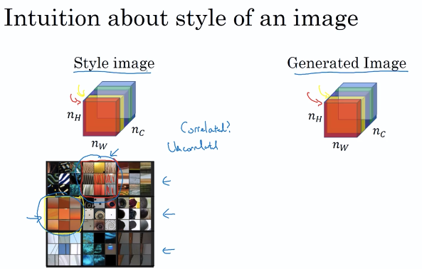

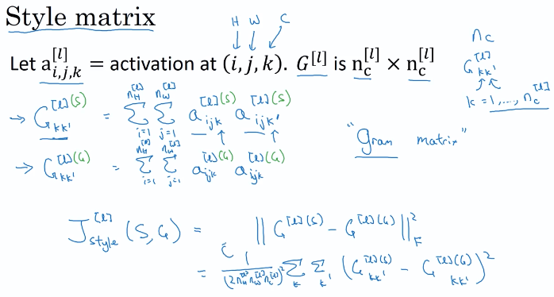

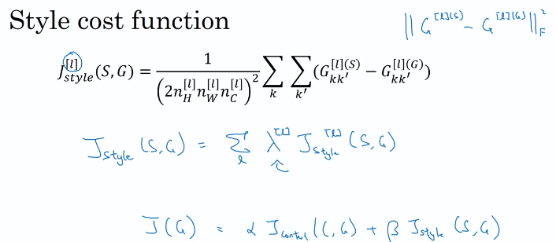

### 1D and 3D Generalizations

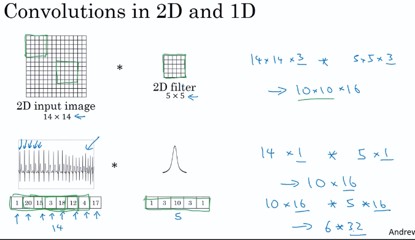

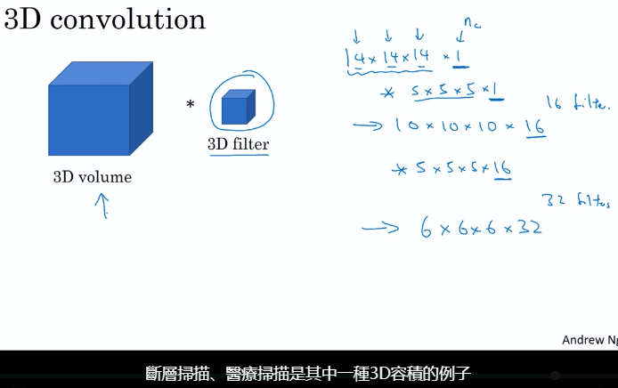