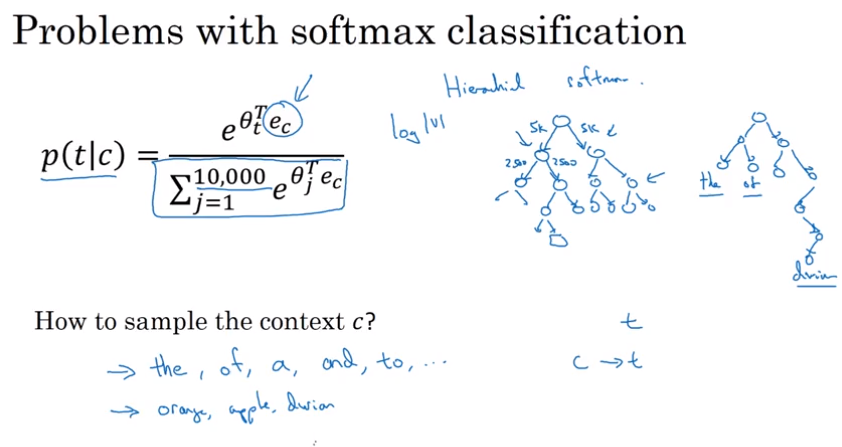

## Word Embeddings

### Word representation

如果每个单词都用一个向量来表示的话，相近的单词之间的相似性很难用距离来度量。

### Using word embeddings

### Properties of word embeddings

### Embedding matrix

## learning word embeddings

### Skip-grams

缺点：计算速度较慢 

####改进方法

- 引入hierachical softmax classifier(一般不是平衡树或者对称树)
- Negative Sampling

### Negative Sampling

得到一个正样本，故意生成一些负样本，然后用这些负样本来训练K-1个二元分类器，每次迭代中，随机选择K-1个负样本并用它们来训练你的算法。

##### 如何选择负样本？

- 一个极端是：可以根据词语出现的频率来抽样，**但是这样会得到一些代词、助词之类的词语（如，the、of、is...）**
- 另外一个极端：根据字典词汇量的倒数均匀地抽取负样本，但也不能很好的代表英语中的单词分布
- 于是有学者提出根据经验，选择两个极端的权衡

### GloVe word vectors

### Sentiment Classification- 情感分析

挑战：数据量不是特别大

求平均的简化模型忽视了词语的顺序 - 解决方法利用RNN

### Debiasing word embeddings - 减少形式的偏差(指的是性别、种族、性取向的偏差)

