## Various sequence to sequence architecture

### Basic Models

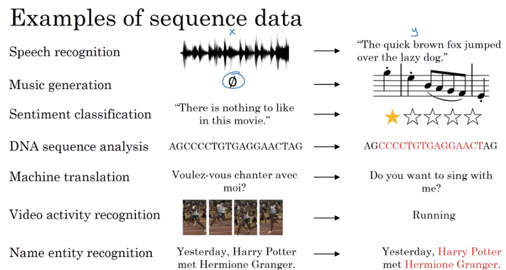

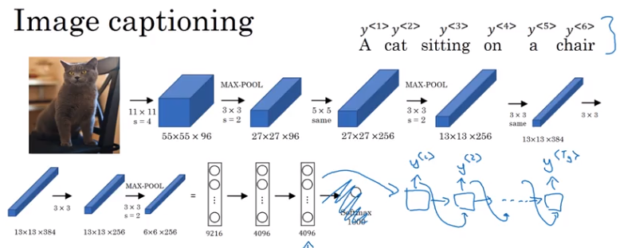

### Picking the most likely sentence

 机器翻译模型与语言模型非常相似

- Beam search
- greedy search - 一般结果不好

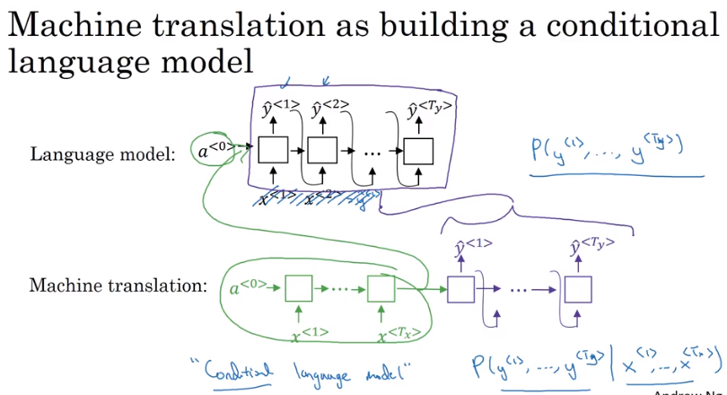

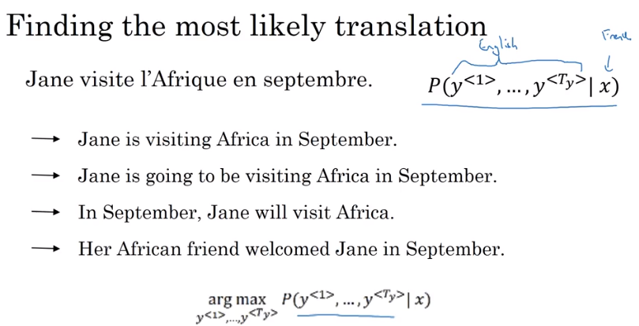

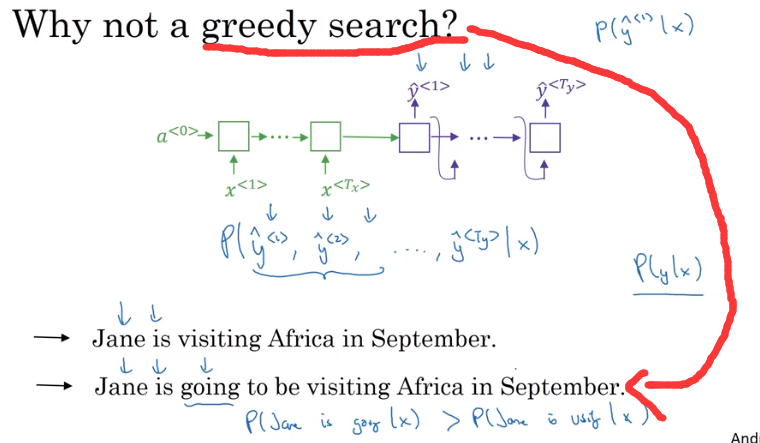

### Beam Search

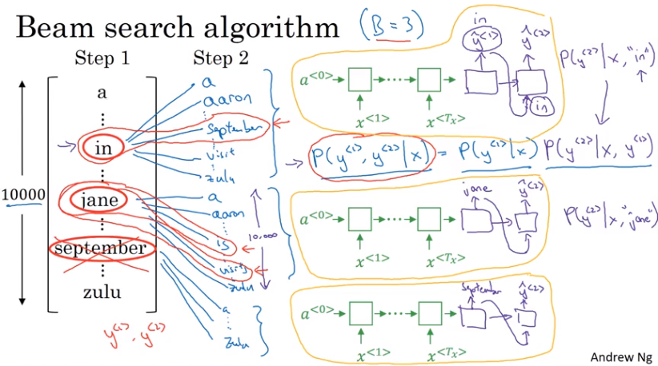

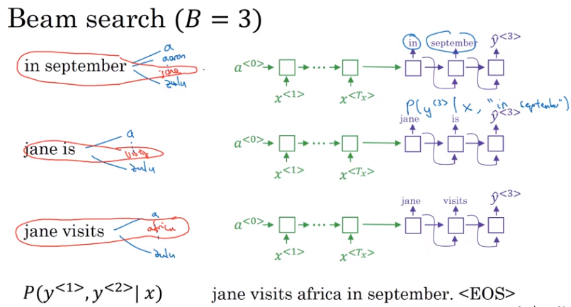

### Refinements to Beam Search

- 对目标函数进行改写和规范化
- 选择B（B越大，考虑的可能性越多，会得到更好的结果但是计算速度会变慢）

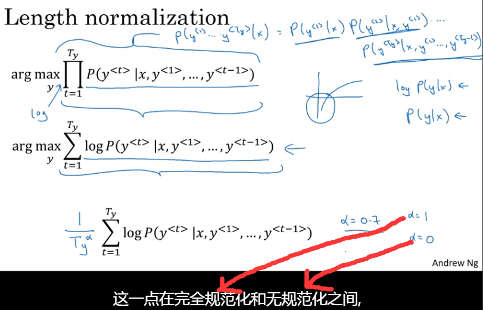

### Error analysis in beam search

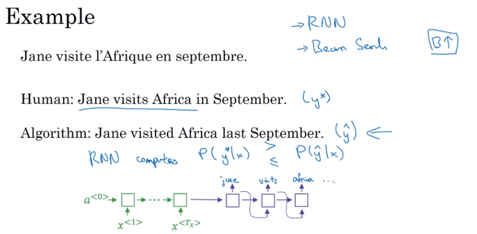

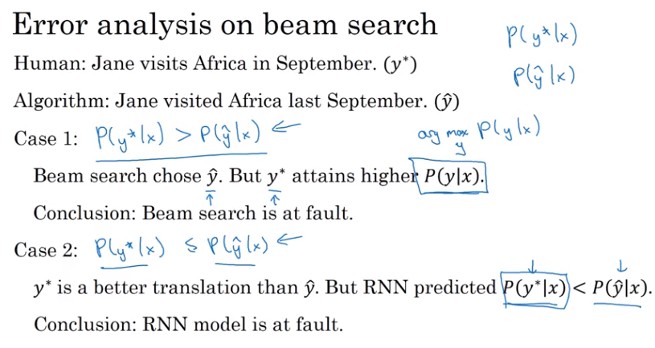

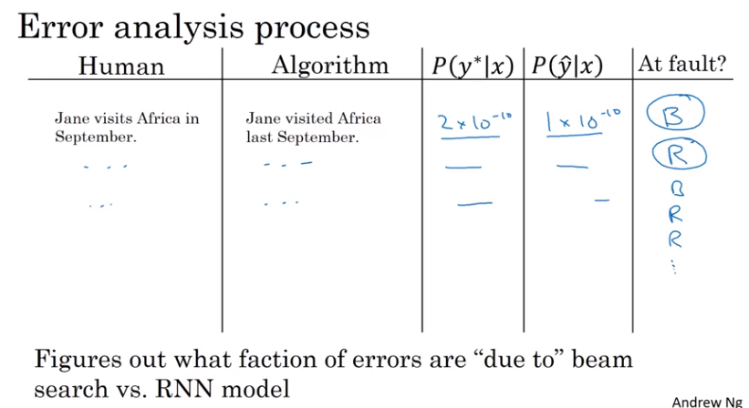

### Bleu Score (optional)

评价机器翻译的好坏

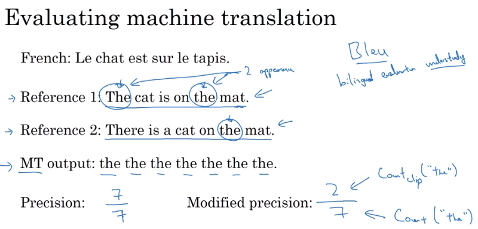

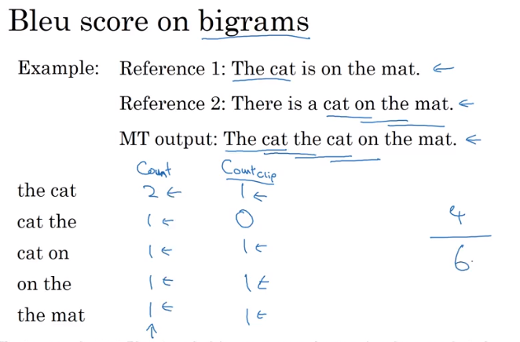

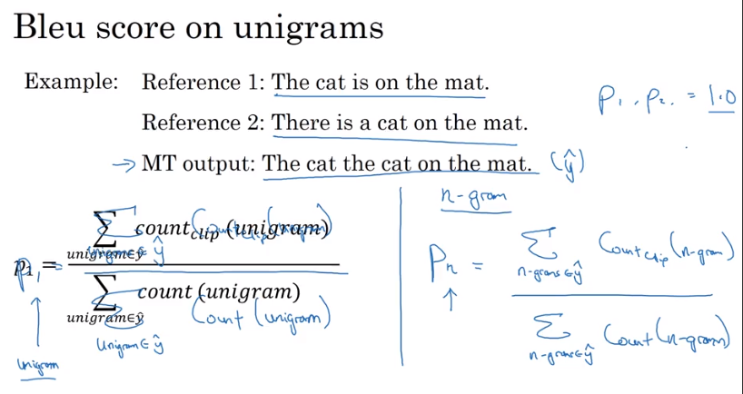

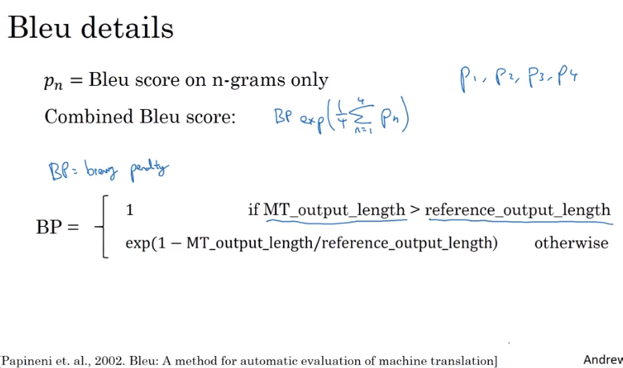

### Attention Model Intuition

**动机**：之前讲的都是encode-decode的结构，这种结构在机器翻译当中需要记住一整个句子然后再翻译

尤其是当一个句子中单词量很多的情况下，Bleu会比较低

Attention Model Intuition 注意力模型的实现过程与人的行为更为接近，在某个时间点只看句子的一部分

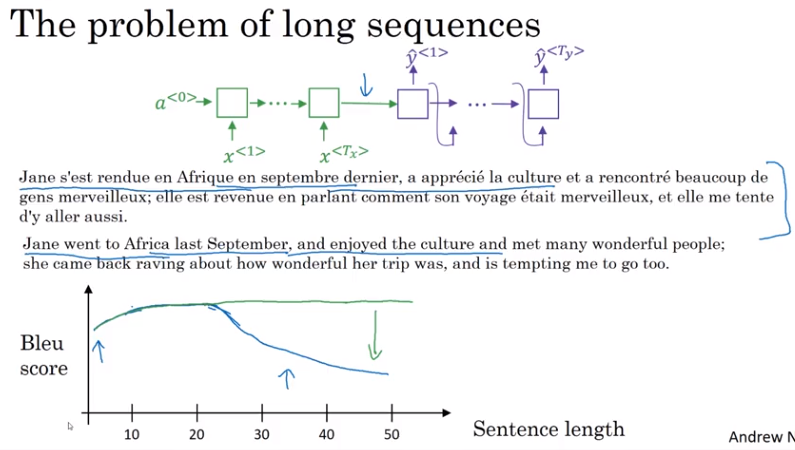

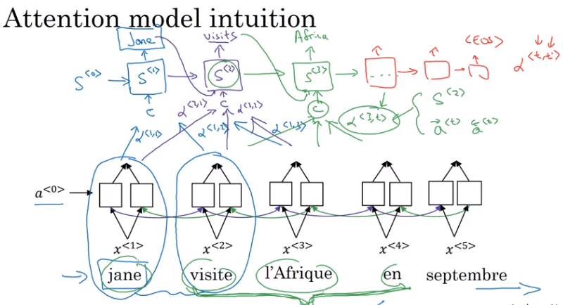

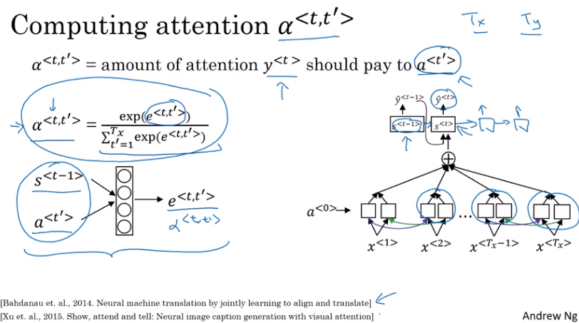

