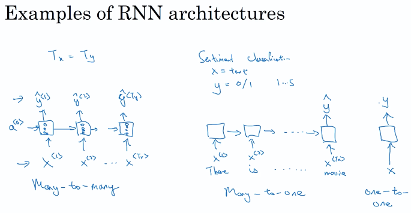

### Notation

### Recurrent Neural Network Model

- 与传统的神经网络相比，rnn不是一个标准的神经网络
  - 输入输出在不同的样本中长度不同
  - 不会将那些从不同的文本位置学习到特征进行共享
- rnn缺点：只使用序列中的先前的信息作出预测，而不使用后面的信息

### Backpropagation through time

### Different types of RNNs

Tx 不一定等于 Ty

### Language model and sequence generation

### RNN 梯度消失

（梯度爆炸更容易检测到，可以利用gradient clipping来处理）

不擅长捕捉长期关系，有附近效应，尤其是很深的网络当中

反向传播过程很难实际去影响前期的计算

解决方法

- GRU
- LSTM
- 

### GRU

### LSTM

比GRU更早出现，经过历史的检验

特点：不再使用单一的更新门控

#### 比较

- GRU 模型比较简单，更适用与构建较大的网络，因为只有两个门限，计算效率更高，可扩展性有利于构建较大的模型
- LSTM更加强大和灵活，因为具有3个门控
- ​

### Bidirectional RNN

传统的RNN只考虑前面的信息，而Bidirectional RNN 考虑双向的信息

- BRNN 的缺点是：需要整个数据序列，然后才能在任何地方进行预测
  - 例如在，在语音识别系统当中，BRNN需要整个演讲的内容才能实现预测-传统BRNN不适用于实时处理

### DRNN

