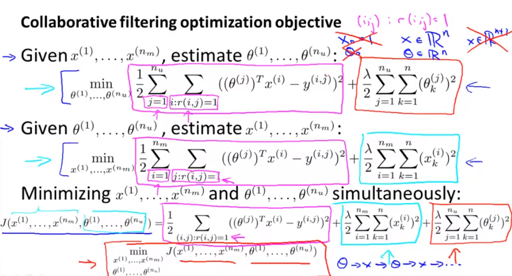

### 异常检测 Anomaly detection

### Gaussian Distribution

### Algorithm

#### density estimation

### evaluate anomaly detection algorithm

### 为什么要用异常检测算法

- 什么时候应该用异常检测算法？

  

  

  ​

### 异常检测的特征选择

- 非高斯的情况下怎么办？
  - 通过log函数转化特征

### 多元高斯分布

### 异常检测之多元高斯

### 什么时候用原始的gauss模型，什么时候用多远高斯模型

- 当运用多元高斯模型的时候发现协方差矩阵是奇异的，那么说明
  - m < n
  - 或者 协方差中存在两个线性相关的特征（重复特征）- 此时需要检查冗余特征

### 推荐系统

####1. 基于内容推荐的推荐系统

- ***其实是线性回归的变形***

*

### Collaborative Filtering - 协同过滤

This serves as symmetry breaking (similar to the random initialization of a neural network’s parameters) and ensures the algorithm learns features $x^{(1)}, \dots, x^{(n_m)}$ that are different from each other。

#### 如何推荐相关联的电影

### 均值归一化

.