## Support Vector Machine

凸优化问题，存在全局最优

### Large Margin Classification

逻辑回归与svm的一个区别是：

逻辑回归假设函数$h(\theta)$的输出是一个概率值，而svm的假设函数输出的是0或者1的离散值。

### Kernels

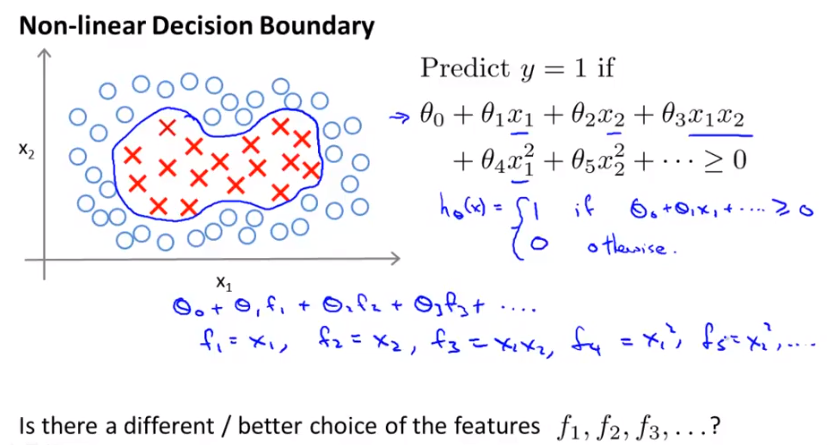

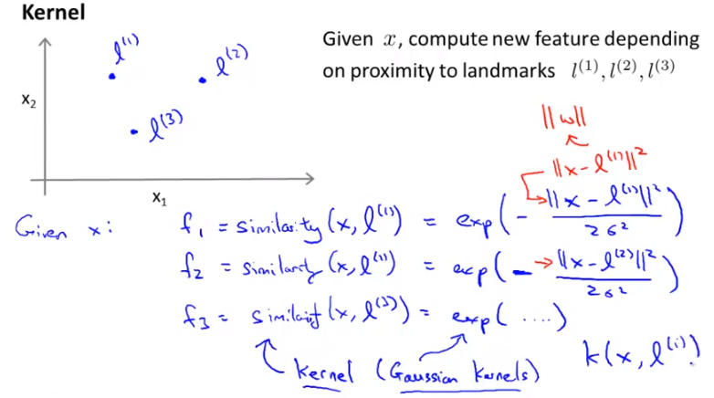

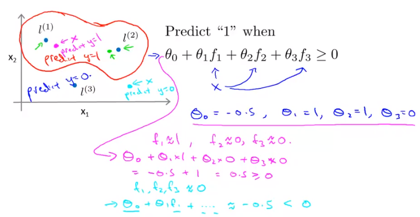

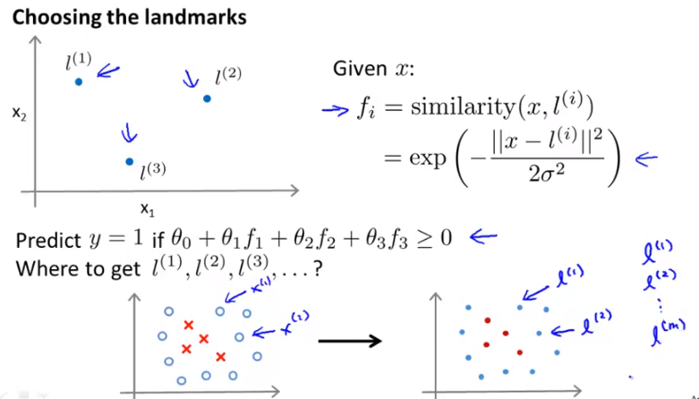

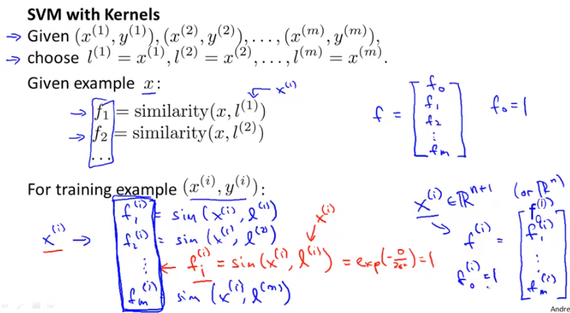

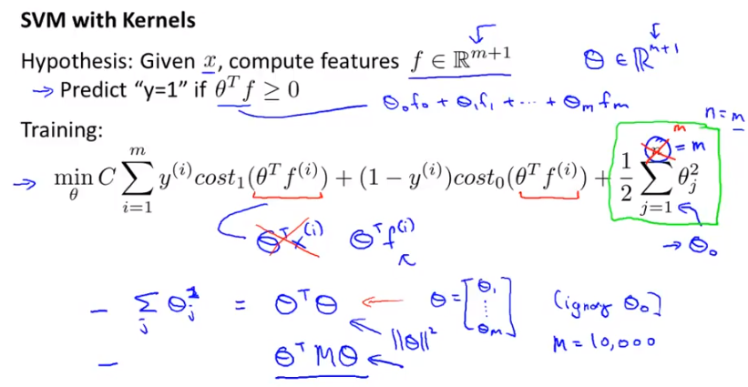

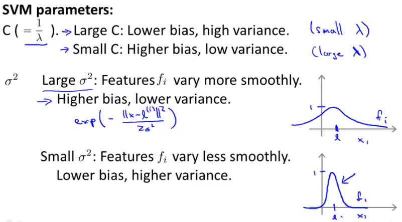

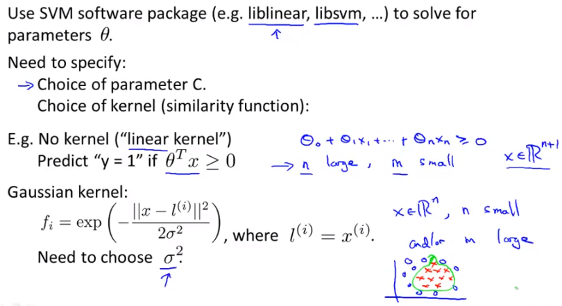

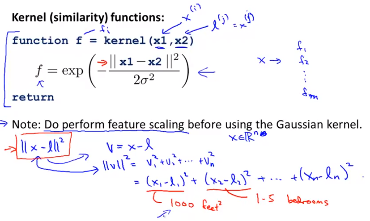

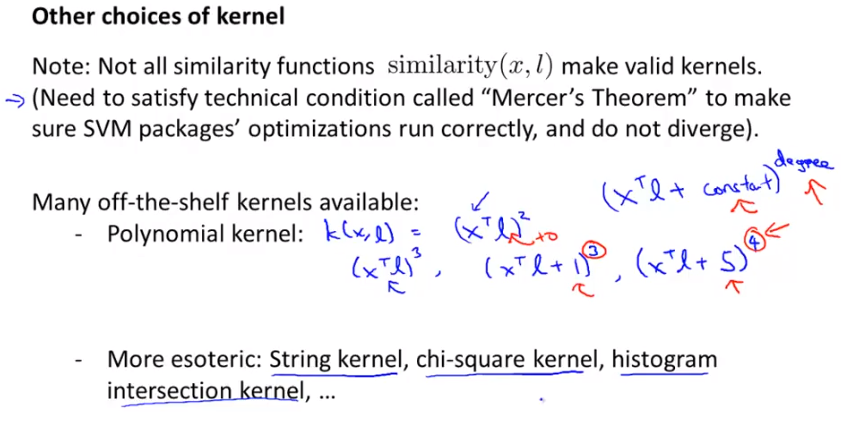

### multi-class classification

- one vs all like linear regression

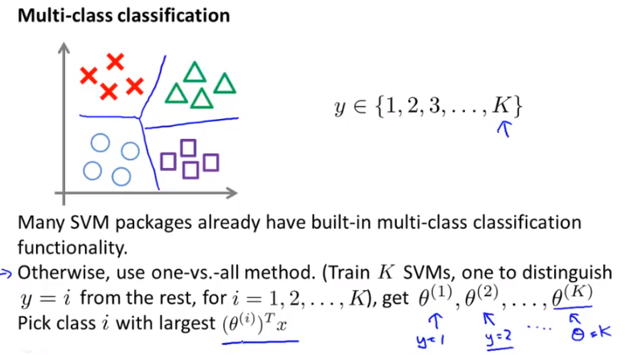

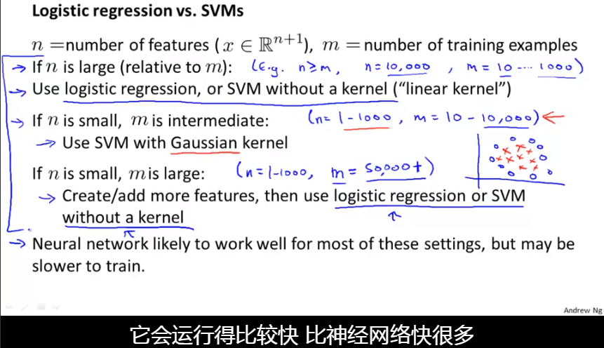