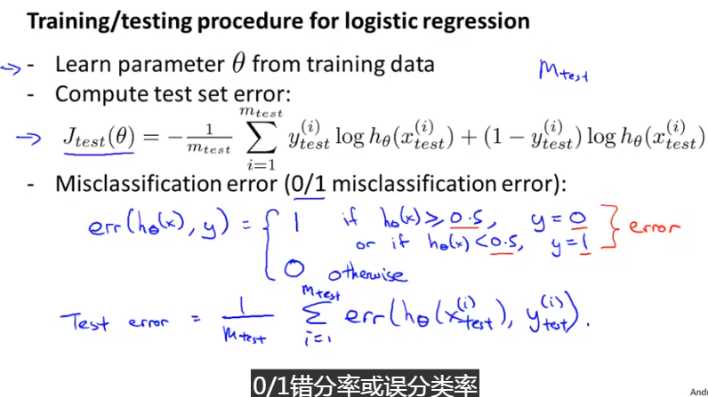
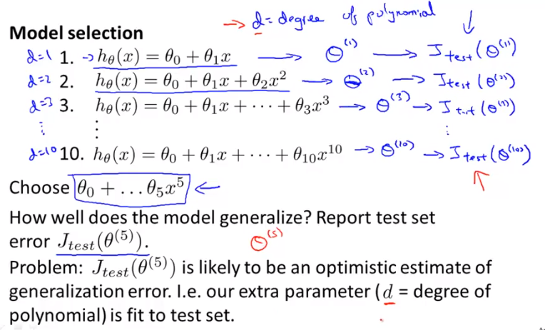
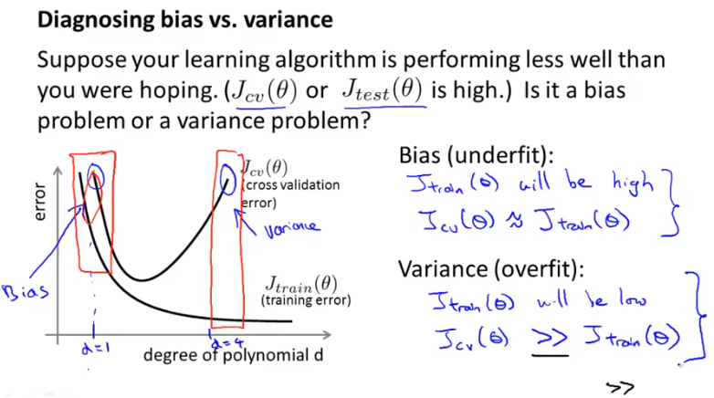
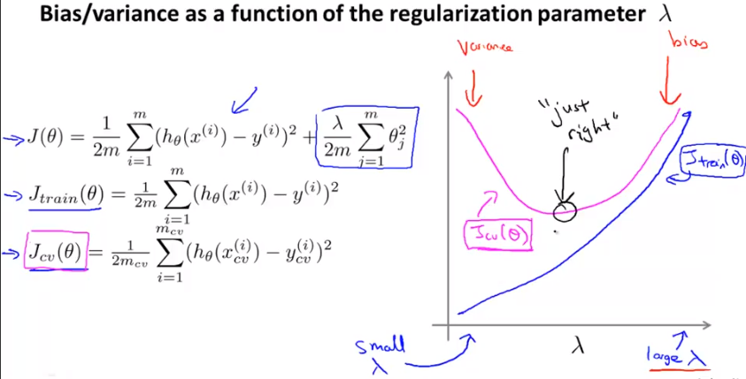
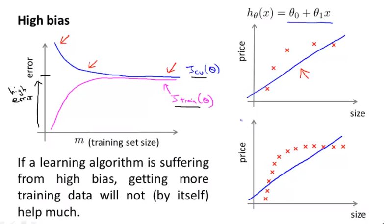
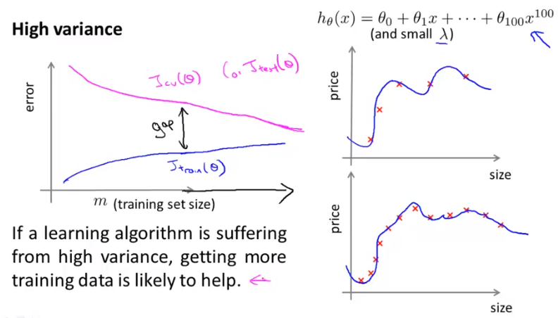
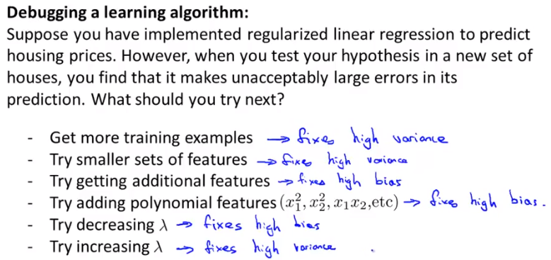
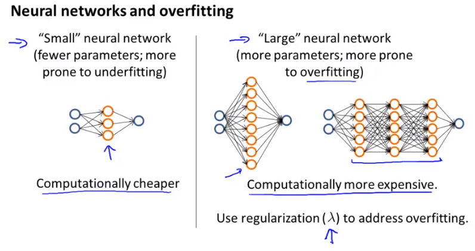

## Evaluation - Week6

### 1. debugging a learning algorithm

一般在实现完正规化后的线性回归会得到一组参数，但是在实际的测试当中，预测值与实际值差距很大，那么如何减小误差？

- 获得更多的训练数据

- 尝试更小的特征集

- 尝试获得额外特征

- 尝试加入多项式特征

- 尝试增加$\lambda$

- 尝试减小$\lambda$

  在实际当中，很多人**凭感觉选择一种方法**然后去优化学习算法，一般得不偿失。

##### * 机器学习诊断法*

一种测试方法：能够帮助你找到学习算法起作用以及不起作用的部分，为提升学习算法的性能提供指引。可能比较费时，但是仍然会为你节省时间。

### 2. 假设评估 - Evaluating a hypothesis

- 如何判断过拟合？

  - 将数据集分为数据集和训练集（一般7:3），然后利用训练集去学习参数，然后用测试集进行验证。

  

  ​

### 3. model selection and train/validation/test sets

- 模型选择
  - 要选择一种模型能够在训练集和测试集上都有很好的表现，如何保证一个模型在实际的预测中误差小？
    - 对数据集进行划分：**训练集、交叉验证集、测试集**
    - 具体操作：先通过训练集学习出不同模型的参数，然后利用交叉验证集去选择在交叉验证集中误差小的模型，最后将选择的模型用于测试集中，计算其泛化误差。

We can now calculate three separate error values for the three different sets using the following method:

1. Optimize the parameters in Θ using the training set for each polynomial degree.
2. **Find the polynomial degree d** with the least error using the cross validation set.
3. Estimate the generalization error using the test set with$ J_{test}(\Theta^{(d)})$, (d = theta from polynomial with lower error);

This way, **the degree of the polynomial d has not been trained using the test set**.

------

### Bias VS Variance

**High bias (underfitting)**: both $J_{train}(\Theta)$and$ J_{CV}(\Theta)$ will be high. Also, $J_{CV}(\Theta) \approx J_{train}(\Theta)$.

**High variance (overfitting)**: $J_{train}(\Theta)$will be low and$ J_{CV}(\Theta)$ will be much greater than $J_{train}(\Theta)$.

------

### Regularization and Bias/Variance

1. Create a list of lambdas$ (i.e. λ∈{0,0.01,0.02,0.04,0.08,0.16,0.32,0.64,1.28,2.56,5.12,10.24})$;
2. Create a set of models with different degrees or any other variants.
3. Iterate through the \lambdaλs and for each \lambdaλ go through all the models to learn some $\Theta$.
4. Compute the cross validation error using the learned Θ (computed with λ) on the$ J_{CV}(\Theta)$**without**regularization or λ = 0.
5. Select the best combo that produces the lowest error on the cross validation set.
6. Using the best combo Θ and λ, apply it on $J_{test}(\Theta)$ to see if it has a good generalization of the problem.

------

### Learning curves

### Neural network and over fitting

### **Diagnosing Neural Networks**

- A neural network with fewer parameters is **prone to underfitting**. It is also **computationally cheaper**.
- A large neural network with more parameters is **prone to overfitting**. It is also **computationally expensive**. In this case you can use regularization (increase λ) to address the overfitting.

Using a single hidden layer is a good starting default. You can train your neural network on a number of hidden layers using your cross validation set. You can then select the one that performs best.

**Model Complexity Effects:**

- Lower-order polynomials (low model complexity) have high bias and low variance. In this case, the model fits poorly consistently.
- Higher-order polynomials (high model complexity) fit the training data extremely well and the test data extremely poorly. These have low bias on the training data, but very high variance.
- In reality, we would want to choose a model somewhere in between, that can generalize well but also fits the data reasonably well.