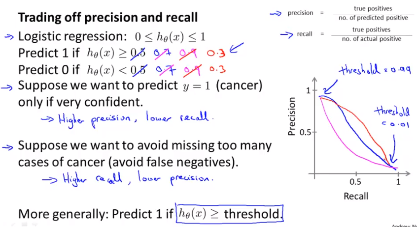

## Evaluation - Week6

### 1. debugging a learning algorithm

一般在实现完正规化后的线性回归会得到一组参数，但是在实际的测试当中，预测值与实际值差距很大，那么如何减小误差？

- 获得更多的训练数据

- 尝试更小的特征集

- 尝试获得额外特征

- 尝试加入多项式特征

- 尝试增加$\lambda$

- 尝试减小$\lambda$

  在实际当中，很多人**凭感觉选择一种方法**然后去优化学习算法，一般得不偿失。

##### * 机器学习诊断法*

一种测试方法：能够帮助你找到学习算法起作用以及不起作用的部分，为提升学习算法的性能提供指引。可能比较费时，但是仍然会为你节省时间。

### 2. 假设评估 - Evaluating a hypothesis

- 如何判断过拟合？

  - 将数据集分为数据集和训练集（一般7:3），然后利用训练集去学习参数，然后用测试集进行验证。

  

  ​

### 3. model selection and train/validation/test sets

- 模型选择
  - 要选择一种模型能够在训练集和测试集上都有很好的表现，如何保证一个模型在实际的预测中误差小？
    - 对数据集进行划分：**训练集、交叉验证集、测试集**
    - 具体操作：先通过训练集学习出不同模型的参数，然后利用交叉验证集去选择在交叉验证集中误差小的模型，最后将选择的模型用于测试集中，计算其泛化误差。

We can now calculate three separate error values for the three different sets using the following method:

1. Optimize the parameters in Θ using the training set for each polynomial degree.
2. **Find the polynomial degree d** with the least error using the cross validation set.
3. Estimate the generalization error using the test set with$ J_{test}(\Theta^{(d)})$, (d = theta from polynomial with lower error);

This way, **the degree of the polynomial d has not been trained using the test set**.

------

### Bias VS Variance

**High bias (underfitting)**: both $J_{train}(\Theta)$and$ J_{CV}(\Theta)$ will be high. Also, $J_{CV}(\Theta) \approx J_{train}(\Theta)$.

**High variance (overfitting)**: $J_{train}(\Theta)$will be low and$ J_{CV}(\Theta)$ will be much greater than $J_{train}(\Theta)$.

------

### Regularization and Bias/Variance

1. Create a list of lambdas$ (i.e. λ∈{0,0.01,0.02,0.04,0.08,0.16,0.32,0.64,1.28,2.56,5.12,10.24})$;
2. Create a set of models with different degrees or any other variants.
3. Iterate through the \lambdaλs and for each \lambdaλ go through all the models to learn some $\Theta$.
4. Compute the cross validation error using the learned Θ (computed with λ) on the$ J_{CV}(\Theta)$**without**regularization or λ = 0.
5. Select the best combo that produces the lowest error on the cross validation set.
6. Using the best combo Θ and λ, apply it on $J_{test}(\Theta)$ to see if it has a good generalization of the problem.

------

### Learning curves

### Neural network and over fitting

### **Diagnosing Neural Networks**

- A neural network with fewer parameters is **prone to underfitting**. It is also **computationally cheaper**.
- A large neural network with more parameters is **prone to overfitting**. It is also **computationally expensive**. In this case you can use regularization (increase λ) to address the overfitting.

Using a single hidden layer is a good starting default. You can train your neural network on a number of hidden layers using your cross validation set. You can then select the one that performs best.

**Model Complexity Effects:**

- Lower-order polynomials (low model complexity) have high bias and low variance. In this case, the model fits poorly consistently.
- Higher-order polynomials (high model complexity) fit the training data extremely well and the test data extremely poorly. These have low bias on the training data, but very high variance.
- In reality, we would want to choose a model somewhere in between, that can generalize well but also fits the data reasonably well.

### 垃圾邮件识别

通过对邮件中单词的统计实现垃圾邮件判别。

- 如何实现高精度的邮件判别
  - 收集足够数据(但并不总是是实用的)
  - 构建基于邮件路由（从邮件头）的复杂特征
  - 构建基于邮件正文的复杂特征：例如，discount和discounts是否应该区别对待？deal和dealer？关于标点的？
  - 实现更为复杂的算法来检测（故意）拼写错误的情形

### Error analysis

- 一般尽可能通过简单的的算法实现该问题，然后利用验证集测试模型效果
- 绘制学习曲线来决定是否增大数据量或者增加特征能够提升模型精度
- 误差分析，人为的去检测那些被误分类的数据，发现其被误分类的系统规律，找出一些最难被分类正确的样本的特征。

It is very important to get error results as a single, numerical value. Otherwise it is difficult to assess your algorithm's performance. For example if we use stemming, which is the process of treating the same word with different forms (fail/failing/failed) as one word (fail), and get a 3% error rate instead of 5%, then we should definitely add it to our model. However, if we try to distinguish between upper case and lower case letters and end up getting a 3.2% error rate instead of 3%, then we should avoid using this new feature. Hence, we should try new things, get a numerical value for our error rate, and based on our result decide whether we want to keep the new feature or not.

### Error metrics for Skewed Classes

数据中类别比例不均衡-**偏斜类**（例如，正例特别多，负例特别少）

- 当遇到偏斜类问题时，如何衡量算法的优劣？

  精确度和召回率：用于高的precision和recall的模型更好

### precision 和 recall的权衡

- 当给出不同算法的precision和recall，如何判断哪种算法更好？

  - F1 score:  $2\frac{PR}{P+R}$.

  - 只有当P和R都很大的时候，F才会比较大

    ​

### Using large data

- 前提是特征要尽可能的包含相关信息，才能利用大量数据实现高性能的学习算法。

