## week 10

### learning with large datasets

- 为什么要用大量的数据进行训练
  - 画学习曲线。如果是过拟合的话，就更有自信考虑用更多的数据。如果是欠拟合的话，则不应该考虑用大数据。先用数量少的数据进行训练，如果效果不佳再考虑更多的数据

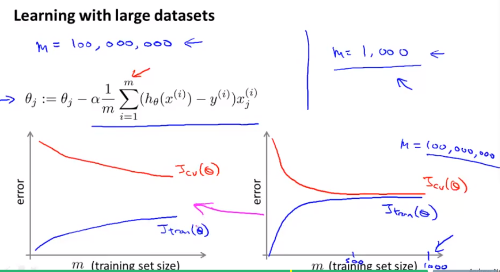

### 随机梯度下降 - SGD

在数据量大的情况下，采用传统的梯度（BGD）下降方法的收敛速度慢，而采用随机梯度下降更快，虽然收敛的过程比较曲折。

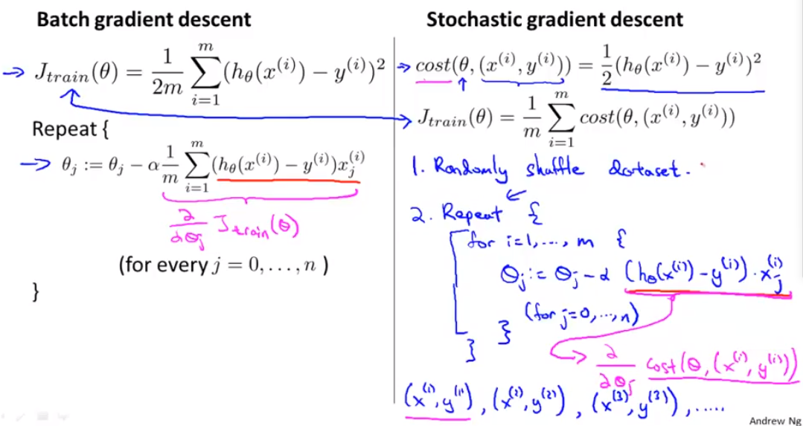

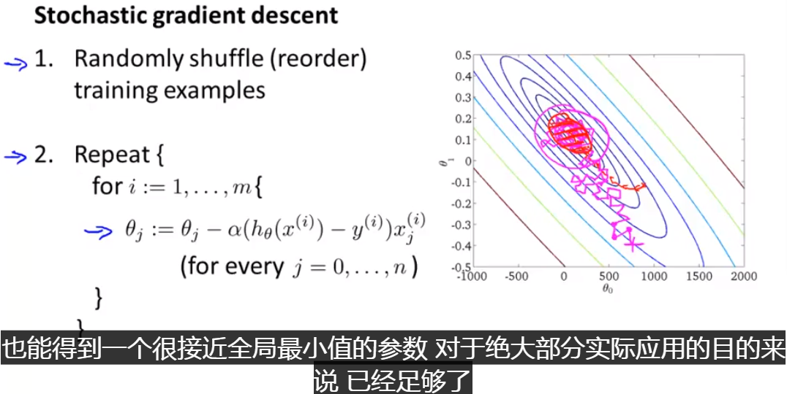

### Mini-batch gradient descent

一种介于BGD和SGD之间的方法

- 这里需要多增加一个参数b，b的选择可能需要一点时间，一般b取10
- 由于并行运行的存在，MSGD的计算效率会比SGD快

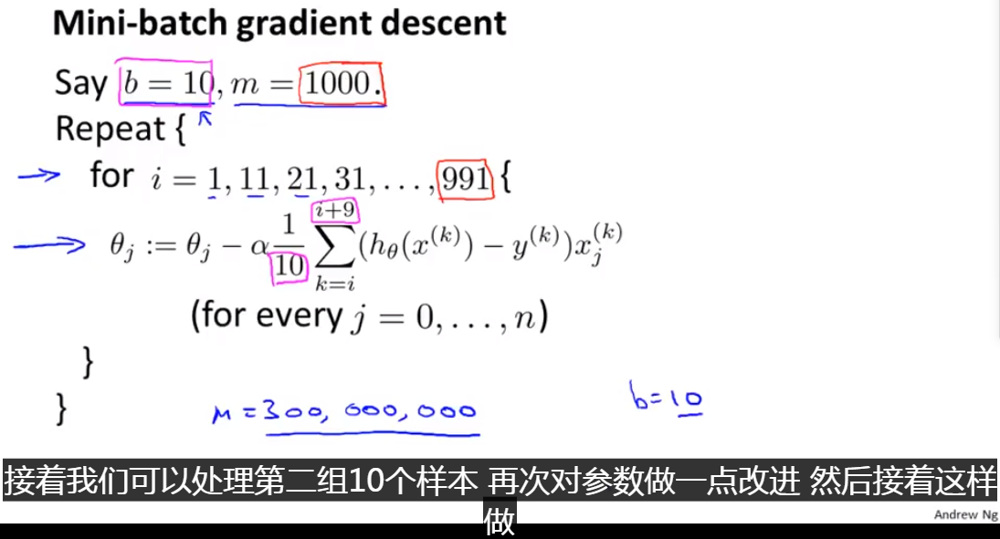

### SGD 收敛性

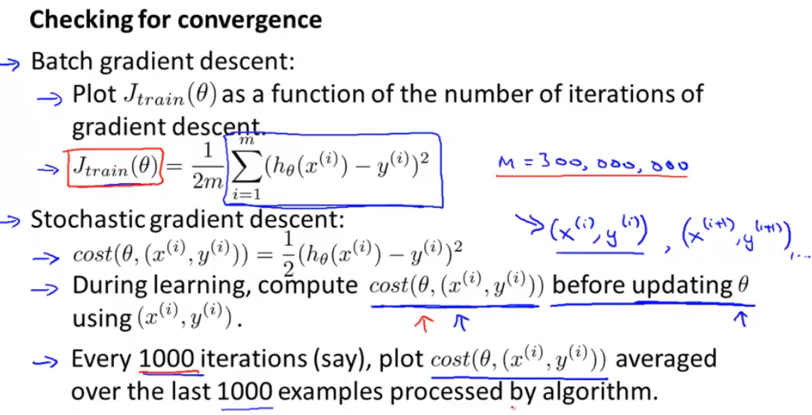

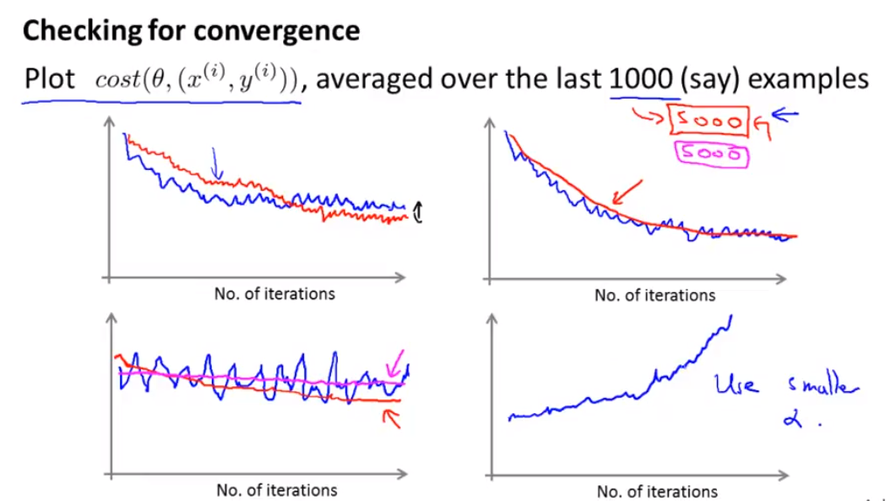

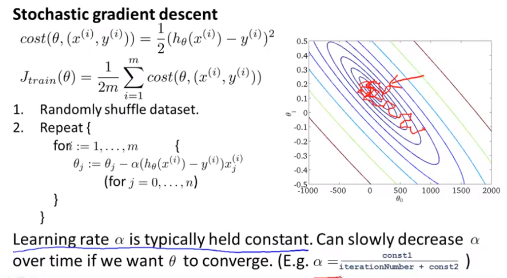

### Online Learning

使用的算法与随机梯度下降类似，唯一的区别是它***不会使用一个固定的数据集***。

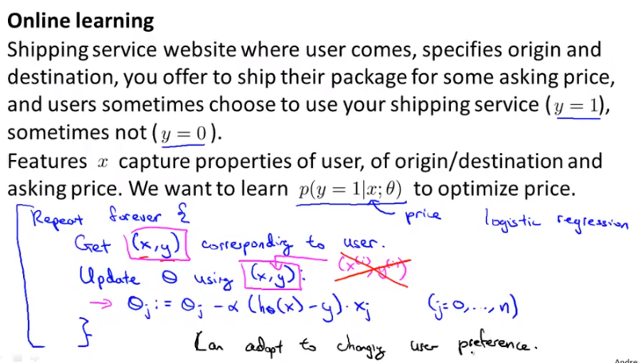

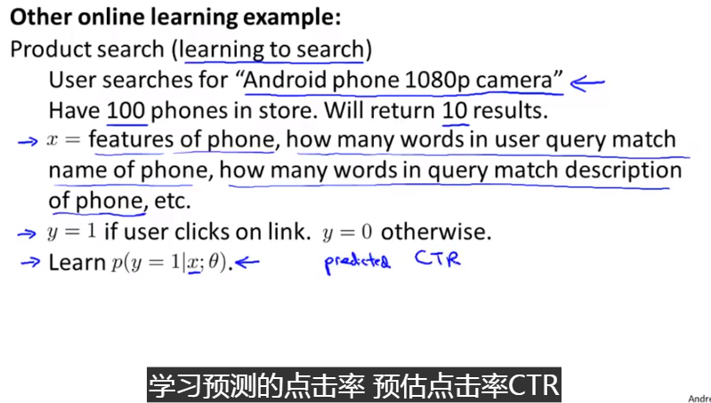

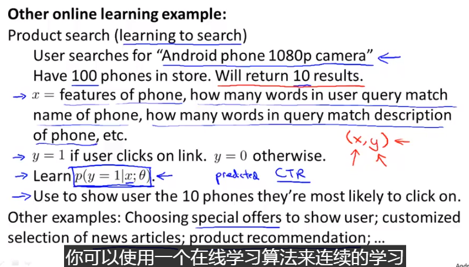

### Map reduce and data parallelism

#### 映射化简算法

数据分开训练（在不同的machine上训练），然后将训练的结果合并

- 只要训练函数可以表示为训练数据的求和形式，可以考虑map reduce

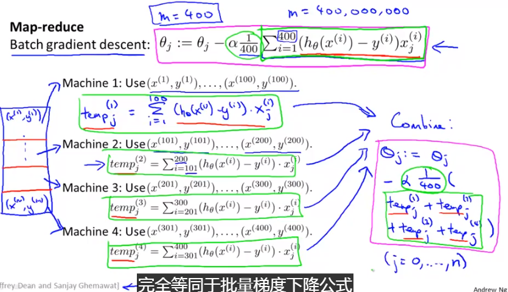

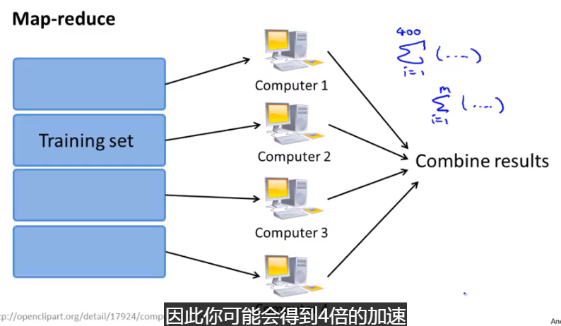

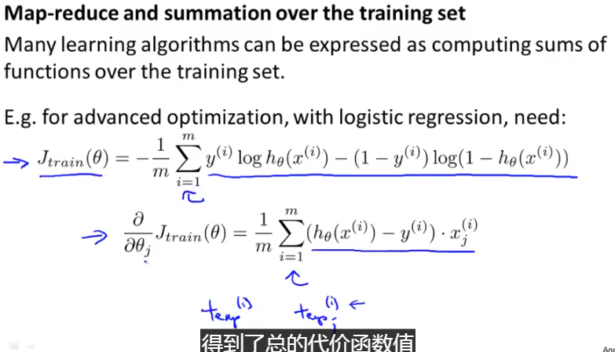

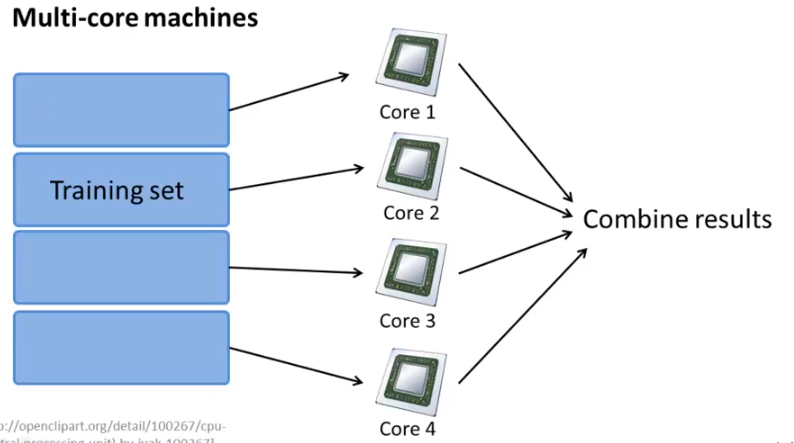