# WEEK 1

##1. machine definition

Tom Mitchell provides a more modern definition: "A computer program is said to learn from **experience E** with respect to some class of **tasks T** and **performance measure P**, if its performance at tasks in T, as measured by P, improves with experience E."

Example: playing checkers.

E = the experience of playing many games of checkers

T = the task of playing checkers.

P = the probability that the program will win the next game.

In general, any machine learning problem can be assigned to one of two broad classifications:

Supervised learning and Unsupervised learning.

### supervised learning

指寻找一种算法，在给定拥有正确答案的数据(training data)的前提下，去尽可能正确估计输入与输出之间的关系，并利用未知的数据 - test data(连续与离散)进行估计

- ***housing price prediction***

  - try to predict the house price and price as a function of size is a continuous output

  - **regression problem**

- ***breast cancer***（malignant， begin）

  - **classification problem**, try to classify correctly as higher as possible

  - 肿瘤的size和良性与恶性的关系 - one dimension/feature

  - we can also consider other features: like cell shape, clump thickness and so on

    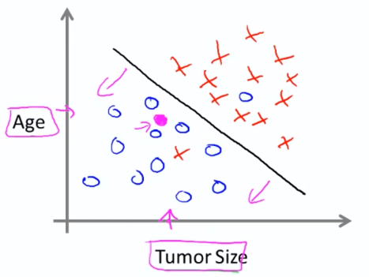

    ------

    ​

### unsupervised learning

允许对不知道结果的数据进行学习，在不需要知道变量所起作用的情况下由数据产生相应的结构，这种结构是基于数据中变量间的关系通过聚类得到的。由此可知，无监督学习没有基于预测结果的反馈（所给的数据并不知道它的标签，而是对这些数据进行聚类，将相近的数据归为一类）

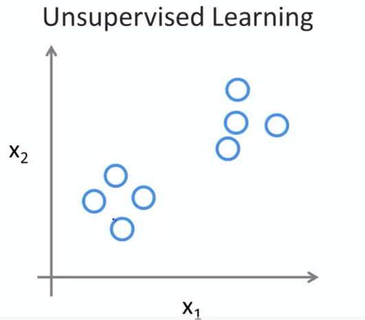

- 应用

  - Social network analysis
  - Market segmentation
  - organize computing clusters
  - Cocktail party problem

- 聚类 example:

  - 基因聚类

- 非聚类 example：

  - Cocktail party problem

  allows you to find structure in a chaotic environment. (i.e. identifying individual voices and music from a mesh of sounds at a [cocktail party](https://en.wikipedia.org/wiki/Cocktail_party_effect))

------

## Model and Cost Function

####- Model

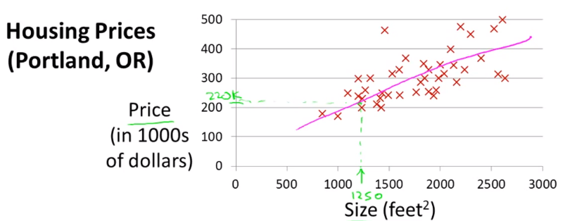

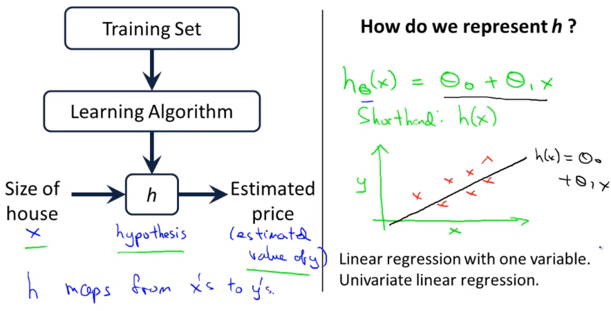

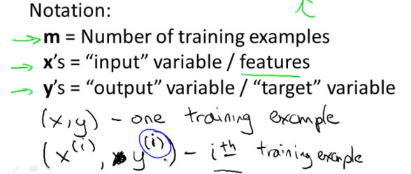

给定一个训练集去学习一个函数$h$: 这个函数$h$ 是实现$X -> Y$ 的映射。所预测的结果的好坏能够反映$h(x)$ 的性能。这里的$h$ 称为 一个假设hypothesis。具体流程如上图所示。这里如果我们所要预测的结果是连续的，就将这问题归类为回归问题，反之如果是离散的话则为分类问题。

#### - Cost Function

利用代价函数来衡量假设函数的精度，它是利用所有样本的输入和实际输出的差的平均结果作为代价函数的

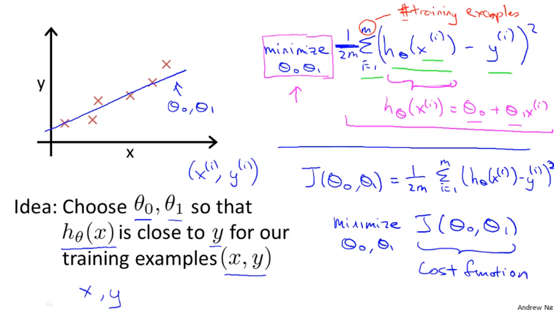

对于回归问题，一个直观的想法就是找一条线能够尽可能的靠近每个样本点。**如何衡量一条线与样本点的接近程度呢？**

- 通过参数$\theta_0$,$\theta_1$的选择使得$h_{\theta}(x)$能够尽可能接近y值（实际值）

- 利用均方差(Square error)构造代价函数，在求$J(\theta_0,\theta_1)$最小化的过程就是该假设 $h(x)$学习的过称

  *当然除了平方误差代价函数，还有其它的代价函数。但平方误差代价函数可能是解决回归问题最常用的手段.*

  ​

  ​

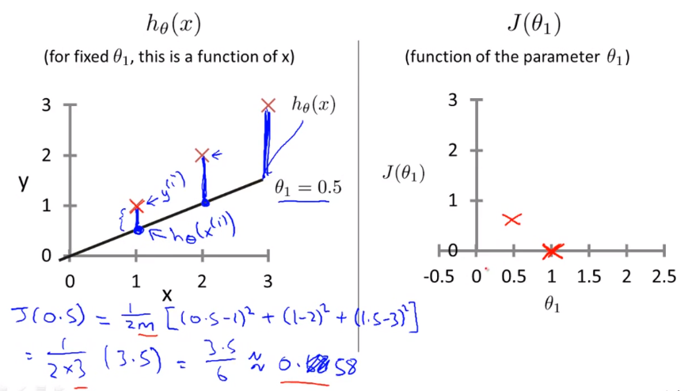

对于每一个假设$h$，针对已有的样本（训练数据），都有一个对应的代价值，具体代价函数的分布如右上角所示，即存在一个极值点使得代价函数的值最小, $\theta_1 = 1$是全局最优

- contour plot （轮廓图）包含很多轮廓线，两个变量的轮廓线在同一条线上有一个常数值，即上面的任何点对应的值都一样。右下图中，三个绿色点所对应的代价函数值是一样的。代价函数值最小的位置时在图的中间位置。

  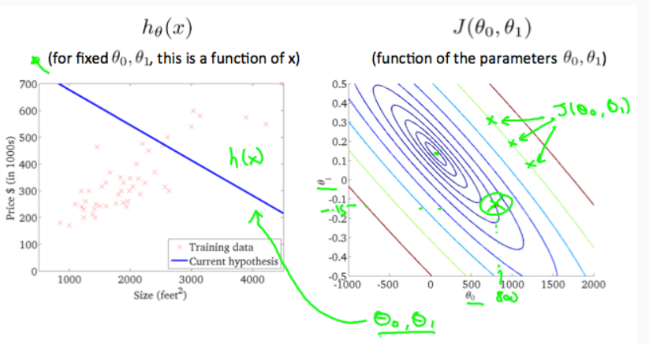

  

  ------

  ​

### How to minimize $J(\theta)$? --------Gradient Descent（GD）

在我们已经有了hypothesis function 并且已经有了衡量该模型与实际数据的拟合程度的方法的前提下，就需要对参数进行估计，于是需要GD的帮助。

- 初始化 $\theta_0, \theta_1$
- 一直改变 $\theta_0, \theta_1$ 来减小$J(\theta)$直到找到local minimum
  - which direction to choose ?

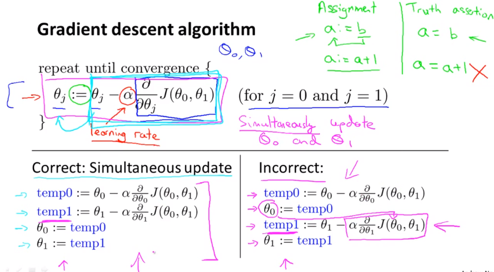

代价函数中的参数通过利用负梯度信息进行参数更新。***值得注意的是：gradient descent 的更新是指同步更新***虽然上图中两种更新方式都能够实现参数的求解，但是左式是作为公认的更新方法，即进行下一轮更新之前需要完成当前所有变量的更新。右边是错误的实现方式，具体为什么就不好解释。。。

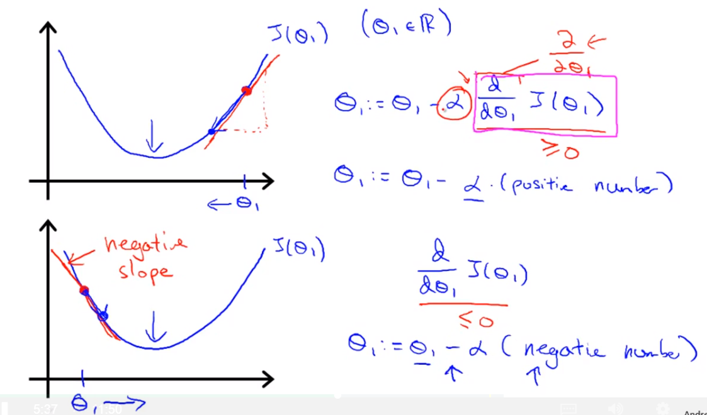

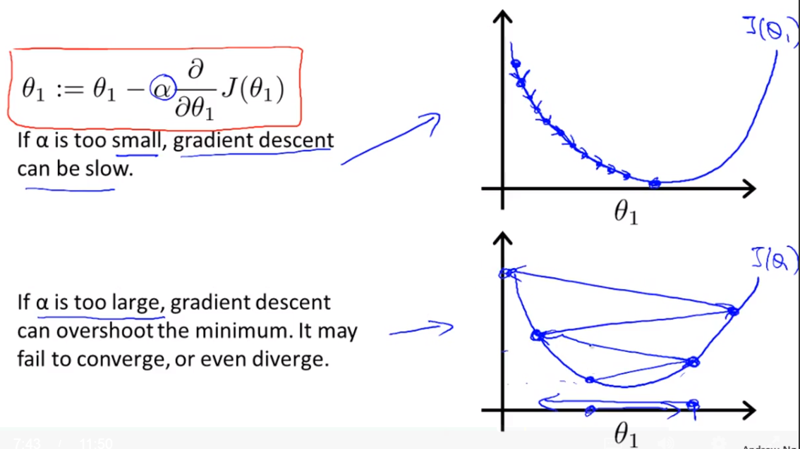

***当学习率设置太小的话收敛速率非常慢，而当学习率设置的很大的话，很可能出现发散的情况，找不到局部最优。***

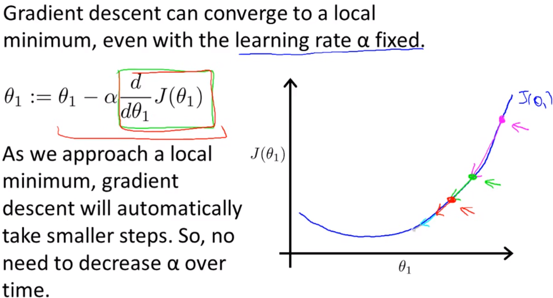

即使学习率是一个固定值（但是不能太大，否则会发散），梯度下降法也能够自动收敛，这是因为越靠近local minimum，梯度约小。

### Gradient Descent for Linear Regression

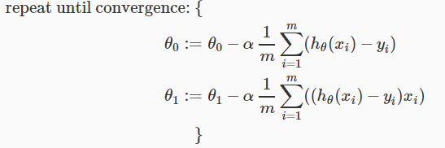

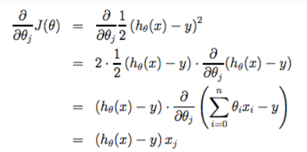

在这里，参数的每一步更新是在整个训练样本集上，该方法被称为批量梯度下降 **batch gradient descent**（BGD）。这里线性回归所利用的BGD能够找到全局最优（因为对于一个凸二次函数，局部最优就是全局最优）

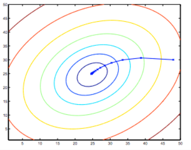

### 线性代数知识补充

- 矩阵与向量的表示，维度
- 矩阵的运算：加法、乘法