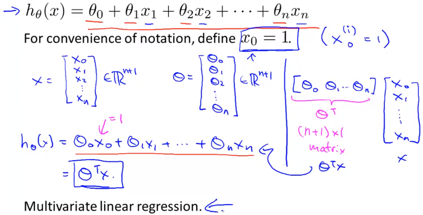
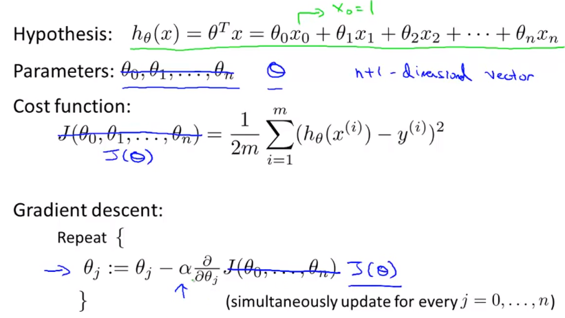
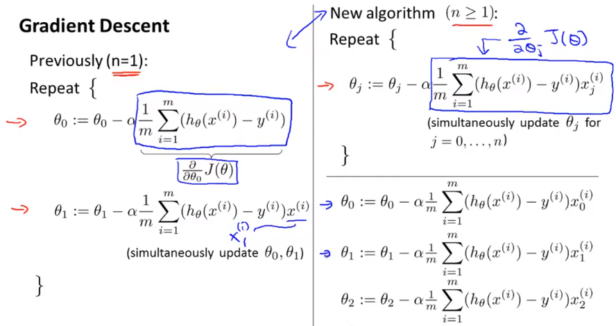
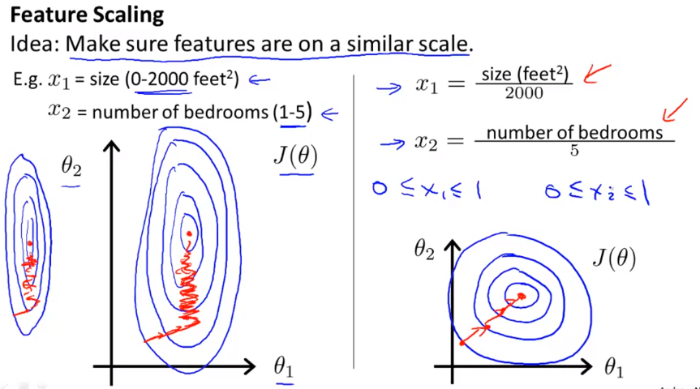
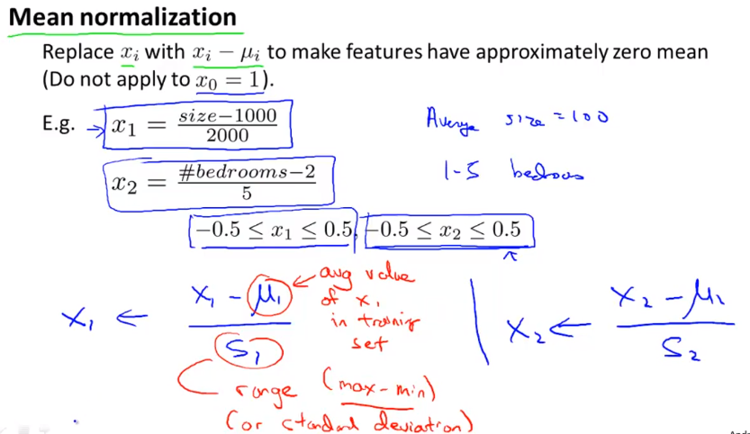
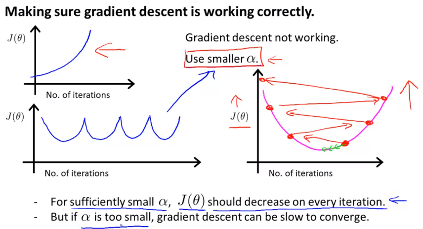
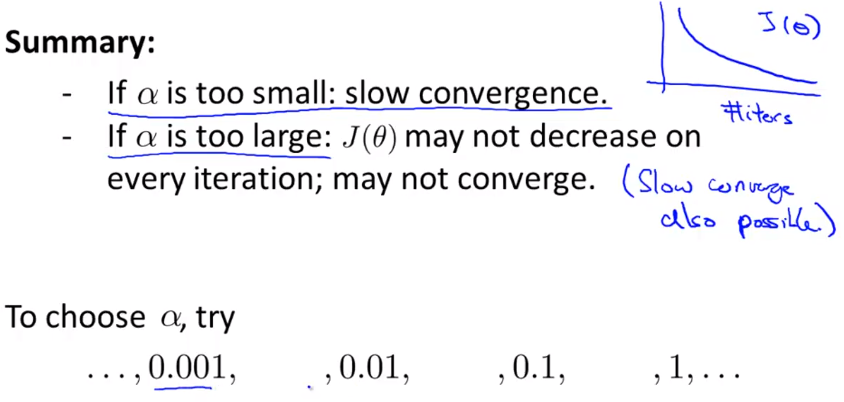
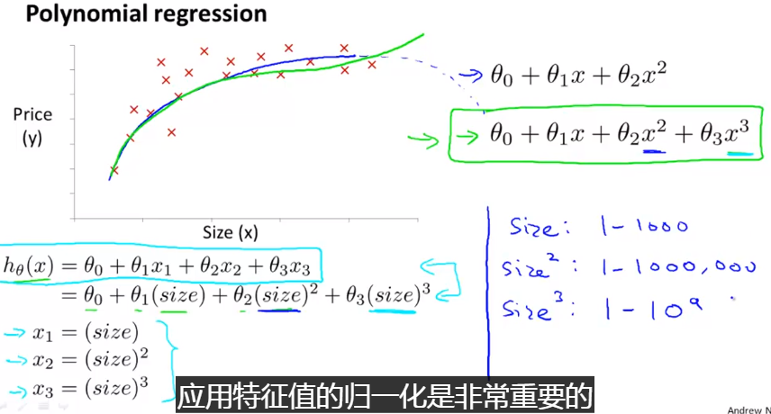
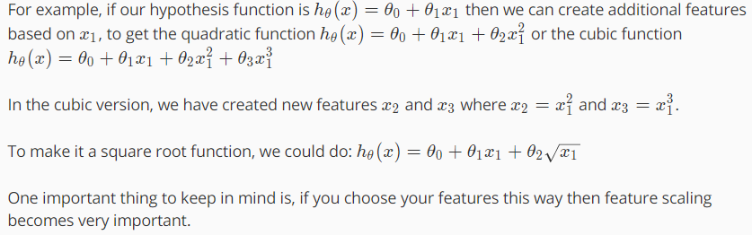

## multivariable linear regression

训练数据集的维度不止一维

### use GD to solve multivariable linear regression

### Feature Scaling

将不同维度的数据缩放到类似的区间，可以使梯度下降 **更快** 地收敛到局部最优。当某一维度的区间范围很大，可以缩放到-1到1的区间；如果维度的区间很小，可以放大到-1到1的区间。

- 比较常用的一种缩放方式是 ***Mean normalization***

  ​

- **How to make sure GD work correctly**

  现象：在每一次的迭代当中，代价函数的值一直变小

- **在使用梯度下降法是需要注意的点**
  - 需要画图，x轴为迭代的次数，纵轴为代价函数值，通过代价函数值的变化情况来判断learning 的选择是否合理。
  - 自动收敛测试：设定迭代停止的条件。当在一次迭代中，代价函数的衰减量小于阈值则停止迭代。

### Feature and polynomial Regression

## 如何选择特征？

- 寻找一些算法帮你找特征
- 如果一条直线无法很好地拟合数据的话，可以尝试二次、三次函数去去构建符合数据的模型

------

------

## 自动计算参数

一般的，我们利用梯度下降法通过一次次迭代去寻找最优解，需要很多步才能找到。相反的，正规方程是通过求得方程的解析解一步到位。

### 1. 正规方程

求极值点

