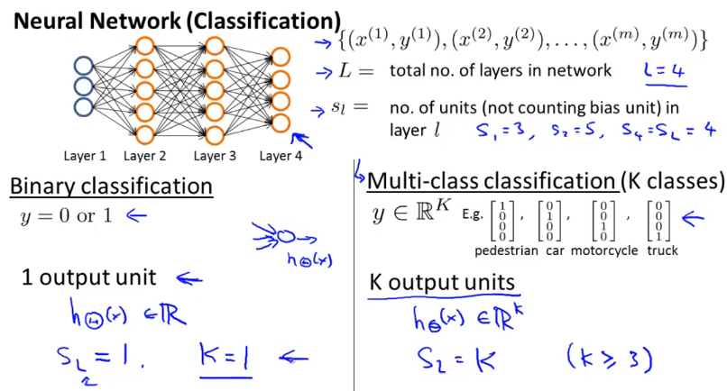
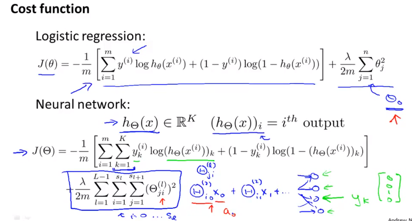
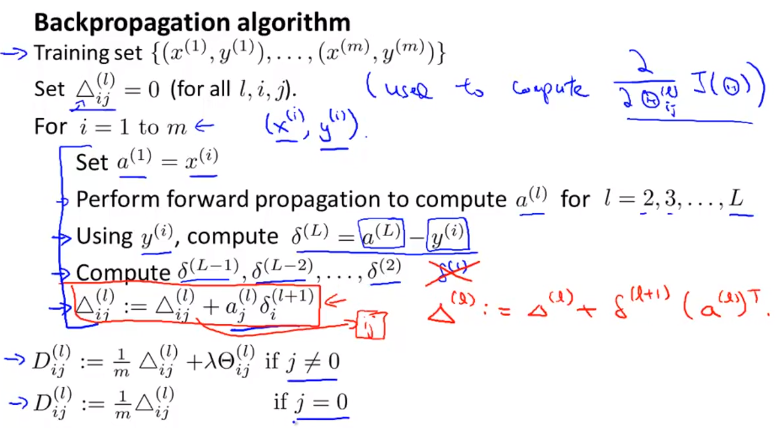
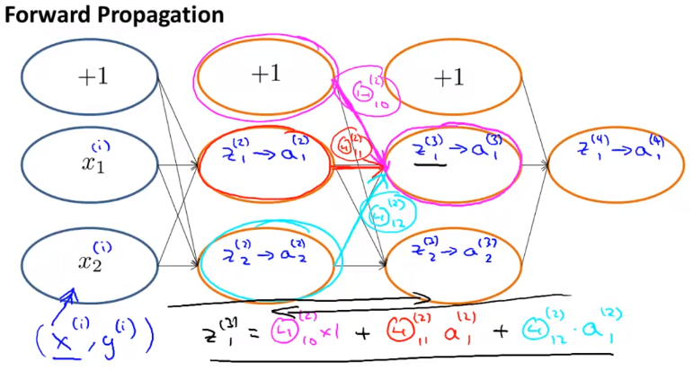
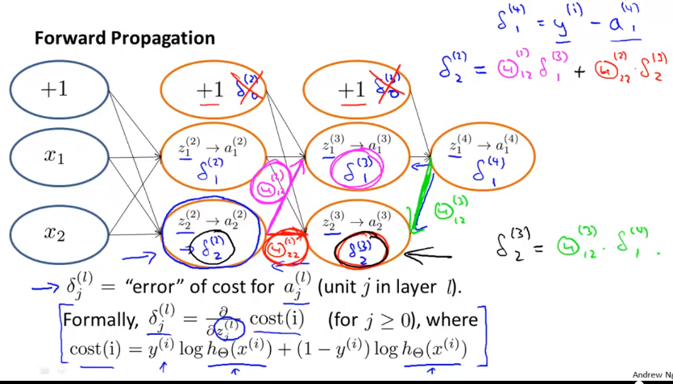
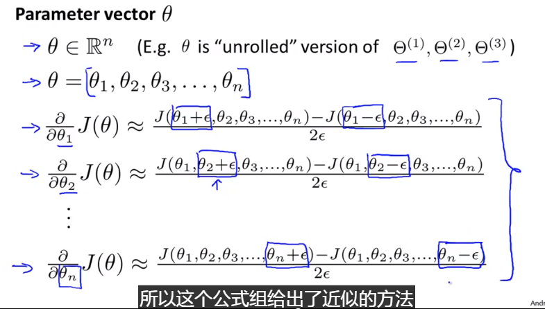
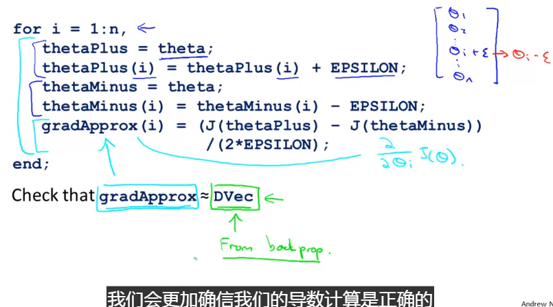
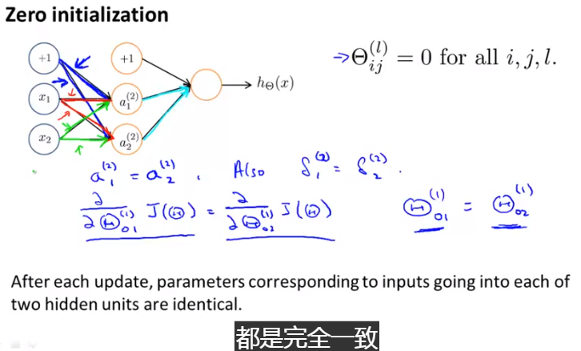
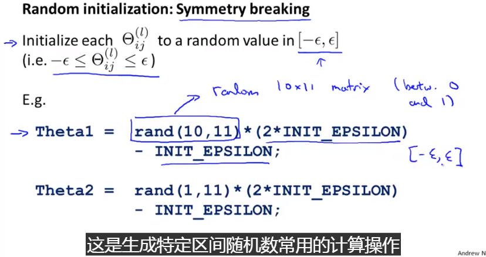
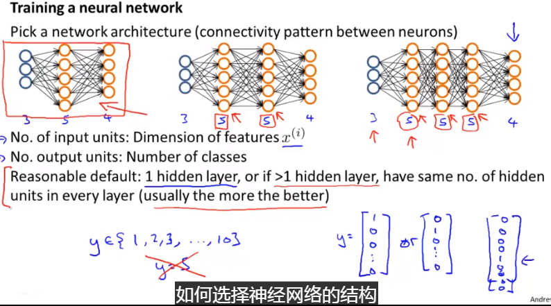

## Neural Network learning algorithm

### 1. Neural Network - classification

- 对于二分类问题，神经网络的输出点只需要1个，对于多分类问题，神经网络的输出为K。

### 2. GD checking 

代价函数求导近似

- 实现方式：
  - 首先，使用反向传播来计算，它是很好的算法 这里就是前面介绍的流程 这里的参数我们把矩阵展开成向量 
  - 然后 我们使用数值的梯度来检验 这是刚刚介绍的内容 我们要确信这两个方法算出来结果一致 你知道，就差一点 
  - 最后，也是最重要的步骤 就是在你开始学习之前， **一定要关掉我们的梯度检验**， 也就是我们讨论的数值计算方法 原因是这个计算过程， 实际上代价更高，复杂度也很高 这不是一个很好的计算导数的方法 相反，我们前面讨论的反向传播算法 很早以前介绍的内容 你知道D1 D2 D3对于DVEC 相对来说非常高效。 恩 
  - 所以，**一旦你检验证明你的算法没有错误 就要把梯度检验关掉** 所以，在你开始迭代训练之前一定要关掉。对于其他很多优化算法也一样。为了训练你的分类器，如果你一定要**用数值方法**来计算梯度， 那么你的算法会**非常慢**。 在你的支付函数的循环过程当中 因为，正如前面所说 我们再重复一下...它很慢 记得，我们这里计算(4)(3)(2)等等 这是我们的反向传播算法 它快得多 所以，再说一遍...检验完了后向传播没有问题 **关掉梯度检验**，重要的事情说三遍 当你在训练你的算法的时候， 所以数值的计算， 这是你的检验方法而已。 对我而言，每当我要使用梯度算法，比如后向传播 我都会用梯度检验一下这个算法是否正确 这会让我更加自信我的算法是正确的。

### 3. Random initiate

***能不能初始化为零？***（在线性回归中是可以的）

- 不能：因为这会导致所学到的参数都一样，从而使神经网络的性能下降

### 3. 整合

- 训练步骤

  - 随机初始化权重
  - 前向传播计算输出$h_\Theta(x^{(i)})$
  - 计算代价函数
  - 误差反向传播，计算代价函数梯度
  - 用GD-checking 来保证反向传播的结果是正确的，然后在实际训练中要关掉梯度checking
  - 使用梯度下降或者先进的优化算法进行反向传播，计算parameters

  Ideally, you want$h_\Theta(x^{(i)}) ≈ y^{(i)}$. This will minimize our cost function. However, keep in mind that $J(\Theta)$ is **not convex** and thus we can end up in a **local minimum** instead.