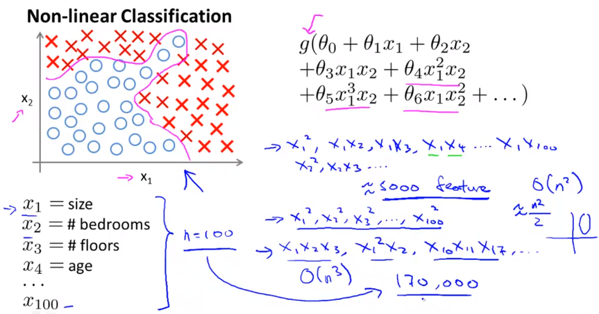
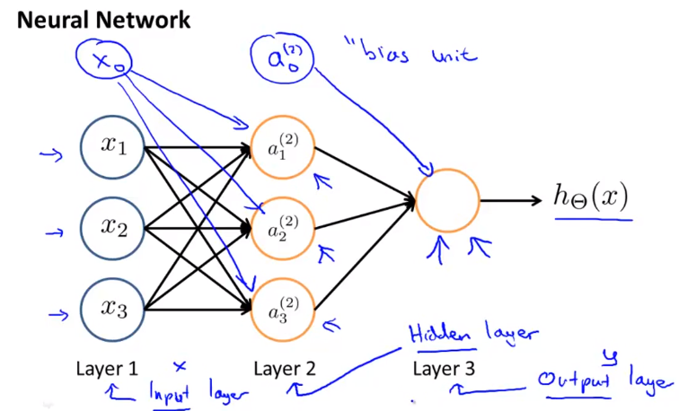
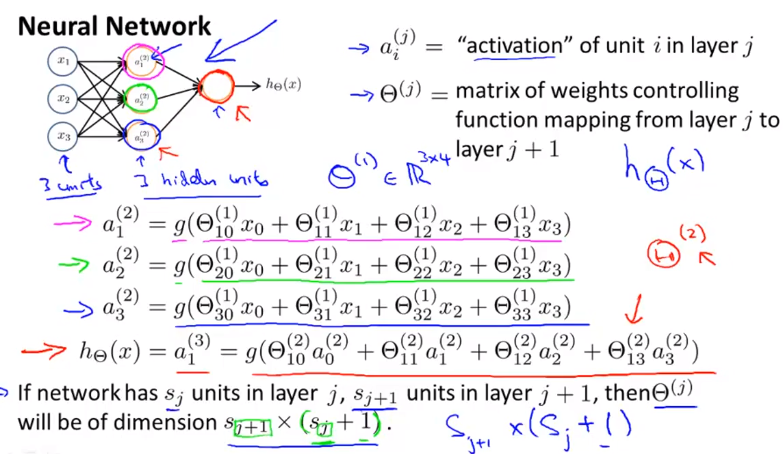
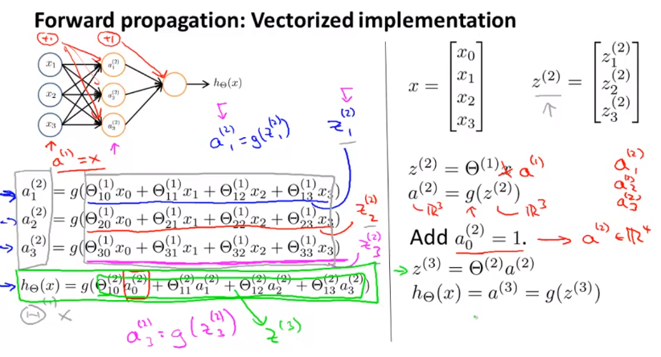
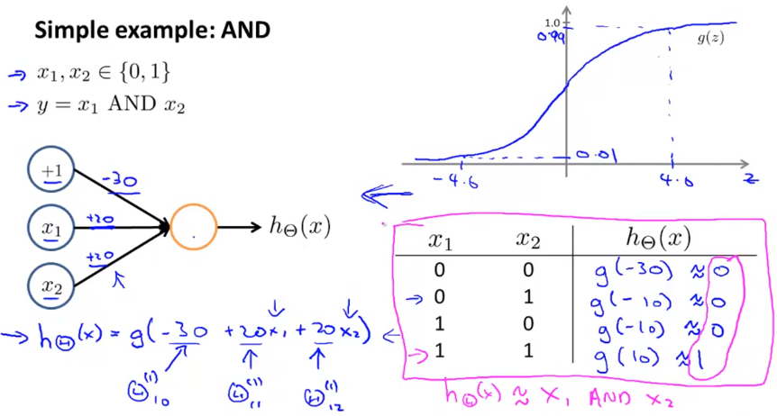
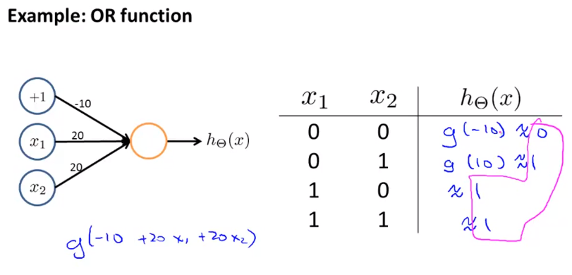
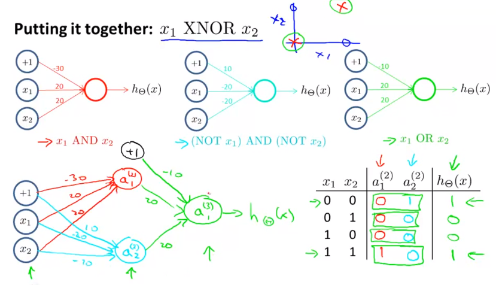

### 1. Motivation

对于非线性的分类问题，当特征数很多时，当对这些特征进行二次拟合时会进一步导致特征变量增多，模型复杂度大大提升。为此出现了神经网络。

### 2. Neural Network representation

Let's examine how we will represent a hypothesis function using neural networks. At a very simple level, neurons are basically computational units that take inputs (**dendrites**) as electrical inputs (called "spikes") that are channeled to outputs (**axons**). In our model, our dendrites are like the input features$x_1⋯x_n$, and the output is the result of our hypothesis function. In this model our x_0x0 input node is sometimes called the "bias unit." It is always equal to 1. In neural networks, we use the same logistic function as in classification, $\frac{1}{1 + e^{-\theta^Tx}}$, yet we sometimes call it a sigmoid (logistic) **activation** function. In this situation, our "theta" parameters are sometimes called "**weights**".

#### Example

- 由于单个线性回归解决不了异或问题，可以通过神经网络实现

- 多分类问题

