## photo OCR 

***a machine learning pipeline: A system with many stages / components, several of which may use machine learning.***

### OCR pipeline

#### - text detection

#### - character segmentation

#### - character classification

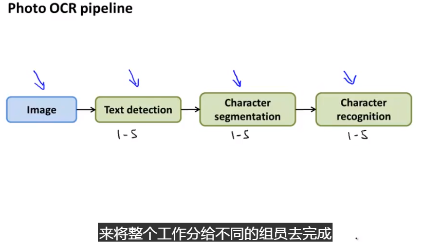

### sliding window 滑动窗分类器

找到图片中感兴趣的部分。如：行人识别。需要选取滑动窗的大小然后在图片上滑动获取图片的区域信息，然后利用图片分类器进行分类。

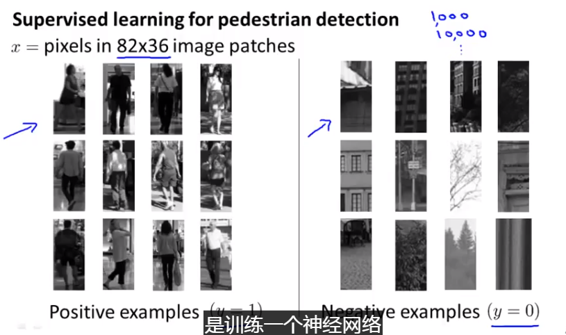

#### text detection

先收集带标签的数据，带字母的正例和不带字母的负例，然后利用训练数据训练文字分类器，然后通过expansion 将附近相关联的区域连成一块。然后对这一块的内容进行文字识别。

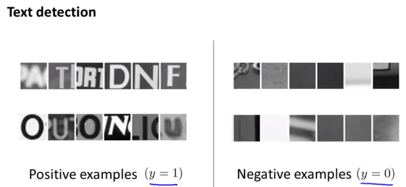

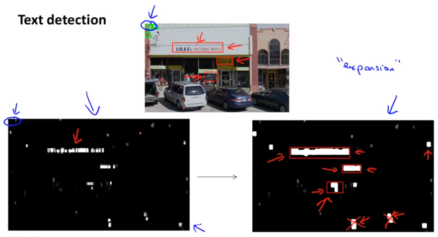

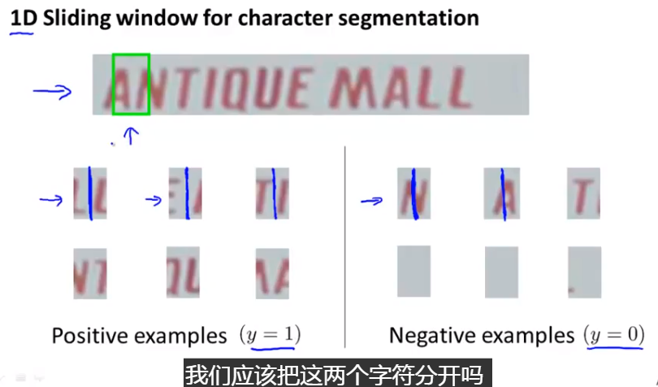

### Getting Lots of Data and Artificial Data

#### 人工数据合成

- 以字母为例，对于已有样本，可以通过字体库加上随机背景噪声来人为创建新的样本
- 以字母为例，可以对字母进行各种扭曲变化来构建新的样本

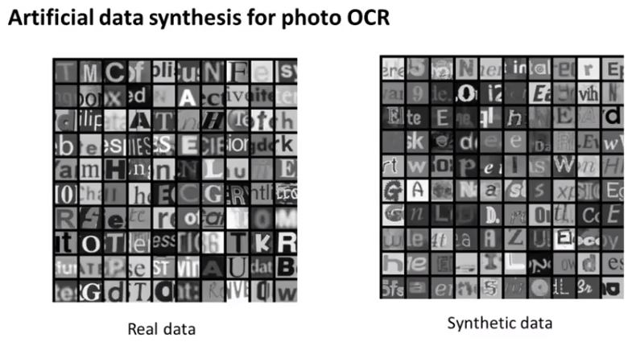

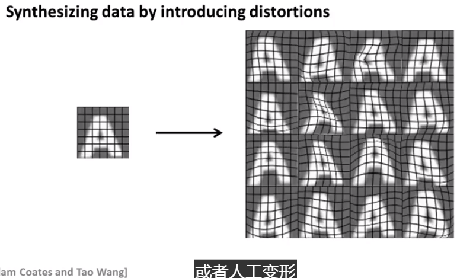

#### 以语音识别为例

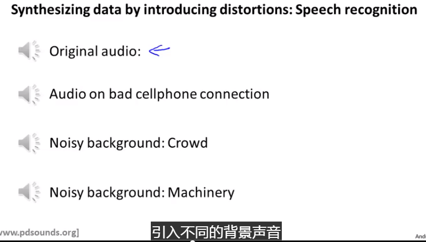

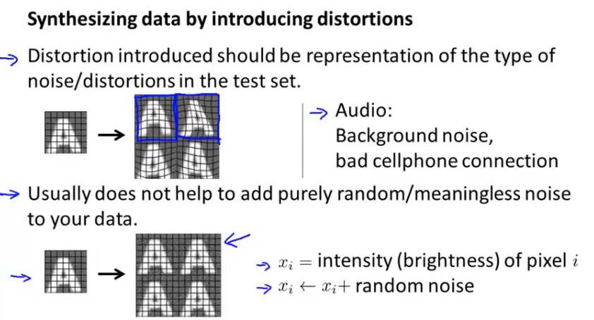

### Getting Lots of Data and Artificial Data

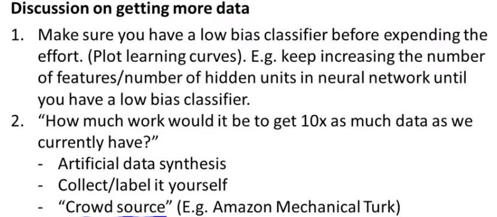

### Ceiling Analysis: What Part of the Pipeline to Work on Next

***上限分析在实际系统开发中非常重要***

一般需要分成多个模块

通过计算每个模块的上升空间确定应该在那个模块上花最多的时间

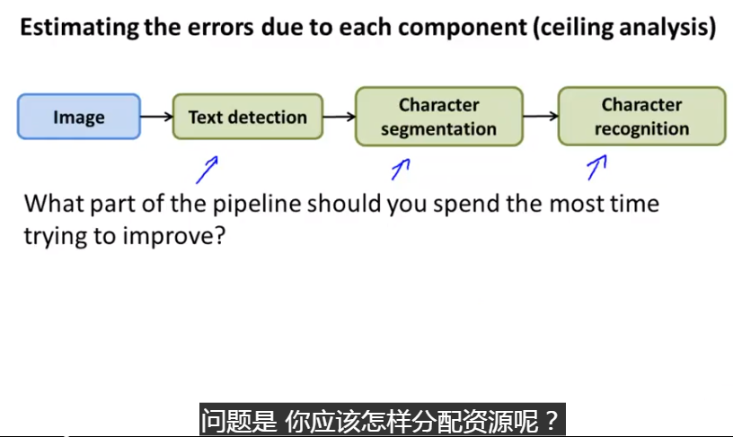

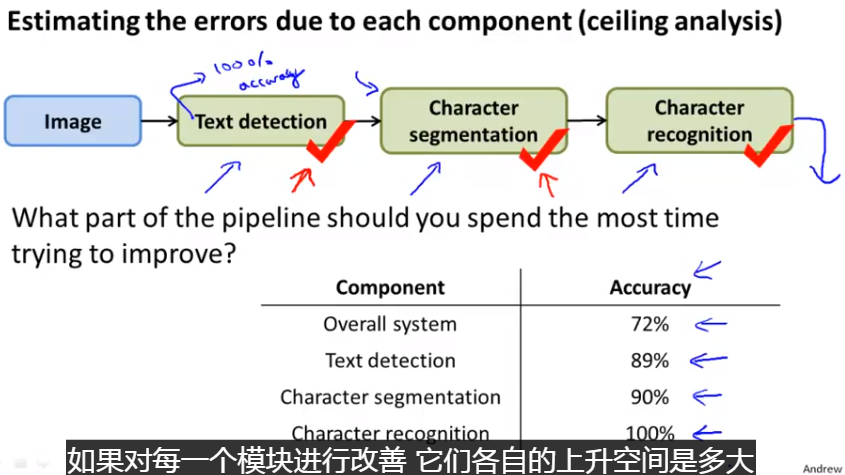

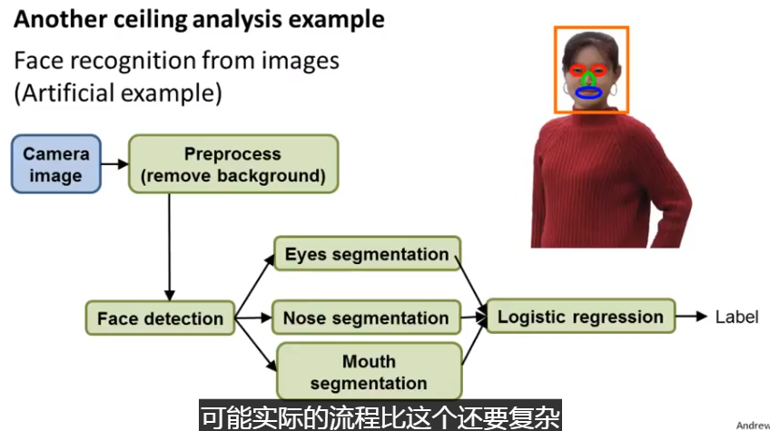

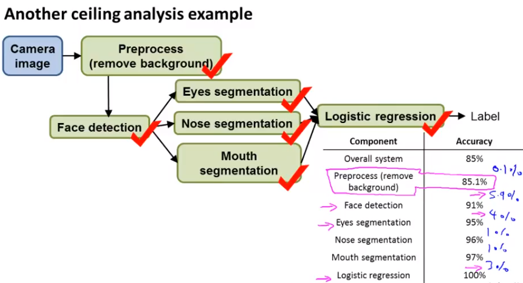