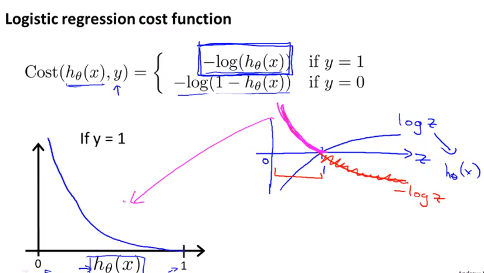

## Week 3

### Classification Representation

- 应用：垃圾邮件识别、网上商品、癌症判别等

- 对于分类，一个很直观的想法是利用线性回归记性判断，比如大于c为一类，小于c为另一类，但是这样并不总是正确的，很多分类问题并不是线性的。于是借鉴回归问题问题的思想，将一定数量的离散值映射到指定区间。以二分类问题为例，如果正例为1的话，那么负例为0.

### Logistic regression

我们想要预测值在0,1之间，$h_\theta(x)=g(\theta^Tx)$属于$(0,1)$区间，有sigmoid function 和 logistic function

- Decision boundary

  

  

### Logistic Regression Model

#### 1. Cost Function

如果代价函数和线性回归的代价函数（平方误差）一样的话，那么所得到的代价函数时非凸函数。非凸函数有很多的局部最优点。所以需要寻找一种代价函数是凸函数。

#### 2. LR - Advanced optimization 

一般的用梯度下降进行参数求解：一般的优化方法 GD, conjugate gradient, BFGS, L-BFGS。

***这里，吴恩达推荐使用现成的库，只有大师才能够写出这种比较鲁棒的代码***

#### 3. multiclass classification: one-vs-all

#### 4. over-fitting

模型对训练数据的描述过于正确，以至于把噪声都当做数据的特征考虑进去，使得模型的泛化性能不佳。

- 解决方法
  - 减少特征量（降维）
    - 人为选择特征量，丢弃部分特征
    - 模型选择算法
  - 正规化（Regularization）
    - 保留所有特征，减小参数的值
    - 对于有很多特征的数据性能不错，尤其是有很多有用的但起的作用又不大的特征。
    - 优点：能够在求解析解的时候保证可逆（$XX^T+\lambda I)$

####  5. 正规化代价函数

它能够smooth假设函数 (model) 减小过拟合。如果$\lambda$如果设置的太大，会导致训练出来的模型欠拟合，存在很大的bias。如果选的太小呢？***如何选取$\lambda$?***

#### 6. Linear regression regularization

#### 7.Logistic regression regularization

***要排除掉偏差项***

