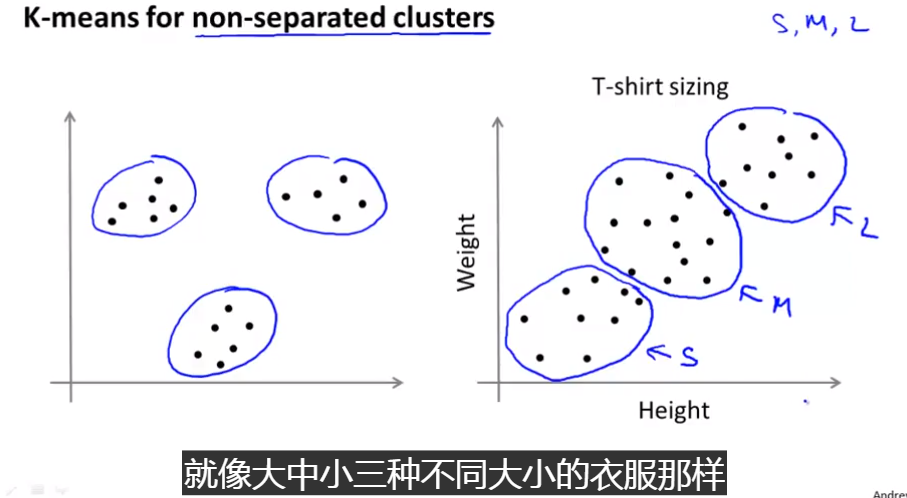
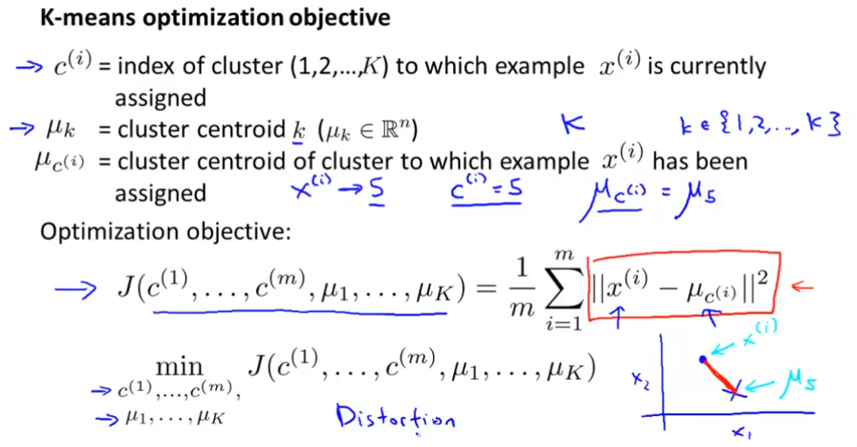

## Unsupervised learning

一个典型的例子是：聚类。未标记的数据，通过聚类算法对其进行聚类。

应用：市场细分、社交网络、计算机集群、星系形成

### K - Means Algorithm

如果没有点分配到的聚类点直接删掉。

- 对于一些不是很分开的数据，如何使用kmeans

- 假设有一家产商要生产衣服，那么应该如何设计衣服的大小？

  

  

  

  ### clustering random initialization

  推荐初始化的方法是随机选K个样本进行K个聚类中心

- 可能得到局部最优，因此需要多次运行，获得多次运行当中结果最好的一组参数-**多次随机初始化**

- 当聚类数少的时候，随机初始化对结果会有较大影响，可以使用多次随机初始化；当聚类数少的话，随机初始化对结果的影响比较小

  

  ​

  

  ### 如何选取K

  一般很难判断数据里面有多少类。

  - 肘部法则
  - 当很难确定的时候，可以考虑下游需求所对应的更优的聚类数量

------

### Dimensionality Reduction

#### Data Compression 维数约减

- 数据压缩 - 减少内存占用，减少冗余，提升算法效率

#### Data Visualization

数据可视化

### PCA  - Principal Component Analysis Problem Formulation

寻找一个低维平面，然后将数据投影到这个平面上,以便最小化平方投影误差。

***在使用PCA之前，需要先进行均值归一化和特征规范化***

- PCA 与线性回归是不同的
  - PCA是寻找一条线，使得样本点到这条线的垂直距离最短，而且PCA没有y值，所以样本的所有特征被同样对待
  - 而线性回归则是要寻找一条线，使得样本点的实际值与同一个样本特征所对应的预测值最小。

### PCA Algorithm

### Reconstruction from Compressed Representation

### Choosing the number of principle component

How to choose K?

